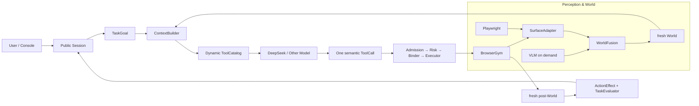
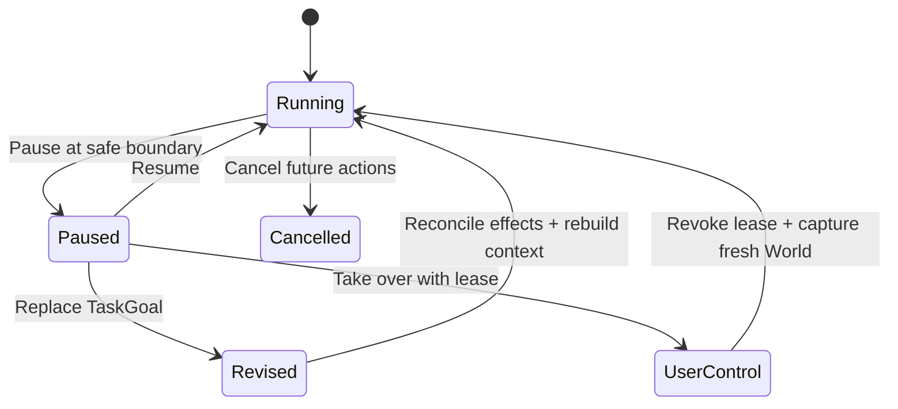

# Affordance Runtime

> 将普通 Tool-Calling Model 升级为可执行跨站网页任务的 **Harness-first GUI Agent**。

[](pyproject.toml)
[](LICENSE)
[](docs/architecture.md)
[](docs/interaction-shell.md)

**在线导览：** [项目首页](https://garrulus21yyx.github.io/affordance-runtime/) · [源码级实现链路](https://garrulus21yyx.github.io/affordance-runtime/implementation-walkthrough.html) · [项目 Pitch](https://garrulus21yyx.github.io/affordance-runtime/project-pitch.html) · [70 问面试指南](https://garrulus21yyx.github.io/affordance-runtime/interview-guide.html)

---

## 30 秒理解项目

Affordance Runtime 不是浏览器外面的一层 Prompt，而是一套完整的 **AI Agent Runtime**：它把 BrowserGym、Playwright、DOM、截图和 VLM 统一成 fresh World，为每一轮动态生成合法工具，再将模型选择安全地绑定到真实网页动作，并用新观察与 Evaluator 闭合结果。

项目的核心判断是：

| 模型负责 | Runtime 负责 | Evaluator 负责 |
|---|---|---|
| 开放世界理解、任务分解、证据选择、语义动作决策 | 当前事实、权限、动态工具、E-ref、binding、dispatch、用户控制 | 局部 UI 效果与全局任务完成证明 |

这让 DeepSeek V4 Flash 等通用模型可以复用同一套 Computer Use 基础设施，而不需要把网站规则、selector 或 benchmark case 写进 Prompt 和生产代码。

## 核心能力

| 能力 | 系统级实现 |
|---|---|
| **统一世界模型** | SurfaceAdapter + WorldFusion 将 DOM、BrowserGym、视觉和外部 source 投影为同一个 `WorldObservation` |
| **动态工具协议** | `Registry ∩ ActionSpace ∩ DeliveryManifest` 为每个 fresh Context 编译一次性 ToolCatalog |
| **安全语义执行** | `E-ref → action_id → ActionBinding → BID → BrowserGym action`，模型永远看不到 selector 和私有路由 |
| **长任务上下文工程** | PageMap、collection fold、R-ref/cursor、bounded Workspace 与 pair-safe Harness compaction |
| **结构 + 视觉协同** | Structural-first 主路径；VLM 只在视觉属性、图片文字、空间关系或 grounding 缺口中按需启用 |
| **Agent 收敛机制** | Failure center、动作效果投影、fresh post-World、native evaluator 与 committed StepResult |
| **人在环协作** | 自然对话、澄清、风险确认、暂停、目标修订、独占接管、归还控制与可证明补偿 |
| **模型可替换** | PydanticAI 统一 provider、typed messages、tool protocol、multimodal 与 history，Runtime 保留控制权 |

## 系统架构



BrowserGym 提供 benchmark/environment contract；Playwright 在专属 owner thread 内负责真实页面、导航时序、DOM quiet 和 live probe；Runtime 负责从统一世界到真实副作用之间的完整控制面。

## 一次任务的完整链路

```text
自然语言 → TaskGoal → GoalPlan → BrowserGym/Playwright capture
→ SurfaceAdapter → WorldFusion → fresh World + E/N/F/R refs
→ ActionSpace → DeliveryManifest → dynamic ToolCatalog
→ PydanticAI → one ToolCall → Admission/Risk/Binder
→ BrowserGym dispatch → causal stable post-World
→ ActionOutcome → TaskEvaluator → StepResult → continue / ask / finish
```

每次执行后都会重新捕获 fresh World 并使旧 executable ref 失效。模型不能把历史中的 `E7`、BID、selector 或坐标带回下一轮执行。

## 用户如何参与



- **Pause / Cancel** 在明确 safe boundary 生效，不会把中间状态伪装成已提交结果。
- **Revision** 生成新的 TaskGoal、fresh World、GoalPlan 与 ToolCatalog，而不是修改旧 todo。
- **Takeover / Return** 通过独占 lease 管理人机控制权，归还前必须重新捕获世界。
- **Undo** 只在 Runtime 能证明 compensation 时执行，避免对真实副作用假装回滚。

## 技术栈

| 层 | 技术与职责 |
|---|---|
| Agent Runtime | Python 3.11、Pydantic、typed ports、单 `CoreAgentLoop` |
| Model Boundary | PydanticAI、OpenAI-compatible providers、DeepSeek / GLM / Gemini profiles |
| Browser | BrowserGym、Playwright、DOM/AX projection、causal stability |
| Vision | 可替换 VLM provider、typed visual evidence、WorldFusion |
| Context | Dynamic ToolCatalog、TurnPacker、PydanticAI Harness compaction |
| Console | FastAPI、Next.js、SSE、Playwright E2E、protected live viewer |
| Evaluation | MiniWoB、WebArena-Verified、visual profiles、property/state-machine tests |
| Observability | JSONL Trace、Langfuse / OpenTelemetry projection、evidence lineage |

## 代码地图

```text
src/affordance_runtime/
├── app/          # composition、CLI、PublicSession、checkpoint
├── agent/        # CoreAgentLoop、context、workspace、monitor、run control
├── world/        # acquisition、fusion、fresh World contracts
├── surfaces/     # BrowserGym、DOM、visual、HTTP、WoT adapters
├── actions/      # ActionSpace、admission、grounding、private Binder
├── model/        # GoalCompiler、PydanticAI bridge、ToolCatalog
├── evaluation/   # action effect 与 task completion
└── benchmarks/   # MiniWoB、WebArena、visual 与 held-out harness

external/interaction-shell/
├── backend/      # versioned Runtime session API、SSE、deployment boundary
└── frontend/     # Next.js Console、conversation、progress、takeover、Labs
```

推荐从 [`app/public_session.py`](src/affordance_runtime/app/public_session.py) → [`agent/core_loop.py`](src/affordance_runtime/agent/core_loop.py) → [`surfaces/browsergym/backend.py`](src/affordance_runtime/surfaces/browsergym/backend.py) → [`model/policy/pydantic_ai_bridge.py`](src/affordance_runtime/model/policy/pydantic_ai_bridge.py) 顺着一轮任务阅读。

## 快速开始

<details>
<summary>安装、配置并运行一个只读网页任务</summary>

```bash
python -m venv .venv
source .venv/bin/activate
pip install -e '.[dev,web,browsergym,visual,pydantic-ai]'
python -m playwright install chromium
```

```bash
export LLM_ACTIVE_PROFILE=deepseek
export LLM_DEEPSEEK_BASE_URL='https://your-provider.example/v1'
export LLM_DEEPSEEK_API_KEY='...'
export LLM_DEEPSEEK_MODEL='your-tool-calling-model'
export LLM_PROFILE_FALLBACK_TO_LOCAL=false
```

`task-boundary.json`：

```json
{
  "allowed_effects": [],
  "requested_outputs": ["Return a concise source-backed answer"],
  "risk_profile": "read_only",
  "loop_budget": {"max_turns": 20, "max_observations": 40}
}
```

```bash
affordance-runtime run \
  --target 'https://example.com' \
  --instruction 'Find the requested information and return the answer' \
  --boundary task-boundary.json
```

</details>

## 项目亮点

- **完整 Agent Runtime**：以单一 `CoreAgentLoop` 连接 Goal、World、Context、Tool、Execution 和 Evaluation，模型负责认知，Runtime 负责控制。
- **Context Engineering**：每轮基于 fresh World 重建上下文，通过动态 ToolCatalog、页面折叠、短期 Workspace 和 Harness compaction 支撑长链任务。
- **语义工具执行链**：模型只选择公开语义动作，Runtime 完成 E-ref 解析、权限校验、私有 binding、BrowserGym dispatch 与 post-action verification。
- **结构与视觉统一感知**：DOM/AX 负责低成本主路径，VLM 负责开放世界视觉推断，所有证据进入同一个 WorldFusion 和 lineage。
- **可控、可验证的 Agent**：支持用户澄清、风险确认、暂停、修订、接管和归还控制，并以 ActionEffect、TaskEvaluator、Monitor 和 Trace 闭合运行结果。

## 深入阅读

- [Implementation Walkthrough](https://garrulus21yyx.github.io/affordance-runtime/implementation-walkthrough.html)：从自然语言到 dispatch 的源码级链路
- [Architecture](docs/architecture.md)：authority、owner 与核心设计合同
- [Benchmark](docs/benchmark.md)：真实运行、验收状态与历史反例
- [Interaction Shell](docs/interaction-shell.md)：对话、进展、控制与部署合同
- [Extending](docs/extending.md)：新增 Surface、Action 与 Evaluator 的规则

## License

[MIT](LICENSE) © 2026 Garrulus21yyx
