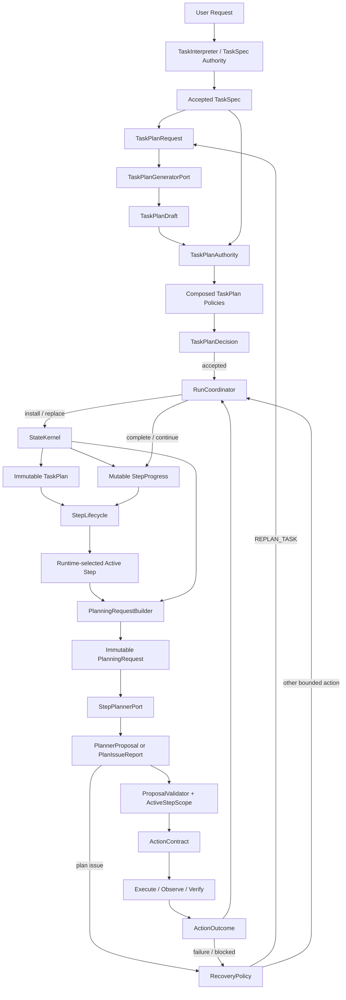

# Affordance Runtime TaskPlan 权威与 Planner 边界架构修改

> [!IMPORTANT]
> Superseded by SAR-0. Current authority is
> `docs/superpowers/specs/2026-07-29-affordance-runtime-authoritative-optimized-architecture.md`
> and
> `docs/superpowers/plans/2026-07-29-affordance-runtime-substitutive-refactor-execution-plan.md`.
> This archived file is historical context only.

> **文档类型：** Architecture Amendment / Domain Ownership Decision
> **状态：** `APPROVED_WITH_GUARDRAILS`
> **适用仓库：** `Garrulus21yyx/affordance-runtime`
> **适用分支：** `agent/migrate-runtime-components`
> **原始审查基线：** `7fe493e8429541b4d42801f4519626891ff794d5`
> **纳入仓库时的执行基线：** `8445747f0d734b3998b88edb204e099edf58d259`
> **父级目标架构：** `docs/archive/superseded-2026-07-29/2026-07-29-affordance-runtime-simplified-target-architecture.md`
> **实施状态：** `NOT_IMPLEMENTED_AS_A_WHOLE`
> **决议日期：** 2026-07-29

---

## 0. 文档目的与权威关系

本文件冻结 `TaskPlan`、任务级规划、step 级动作规划、replan、状态提交和进度推进之间的唯一 Owner 关系。

它解决当前代码中的一个核心命名与职责漂移：

```text
“Planner”
既可能指：
  TaskSpec → TaskPlan 的任务级规划者
又可能指：
  Active Step → 下一语义动作的 step 级规划者
```

这两个角色不得继续共享模糊的 `Planner` 名称和权威。

本文件对父级简化架构作以下补充，并在冲突时优先：

1. `TaskPlan` 是 Runtime-owned immutable domain object；
2. Step Planner 永远不能创建、修改、替换、推进或完成 `TaskPlan`；
3. 候选计划生成、计划验证、最终准入和状态提交必须分离；
4. `TaskPlanAuthority` 是 initial plan 和 replacement plan 的唯一决策 Owner；
5. `RunCoordinator` 是 accepted plan 的唯一 production committer；
6. `StateKernel` 只保存已准入的 immutable plan 与独立 progress；
7. Recovery 只能决定“是否需要 replan”，不能直接生成、接受或安装新计划；
8. 任何 plan 结构变化必须产生新 revision，不允许原地 patch。

本文件不立即改变当前 Runtime 行为。纳入仓库时的执行基线 `8445747` 中：

- legacy `TaskPlan / Subgoal / PlanProgress` 仍是 production progress authority；
- S1 simplified contracts 与 S2 legacy-step projection 仍为 foundation-only；
- S2.1 已完成 active/ready/completed 投影、source-unit provenance、typed evidence policy
  和 legacy progress ID 的 fail-closed hardening；未完成且无 ready step 的状态保持
  `PROJECTION_INVALID`，不新增未经审批的 `BLOCKED` projection authority；
- ODG advanced attribution 仍为 experimental/foundation；
- S3 immutable `PlanningRequest` 尚未切换标准 Planner 接口；
- 当前 Coordinator 仍通过 `TaskPlanFlow → TaskPlanLifecycle → TaskPlannerPort` 获取 plan，并由 `StateKernel.install_task_plan()` / `replace_task_plan()` 提交。

---

## 1. 最终决议

### 1.1 一句话决议

```text
TaskPlanGenerator 产生候选；
TaskPlanValidator 验证候选；
TaskPlanAuthority 决定接受、拒绝或要求澄清；
RunCoordinator 提交；
StateKernel 保存；
StepPlanner 只提出当前 active step 的下一动作。
```

### 1.2 冻结后的命名

| 当前/模糊名称 | 目标名称 | 责任 |
|---|---|---|
| `TaskPlannerPort` | `TaskPlanGeneratorPort` | 只产生 `TaskPlanDraft` |
| `PlannerPort` | `StepPlannerPort` | 针对当前 active step 产生 `PlannerDecision` |
| `TaskPlanValidator` | 保留，但拆分内部策略 | 纯验证，不安装、不修补状态 |
| `TaskPlanLifecycle` | `TaskPlanAuthority` + `StepLifecycle` | 拆开 plan 准入与 step 调度 |
| `TaskPlanFlow` | `TaskPlanApplicationFlow` | application orchestration，不拥有 domain 决策 |
| `SubgoalSpec` | compatibility；目标为 `StepSpec` | plan 中的阶段性效果 |
| `PlanProgress` | compatibility；目标为 `StepProgress` | mutable runtime progress |

兼容期可以保留旧名称 facade，但标准接口和新文档必须使用目标名称。

---

## 2. 当前代码库的真实调用链

### 2.1 Initial plan 当前路径

```text
RunCoordinator.run_sync
    ↓
TaskPlanFlow.prepare
    ↓ state.task_plan is None
TaskPlanLifecycle.propose_initial
    ↓
TaskPlanLifecycle.build_context
    ↓
TaskPlannerPort.plan(context)
    ├── PlanningRouter
    ├── RuleTaskPlanner
    ├── TaskObligationOutcomeCompiler
    ├── LLMTaskPlanner
    └── PricingTaskPlanner / custom planner
    ↓
TaskPlan
    ↓
TaskPlanValidator.validate
    ↓
TaskPlanTransition
    ↓
TaskPlanCommitPreparation
    ↓
RunCoordinator
    ↓
StateKernel.install_task_plan
    ↓
StateKernel.activate_next_subgoal
```

当前问题：`TaskPlannerPort.plan()` 直接返回带 authority 字段的 `TaskPlan`，候选生成者、authority-field binder 和 domain plan producer 没有彻底分离。

### 2.2 Replacement plan 当前路径

```text
TaskPlanLifecycle.evaluate_replacement
    ↓
replacement reason:
  - action budget exhausted
  - active action family unavailable
  - current outcome already satisfied
  - current outcome state unsupported
    ↓
TaskPlanFlow._prepare_replacement
或 compatibility current-state discard
    ↓
TaskPlanLifecycle.propose_replacement
    ↓
TaskPlannerPort.plan(context)
    ↓
carry_forward_completed_subgoals
    ↓
TaskPlanValidator.validate(previous_plan=...)
    ↓
RunCoordinator
    ↓
StateKernel.replace_task_plan
```

当前优点：

- plan replacement 是新 `plan_id` / 新 `plan_version`；
- `supersedes_plan_id` 被检查；
- verified completed subgoal 必须保留且不得重定义；
- Coordinator/StateKernel 仍是唯一提交路径。

当前问题：

- “是否需要 replan”、候选生成、验证、完成单位 carry-forward 和最终准入分散在 Lifecycle/Flow/Validator/StateKernel；
- `TaskPlanLifecycle` 同时承担 invocation、replacement trigger、context projection、completed 判断和 active-subgoal lookup；
- `TaskPlanValidator` 同时承担 schema、authority、TaskSpec coverage、current-state feasibility、repair classification 与 action-family compatibility；
- `TaskPlanFlow` 还保留 current-state discard 的 compatibility policy；
- Recovery 中 `REPLAN_TASK` 由 Coordinator 特殊处理，尚无明确 `TaskPlanAuthority` port。

### 2.3 Step Planner 当前路径

```text
TaskEnvelope + mutable StateKernel + BrowserSnapshot
    ↓
PlannerPort.propose(envelope, state, snapshot)
    ↓
PlannerContextBuilder 读取：
  TaskSpec
  active_subgoal
  TaskPlan / PlanProgress
  receipts / verification
  planner history
  budget
  recovery
  snapshot / affordances
    ↓
GeneralistLMPlanner / ParentAgentPlannerAdapter / reference planner
    ↓
PlannerProposal 或 legacy ActionContract
```

当前问题：

- Step Planner 能看到完整 mutable `StateKernel`；
- `PlannerProposal.subgoal` 是自由文本，不应成为 plan authority；
- `decision_constraints` 和 terminal readiness 仍直接读 legacy plan/progress；
- reference planners 直接读 `StateKernel` 并部分直接创建 `ActionContract`；
- BrowserGym planner adapter 也使用三参数接口；
- `planner_model_orchestrator.restrict_targets_to_active_subgoal()` 仍部分依赖 active-subgoal prose/token heuristic。

### 2.4 Progress 与完成当前路径

```text
post-action VerificationReport
    ↓
VerifierBackedSubgoalVerifier(active legacy subgoal)
    ↓
StateKernel.complete_subgoal
    ↓
PlanProgress.completed_subgoal_ids / evidence_by_subgoal
    ↓
TaskPlanLifecycle.completed
    ↓
finish guard / TaskCompleted
```

同时还存在：

- `task_plan_progress_flow` 的 current-state completion；
- ODG shadow comparison；
- compatibility `TaskPlanProgressTarget` / `SubgoalEvidenceBinder`；
- TaskSkill 自己的 `TaskSkillRunState` 和 step cursor。

目标架构必须避免这些结构形成并行 production completion authority。

---

## 3. 当前结构压力与根因

### 3.1 `TaskPlannerPort` 返回权威 `TaskPlan`

当前 `TaskPlannerPort.plan()` 返回完整 `TaskPlan`。即使 LLM provider 先产生 `TaskPlanCandidate`，`LLMTaskPlanner` 自己会绑定 plan ID、version、state version、source，并返回 domain object。

这造成：

```text
Generator
+
authority-field binder
+
部分 validator/repair loop
```

集中在同一个实现中。

### 3.2 `TaskPlanValidator` 混合太多变化原因

当前 validator 同时检查：

- task ID / revision / state version；
- initial/replacement lineage；
- subgoal count；
- completed step preservation；
- exact obligation-to-subgoal mapping；
- action/outcome relation；
- operation class escalation；
- executable content；
- dependencies / cycles / terminal；
- current entry feasibility；
- current state already satisfied；
- state relation support；
- repairable vs fatal。

目标需要保留这些安全检查，但按变化原因拆成组合 policy，而不是继续扩大一个 validator 方法。

### 3.3 Task Planner 与 Step Planner 的角色边界不够显式

Task Planner 负责 `TaskSpec → plan structure`；Step Planner 负责 `active step + observation → next action`。

任何以下行为都属于违规：

- Step Planner 新增/删除 step；
- Step Planner 修改 dependency 或 completion criterion；
- Step Planner选择 active step；
- Step Planner直接完成 step；
- Step Planner输出 plan patch；
- Planner 的自由文本 `subgoal` 被当成 authoritative identity。

### 3.4 TaskSkill 形成潜在平行 step authority

`AcceptedTaskSkillRuntime` 有自己的：

- active skill；
- next step index；
- completed skill step IDs；
- evidence；
- step checkpoint。

目标状态中，TaskSkill 只能作为当前 Runtime step 的执行策略或 Step Planner proposal source。它不能独立决定整个 Runtime TaskPlan、Task completion 或形成第二个 progress authority。

### 3.5 Benchmark/CLI wiring 直接注入具体 planner

CLI、BrowserGym、reference scenarios 会直接构造 `PlanningRouter`、`PricingTaskPlanner`、Generalist/BrowserGym planners。

迁移必须保证：

- adapter 只配置 generator/step planner implementation；
- benchmark 不获得 plan admission 或 completion authority；
- run identity 在 TaskPlan schema、prompt、PlanningRequest policy 变化时更新；
- 所有真实路径继续经过 Coordinator。

---

## 4. 目标架构总览



### 4.1 关键边界

```text
TaskPlanGeneratorPort
  只产生 TaskPlanDraft

TaskPlanAuthority
  唯一 plan creation/revision decision owner

RunCoordinator
  唯一 install/replace committer

StateKernel
  保存 accepted immutable TaskPlan + mutable StepProgress

StepLifecycle
  根据 dependency/progress 决定 active step

StepPlannerPort
  只提出当前 active step 的下一动作或 PlanIssueReport
```

---

## 5. 目标领域模型

### 5.1 TaskPlanDraft

```python
@dataclass(frozen=True)
class TaskPlanDraft:
    task_spec_identity: str
    task_revision: int
    generated_by: TaskPlanSource
    steps: tuple[StepSpec, ...]
    assumptions: tuple[str, ...] = ()
    generator_ref: str = ""
    model_call_ref: str = ""
```

规则：

- 不含 `plan_id`；
- 不含 `plan_revision`；
- 不含 `supersedes_plan_id`；
- 不含 `based_on_state_version` 作为可伪造 authority；
- 不含 StateKernel mutation；
- 不含 backend locator / selector / coordinate；
- LLM/Parent/Rule/Skill generator 都只能产生 Draft。

### 5.2 Accepted TaskPlan

```python
@dataclass(frozen=True)
class TaskPlan:
    plan_id: str
    task_id: str
    task_spec_identity: str
    based_on_task_revision: int
    plan_revision: int
    supersedes_plan_id: str
    admitted_at_state_version: int
    generated_by: TaskPlanSource
    steps: tuple[StepSpec, ...]
    assumptions: tuple[str, ...] = ()
    plan_digest: str = ""
```

规则：

- 只能由 `TaskPlanAuthority` 构造；
- 安装后不可原地修改；
- 结构变化产生 revision N+1；
- `plan_id` 必须变化；
- replacement 必须引用 previous plan；
- plan digest 覆盖所有 authority fields 和 steps；
- TaskPlan 不保存运行时 completed/active 状态。

### 5.3 StepProgress

```python
@dataclass
class StepProgress:
    active_step_id: str | None = None
    completed_step_ids: list[str] = field(default_factory=list)
    failed_step_ids: list[str] = field(default_factory=list)
    blocked_step_ids: list[str] = field(default_factory=list)
    evidence_by_step_id: dict[str, list[str]] = field(default_factory=dict)
    attempt_count_by_step_id: dict[str, int] = field(default_factory=dict)
    plan_replan_count: int = 0
```

以下属于 progress update，不是 plan modification：

- activate ready step；
- complete current step；
- record evidence；
- mark blocked/failed；
- increment attempt count。

以下属于 plan modification，必须新 revision：

- add/remove/reorder step；
- change objective；
- change completion criterion；
- change dependency；
- split/merge step；
- replace remaining strategy。

### 5.4 TaskPlanRequest

```python
@dataclass(frozen=True)
class TaskPlanRequest:
    task: PlannerTaskView
    observation: PlannerObservationView
    state_version: int
    reason: Literal["initial", "replan_step", "replan_task"]
    previous_plan: TaskPlanView | None
    progress: StepProgressView | None
    failure: TypedFailureSummary | None
    recovery: PlannerRecoverySummary | None
    remaining_budget: RuntimeBudgetView
```

这是 TaskPlanGenerator/Authority 使用的 immutable application input。

### 5.5 TaskPlanDecision

```python
@dataclass(frozen=True)
class TaskPlanDecision:
    status: Literal[
        "accepted",
        "rejected",
        "repair_required",
        "clarification_required",
        "no_plan_required",
    ]
    accepted_plan: TaskPlan | None = None
    issues: tuple[TaskPlanIssue, ...] = ()
    reason_code: str = ""
    reason: str = ""
```

不变量：

```text
accepted          ↔ accepted_plan is not None
non-accepted      → accepted_plan is None
no_plan_required  → flat/implicit-step policy明确允许
```

### 5.6 PlanIssueReport

Step Planner 发现计划问题时，只能返回：

```python
@dataclass(frozen=True)
class PlanIssueReport:
    step_id: str
    kind: Literal[
        "step_unexecutable",
        "target_unavailable",
        "criterion_unverifiable",
        "plan_assumption_invalid",
        "scope_ambiguous",
    ]
    evidence_refs: tuple[str, ...]
    reason_code: str
    reason: str = ""
```

禁止字段：

- new plan；
- plan patch；
- next active step；
- completed step ID；
- dependency mutation。

---

## 6. Owner Matrix

| 责任 | 唯一 Owner | 允许 | 禁止 |
|---|---|---|---|
| 自然语言 → TaskSpec draft | `TaskInterpreter` | semantic interpretation | 动作执行、计划安装 |
| TaskSpec 准入 | Task intake authority/validator | 接受 Runtime task authority | 写 plan progress |
| 计划候选生成 | `TaskPlanGeneratorPort` | 产生 `TaskPlanDraft` | 返回 accepted plan、写 StateKernel |
| deterministic plan compilation | `RuleTaskPlanGenerator` | 从 accepted TaskSpec 产生 draft | 绕过 authority |
| model plan generation | `LLMTaskPlanGenerator` | structured draft + bounded repair | 绑定 plan ID/version、直接准入 |
| plan structural validation | `TaskPlanStructuralValidator` | ID、dependency、cycle、cardinality | current state mutation |
| TaskSpec coverage/source validation | `TaskPlanAuthorityPolicy` | source/criterion/risk/coverage | 调模型、执行动作 |
| current feasibility advisory | `TaskPlanFeasibilityEvaluator` | 当前 observation 下的 typed issue | 修改 plan、完成 step |
| plan final decision | `TaskPlanAuthority` | accept/reject/clarify/no-plan | 写 StateKernel、执行 |
| plan install/replace | `RunCoordinator` | 提交 accepted decision | 发明或修补 steps |
| plan storage | `StateKernel` | 保存 immutable plan reference | 解释任务语义 |
| active step selection | `StepLifecycle` | dependency + progress 调度 | Planner 选择 active step |
| 下一动作建议 | `StepPlannerPort` | semantic proposal / PlanIssueReport | 创建、修改、完成 plan/step |
| proposal scope | `ProposalValidator + ActiveStepScope` | pre-execution gate | replan |
| step verification | `ActiveStepVerifier` | typed verification result | state commit |
| progress commit | `RunCoordinator → StateKernel` | complete/blocked/failed step | 自行判断 evidence |
| 是否需要 replan | `RecoveryPolicy` | typed recovery decision | 生成/准入/安装 plan |
| replan plan decision | `TaskPlanAuthority` | new accepted revision | 直接 state mutation |
| benchmark score | benchmark adapter | evaluation artifact | Runtime completion |

---

## 7. Initial plan 决策

### 7.1 Flat task

满足以下条件时不调用模型 Task Planner：

- 单一 completion criterion；
- 无 dependency；
- 无跨阶段 approval/budget；
- 无跨应用/data-dependent 分解要求。

流程：

```text
TaskPlanAuthority
    ↓
TaskPlanDecision(no_plan_required)
    ↓
Runtime implicit StepSpec
```

隐式 step 由 Runtime 创建，Step Planner不能创建。

### 7.2 Complex task

```text
Accepted TaskSpec
    ↓
TaskPlanRequest(reason=initial)
    ↓
TaskPlanGeneratorPort.generate
    ↓
TaskPlanDraft
    ↓
TaskPlanAuthority.admit
    ├── structural validation
    ├── TaskSpec coverage/source validation
    ├── risk/capability non-escalation
    ├── criterion/evidence validation
    ├── dependency validation
    └── optional feasibility issue evaluation
    ↓
TaskPlanDecision(accepted)
    ↓
RunCoordinator.install
```

Generator 可以是 LLM，但 LLM 没有 authority。

---

## 8. Replan 决策

### 8.1 谁决定“是否 replan”

Owner：`RecoveryPolicy`。

输入：

- typed failure；
- latest ActionOutcome；
- active step；
- observation；
- remaining budget；
- recovery history。

输出：

```text
REOBSERVE
REGROUND
SWITCH_BACKEND
RETRY
REPLAN_STEP
REPLAN_TASK
ASK_USER
TERMINATE
```

### 8.2 谁决定“新 plan 是什么”

Owner：`TaskPlanAuthority`。

```text
RecoveryDecision(REPLAN_TASK)
    ↓
TaskPlanRevisionRequest
    ↓
TaskPlanGeneratorPort.generate
    ↓
TaskPlanDraft
    ↓
TaskPlanAuthority.revise
    ↓
TaskPlanDecision(accepted plan revision N+1)
    ↓
RunCoordinator.replace
```

### 8.3 Replan 不变量

Replacement plan 必须：

- 引用同一个 TaskSpec identity/revision；
- `plan_revision = previous + 1`；
- `supersedes_plan_id = previous.plan_id`；
- 使用新 plan ID；
- 保留已验证 completed step 的完整定义和 evidence lineage；
- 不删除未满足的 required task semantics；
- 不增加无 source refs 的 side effect；
- 不降低 risk、capability 或 approval；
- dependency 无环；
- 说明被替换的 unfinished strategy；
- 不读取 benchmark task name/seed/URL 作为语义 authority。

---

## 9. Step Planner 边界

目标接口：

```python
class StepPlannerPort(Protocol):
    def propose(
        self,
        request: PlanningRequest,
    ) -> PlannerDecision | Awaitable[PlannerDecision]: ...
```

Step Planner 允许：

- 读取 immutable TaskSpec view；
- 读取 Runtime-selected active step；
- 读取 ActiveStepScope；
- 读取 UnifiedObservation；
- 读取 recent ActionOutcome summary；
- 读取 budget/recovery summary；
- 提出一个 semantic action；
- ask user；
- 提交 PlanIssueReport。

Step Planner 禁止：

- 生成 TaskPlan/TaskPlanDraft；
- 修改 plan/step/dependency/criterion；
- 选择或激活 step；
- 完成/跳过 step；
- 安装/替换 plan；
- 调用 TaskPlanAuthority；
- 输出 plan patch；
- 直接调用 executor；
- 获取 mutable StateKernel。

`PlannerProposal.subgoal` 在迁移完成后只可作为 compatibility prose，不能用于 identity、scope、verification 或 progress commit。

---

## 10. TaskSkill 的目标位置

TaskSkill 是已接受的执行策略，不是 TaskPlan authority。

### 10.1 允许

- 在当前 active Runtime step 内产生一个 semantic proposal；
- 声明更严格的 capability/risk/approval requirement；
- 使用 accepted bindings；
- 在验证失败时 fall through 到 Step Planner；
- 保留 skill-level diagnostics。

### 10.2 禁止

- 激活不同 Runtime step；
- 独立完成 Runtime TaskPlan；
- 让 skill cursor 成为 task completion authority；
- 绕过 ActiveStepScope；
- 在没有 Runtime active step 对应关系时 checkpoint 为任务进度；
- 修改 TaskPlan。

### 10.3 迁移目标

```text
AcceptedTaskSkillRuntime
    ↓
StepExecutionStrategyPort
    ↓
PlannerProposal
    ↓
normal ProposalValidator / ActionContract / Verifier
    ↓
Runtime StepProgress commit
```

Skill internal progress 最终降级为 strategy diagnostic/continuation state。

---

## 11. Validator 目标拆分

`TaskPlanValidator` 不应继续作为单一大方法扩张。目标组合：

```python
class TaskPlanAuthority:
    structural: TaskPlanStructuralValidator
    lineage: TaskPlanLineageValidator
    task_coverage: TaskPlanTaskSpecValidator
    source_policy: TaskPlanSourcePolicy
    safety_policy: TaskPlanSafetyPolicy
    feasibility: TaskPlanFeasibilityEvaluator
```

### 11.1 Structural Validator

检查：

- IDs；
- cardinality；
- dependency references；
- cycles；
- terminal path；
- immutable type shape。

### 11.2 Lineage Validator

检查：

- initial/replacement revision；
- supersedes；
- state/task freshness；
- completed step preservation；
- digest identity。

### 11.3 TaskSpec Validator

检查：

- 每个 step 由 TaskSpec/source refs 支持；
- completion criteria 不增加新任务要求；
- required task semantics 未丢失；
- precondition 与 completion criterion 分离。

### 11.4 Safety Policy

检查：

- operation/risk 不升级；
- capability/approval 不被 plan 增加；
- 无 selector/coordinate/backend handle；
- 无 executable instruction step。

### 11.5 Feasibility Evaluator

检查当前 observation 下：

- active/entry step action family 是否有当前支持；
- criterion 是否可验证；
- target 是否 ambiguous；
- current state 是否已经满足。

它返回 issue/advisory，不直接改 plan，不直接触发 state mutation。

---

## 12. StateKernel 与 Coordinator

### 12.1 StateKernel

目标方法：

```text
install_task_plan(accepted_plan)
replace_task_plan(accepted_plan)
activate_next_step()
complete_step(step_id, evidence)
mark_step_blocked(...)
record_step_attempt(...)
```

StateKernel 只做 invariant enforcement：

- task identity；
- plan revision/supersession；
- completed step preservation；
- progress IDs 合法；
- version increment。

StateKernel 不决定：

- plan 内容；
- 是否 replan；
- criterion 是否满足；
- active step 的语义；
- task 是否最终完成。

### 12.2 RunCoordinator

Coordinator 只做：

```text
request authority decision
→ validate freshness
→ commit install/replace/progress
→ append canonical trace
```

禁止在 `run_sync()` 中新增：

- plan generation algorithm；
- source/coverage matching；
- current-state feasibility matching；
- step criterion matcher；
- plan repair heuristic；
- task-specific branch。

---

## 13. Trace 与事件

Canonical plan events：

```text
TaskPlanDraftProduced        diagnostic/provider lineage
TaskPlanAccepted             canonical accepted plan identity
TaskPlanRejected             canonical admission decision
TaskPlanClarificationNeeded  canonical pause
TaskPlanRevised              canonical replacement lineage
StepActivated                canonical progress
StepCompleted                canonical progress + evidence
StepBlocked                  canonical progress
```

事件至少包含：

- task ID/revision/identity；
- plan ID/revision/digest；
- previous plan ID；
- state version；
- generator source；
- validation policy versions；
- issues/reason codes；
- committed step identity/evidence。

Provider prompt、repair details和 candidate payload属于 diagnostic，不得作为 state reconstruction authority。

---

## 14. 模块耦合与目标修改矩阵

| 当前模块 | 当前责任 | 目标责任 | 迁移动作 |
|---|---|---|---|
| `task_planning.py` | models、provider schema、compiler、validator、router、planners | compatibility facade；逐步拆分 | 新代码不再继续堆入；按 owner 抽取 |
| `TaskPlanCandidate` | provider/model candidate | `TaskPlanDraft` | 去除 authority fields，保留 candidate payload |
| `TaskPlannerPort` | 返回 TaskPlan | `TaskPlanGeneratorPort` 返回 draft | 改名/兼容 adapter |
| `RuleTaskPlanner` | 直接生成 plan | rule draft generator | authority 统一绑定 plan identity |
| `LLMTaskPlanner` | generate、bind、repair、部分 validate | LLM draft generator | 不再返回 accepted plan |
| `PlanningRouter` | 直接选择 planner并返回 plan | generator router | 返回 draft/no-plan candidate |
| `TaskPlanValidator` | 混合 validator/policy | composed authority policies | 分拆不变量 |
| `task_plan_lifecycle.py` | context、invoke、validate、replacement、completed | `TaskPlanAuthority` + `StepLifecycle` | 拆分 plan authority 与 progress lifecycle |
| `task_plan_flow.py` | application flow + compatibility discard | TaskPlan application flow | 只消费 TaskPlanDecision |
| `state_kernel.py` | plan storage/progress + legacy/ODG/skill state | accepted plan + StepProgress storage | 保持单一 writer，移除平行 authority |
| `coordinator.py` | flow调用、plan commit、planner、progress、recovery | orchestration/commit only | 使用 typed decisions，不能增长 domain logic |
| `simplified_step_projection.py` | legacy read-only projection | S3 request builder input/compat diagnostics | 先做 S2.1 hardening |
| `planning_contracts.py` | ambiguous PlannerPort 三参数 | StepPlannerPort(request) | 删除 StateKernel/Envelope/Snapshot import |
| `planner_context.py` | state interpretation + provider context | request → bounded provider context | state interpretation移到 request builder |
| `generalist_planner.py` | Step Planner + semantic fallbacks | StepPlanner implementation | 不接 TaskPlanAuthority |
| `decision_constraints.py` | StateKernel/TaskPlan terminal constraint | immutable step/scope constraint | 去 StateKernel import |
| `planner_model_orchestrator.py` | candidate generation/repair | provider orchestration only | `subgoal` prose不再有 authority |
| `planning.py` | proposal, validator, contract, subgoal binding | proposal/contract + step scope | generic progress target降级 compatibility |
| `terminal_readiness.py` | legacy TaskPlan terminal dependency gate | step/task completion readiness view | 迁移后 legacy compatibility |
| `task_plan_progress_flow.py` | current-state subgoal commit + ODG shadow | current-step precheck / compatibility | ODG 默认 hook后续移除 |
| `task_skills.py` | skill selection + independent step progress | StepExecutionStrategy | 不能成为 TaskPlan/progress authority |
| `planners.py` | reference step planners + PricingTaskPlanner | request-based StepPlanner + plan draft generator | 分离两种角色 |
| `planner_adapters.py` | Parent step planner 三参数 | request-based parent StepPlanner | 无 StateKernel |
| `browsergym_episode_runner.py` | benchmark planner/wrapper/terminal | adapter配置 | 不决定 plan/Runtime completion |
| `cli.py` | wiring | injection/config only | 显式注入 generator/authority/step planner |
| recovery modules | typed decision + owner dispatch | replan trigger only | new plan归 TaskPlanAuthority |
| tests/governance | legacy + ODG gates | 新 owner/authority gates | allowlist只能缩小 |

---

## 15. Dependency 规则

允许：

```text
TaskPlanAuthority
  → TaskPlanGeneratorPort
  → validators/policies
  → neutral plan contracts

TaskPlanApplicationFlow
  → TaskPlanAuthority

RunCoordinator
  → TaskPlanApplicationFlow
  → StateKernel commit

StepPlannerPort
  → PlanningRequest contracts
```

禁止：

```text
StepPlanner → TaskPlanAuthority
StepPlanner → StateKernel mutation
TaskPlanGenerator → StateKernel
TaskPlanGenerator → Coordinator/TraceDag
TaskPlanValidator → Executor/BrowserGym
RecoveryPolicy → TaskPlan install/replace
Benchmark adapter → TaskPlan admission/completion
StateKernel → model/provider
```

---

## 16. Architecture Gates

必须增加以下可执行门禁：

1. 标准 `StepPlannerPort` 只有 `propose(request)`；
2. Step Planner modules不 import `StateKernel`；
3. Step Planner modules不 import TaskPlanAuthority；
4. `TaskPlanGeneratorPort` 返回 Draft，不返回 accepted TaskPlan；
5. generator modules不 import StateKernel/Coordinator/TraceDag/Executor；
6. 只有 TaskPlanAuthority 构造 authority plan ID/revision/supersedes/digest；
7. 只有 Coordinator调用 `install_task_plan` / `replace_task_plan`；
8. `StateKernel` 的 plan mutation方法只接受已接受的 immutable plan；
9. PlannerProposal 无 plan patch/completion authority；
10. RecoveryPolicy 只能返回 replan command，不能包含 new plan；
11. completed step不能被 replacement删除或重定义；
12. TaskSkill progress不能完成 Runtime step/task；
13. benchmark/external reward不能接受 plan或完成 step；
14. default profile不 import advanced attribution completion；
15. `task_planning.py` ceiling只能持平或下降；
16. `coordinator.py` / `run_sync()` 只能持平或下降。

---

## 17. Compatibility 与迁移策略

### 17.1 兼容期 authority

```text
当前：
legacy TaskPlan / PlanProgress = production authority
new Step views / PlanningRequest = projection/input only
```

### 17.2 接口兼容

允许临时：

```python
class LegacyTaskPlannerAdapter(TaskPlanGeneratorPort): ...
class LegacyStepPlannerAdapter(StepPlannerPort): ...
```

限制：

- adapter 只转发，不保留第二套政策；
- object identity/schema migration必须可测试；
- default path最终不调用旧三参数 Planner；
- compatibility profile 与 standard profile明确分开。

### 17.3 物理移动时机

不立即重排目录。先完成：

- S3 immutable PlanningRequest；
- TaskPlanAuthority initial/replan path；
- Step Planner scope gate；
- TaskSkill alignment；
- current call-site inventory清零。

随后再按 change reason移动模块。

---

## 18. 非目标

本次架构修改不授权：

- 大爆炸重写 TaskPlan/Coordinator；
- 立即删除 legacy plan/progress；
- 立即切换 active-step production authority；
- ODG-10/11 恢复；
- Planner 直接生成 plan patch；
- 将 TaskPlan 改为 mutable object；
- 用 LangGraph 替换内部主循环；
- 将 TaskSkill 变成第二个 TaskPlan；
- 为 benchmark task添加 plan grammar；
- 弱化 ActionContract、preflight、verification、approval；
- 仅为降低 LOC 拆文件。

---

## 19. 最终生命周期

### Initial plan

```text
TaskSpec
→ TaskPlanRequest
→ TaskPlanGeneratorPort
→ TaskPlanDraft
→ TaskPlanAuthority
→ TaskPlanDecision
→ RunCoordinator
→ StateKernel.install_task_plan
```

### Normal turn

```text
StepLifecycle selects active step
→ PlanningRequestBuilder
→ StepPlannerPort
→ PlannerProposal
→ ProposalValidator(active-step scope)
→ ActionContract
→ Execute / Verify
→ ActionOutcome
→ RunCoordinator updates StepProgress
```

### Replan

```text
Typed failure / PlanIssueReport
→ RecoveryPolicy(REPLAN_STEP/REPLAN_TASK)
→ TaskPlanRevisionRequest
→ TaskPlanGeneratorPort
→ TaskPlanDraft
→ TaskPlanAuthority
→ accepted TaskPlan revision N+1
→ RunCoordinator.replace_task_plan
```

### Task finish

```text
all required steps verified complete
+
TaskSpec completion criterion independently verified
→ TaskCompleted
```

---

## 20. 决议

```yaml
architecture_decision: APPROVED_WITH_GUARDRAILS
original_review_revision: 7fe493e8429541b4d42801f4519626891ff794d5
repository_adoption_base_revision: 8445747f0d734b3998b88edb204e099edf58d259

task_plan:
  kind: runtime_owned_immutable_domain_object
  final_decision_owner: TaskPlanAuthority
  candidate_owner: TaskPlanGeneratorPort
  validator_owner: composed_task_plan_policies
  commit_owner: RunCoordinator
  storage_owner: StateKernel

step_planner:
  target_name: StepPlannerPort
  can_modify_task_plan: false
  can_choose_active_step: false
  can_complete_step: false
  allowed_outputs:
    - PlannerProposal
    - PlanIssueReport

replan:
  trigger_owner: RecoveryPolicy
  plan_decision_owner: TaskPlanAuthority
  commit_owner: RunCoordinator

current_production_authority: legacy_taskplan_subgoal_planprogress
completed_preliminary_boundary: s2_1_projection_hardening
next_required_boundary: tpa_1_inventory_then_immutable_planning_request_then_taskplan_authority
active_step_cutover: not_authorized
promotion: held
```
