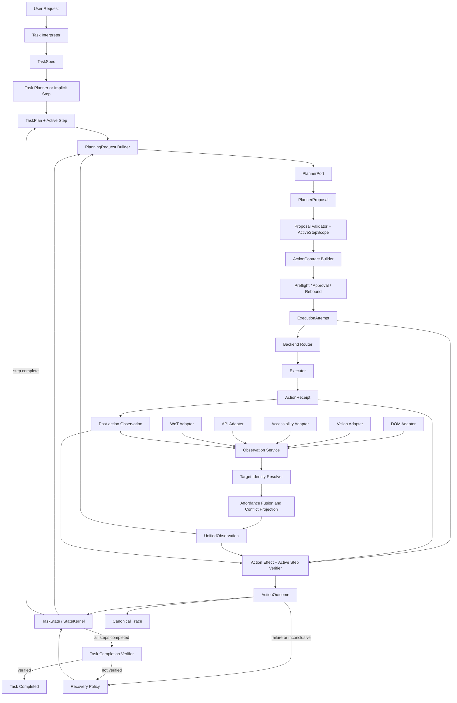

# Affordance Runtime 简化目标架构（优化版）

> **建议仓库路径：** `docs/superpowers/specs/2026-07-29-affordance-runtime-simplified-target-architecture.md`  
> **文档类型：** Target Architecture / Architecture Sustainability Decision  
> **状态：** `APPROVED_WITH_GUARDRAILS`  
> **适用基线：** `agent/migrate-runtime-components` @ `21f49e730a24640b00ef42fd3a3e98e1813f6656`  
> **实施状态：** `NOT_IMPLEMENTED_AS_A_WHOLE`  
> **默认生产进度权威：** 迁移完成后由 Runtime-owned active step 与独立 step verification 共同决定  
> **高级 attribution：** `EXPERIMENTAL_ONLY`  
> **日期：** 2026-07-29

---

## 0. 文档目的与权威关系

本文件冻结 Affordance Runtime 的长期默认生产架构，回答三个问题：

1. 项目真正需要长期保护的技术价值是什么；
2. 默认串行 GUI/设备任务需要保留哪些复杂度；
3. 哪些已经实现的高级 attribution 机制应停止进入默认主路径，并转为实验能力。

本文件不是一次性重构指令，也不立即改变当前 Runtime 行为。迁移期间：

- 当前 `TaskPlan / Subgoal / PlanProgress` 路径继续作为生产 authority，直到对应切换 slice 通过；
- 已实现的 ODG-2–ODG-9 代码保持 foundation/diagnostic 状态；
- ODG-10 obligation ledger commit 与 ODG-11 finish-authority migration 停止；
- 每个迁移阶段必须明确唯一生产 authority、shadow 输出、回滚条件与可执行 exit gate；
- 不允许同时让 legacy step progress、新 active-step progress 和 obligation ledger 三套结构都能完成任务。

本文件取代 ODG-0 作为**默认生产路径的长期目标架构**。ODG 设计与代码保留为高级 progress attribution 实验基础，不再是默认架构的完成前置条件。

---

## 1. 项目定位

Affordance Runtime 固定定位为：

> **一个从自然语言任务开始，面向长程 GUI 与设备任务，支持多来源感知、多后端执行、版本化动作合同、独立动作效果验证和有界恢复的 Planner-neutral Agent Runtime。**

默认闭环：

```text
自然语言任务
    ↓
TaskSpec
    ↓
TaskPlan / Runtime implicit step
    ↓
UnifiedObservation
    ↓
immutable PlanningRequest
    ↓
PlannerProposal
    ↓
Proposal validation against active-step scope
    ↓
versioned ActionContract
    ↓
preflight / approval / optional rebound
    ↓
ExecutionAttempt
    ↓
Executor
    ↓
ActionReceipt
    ↓
post-action UnifiedObservation
    ↓
action-effect + active-step verification
    ↓
ActionOutcome
    ↓
Advance / Continue / Recover / Replan / Finish
```

### 1.1 当前非目标

默认主路径不继续扩张为：

- 通用业务工作流引擎；
- 任意 evidence 到任意 obligation 的通用事后归因系统；
- 分布式 Agent 调度平台；
- 完整因果推断框架；
- 概率世界模型或 factor graph；
- 通用 Agent 操作系统；
- 多租户 durable worker 平台；
- 为 benchmark family 建立专用任务语义；
- 内部 LangGraph 微节点编排；
- Langfuse 或外部观测系统驱动业务完成。

---

## 2. 必须保护的核心能力

### 2.1 Natural-language intake

Runtime 必须从用户自然语言形成可验证的任务解释，而不能只接收预写工具调用。

最小任务权威：

```text
TaskSpec
  - task identity and revision
  - source text and minimal source references
  - goal
  - global constraints
  - task-level completion criterion
  - risk / approval policy
```

复杂任务可以形成：

```text
TaskPlan
  - ordered or dependency-constrained steps
  - active step
  - completion criterion per step
  - plan revision and supersession identity
```

简化的是默认运行时的通用 obligation graph 与通用 evidence attribution，不是删除所有来源约束。TaskSpec 与 StepSpec 仍需保存最小 source provenance，防止 Planner 或 TaskPlanner增加用户未授权的步骤与副作用。

### 2.2 Multi-source unified perception

项目最有辨识度的技术能力之一是：

```text
DOM / Vision / Accessibility / API / WoT
    ↓ schema normalization
UnifiedAffordance
    ↓ target alignment
stable Runtime target identity
    ↓ conflict-aware observation
UnifiedObservation
```

必须分别处理：

1. **Schema normalization**：不同来源投影为统一 affordance；
2. **Target alignment**：多个来源是否指向同一对象；
3. **Conflict representation**：来源不一致时显式保留冲突，不制造虚假融合真值；
4. **Freshness**：每项事实与目标绑定其观测 epoch；
5. **Backend binding**：Runtime target identity 与 backend-specific binding 分离。

### 2.3 Planner-neutral boundary

Runtime 依赖稳定的 PlannerPort，而不依赖 Planner 的内部 loop：

```python
class PlannerPort(Protocol):
    def propose(self, request: PlanningRequest) -> PlannerProposal:
        ...
```

Planner 可以是本地模型、云模型、规则 Planner、Parent Agent adapter 或其它 Agent framework。Planner：

- 只能提出 semantic proposal；
- 不接收 mutable StateKernel；
- 不直接调用 Playwright、视觉坐标 executor 或 WoT executor；
- 不提交 step completion；
- 不选择 state/trace mutation；
- 不携带 benchmark-specific authority。

### 2.4 Versioned ActionContract

PlannerProposal 不是执行命令。Runtime 将 proposal 绑定到版本化 ActionContract。

必须保留已经证明有价值的合同边界：

- environment / page / snapshot revision；
- target fingerprint 与 lease；
- grounding candidate 与 route plan；
- scope authorization；
- preconditions；
- expected effects；
- verifier plan；
- risk、capability 与 approval；
- idempotency、timeout 与 compensation；
- backend fallback。

本文中的简化 ActionContract 代码示例只表达概念字段子集，不授权删除现有安全和 stale-state 字段。

### 2.5 Receipt、effect 与 completion 分离

必须维持：

```text
ActionReceipt
≠
Action effect verification
≠
Step completion
≠
Task completion
```

Executor 接受了动作，只说明执行尝试成立。任务推进必须来自独立观测与 verifier。

### 2.6 Runtime-owned long-horizon state

Runtime 保存：

- TaskSpec；
- TaskPlan 或 implicit step；
- active step；
- completed/blocked steps；
- latest UnifiedObservation；
- latest ActionOutcome；
- recovery history；
- model/action/recovery budgets；
- final status。

完整历史属于 trace；Planner 只获得小型 immutable projection。

### 2.7 Bounded recovery

Recovery 是主 Runtime loop 的受控决策阶段，不是拥有第二执行路径的 Agent。

Recovery 处理：

- stale observation；
- missing / ambiguous target；
- action family unavailable；
- backend failure；
- transient execution error；
- expected effect absent；
- verifier inconclusive；
- active-step scope mismatch；
- invalid plan；
- no-progress；
- budget exhaustion；
- approval / clarification。

允许动作：

```text
reobserve
reground
switch_backend
retry
replan_step
replan_task
restore_checkpoint
ask_user
terminate_safely
```

Recovery 不绕过 ActionContract、preflight、Executor、Verifier 或 StateKernel。

---

## 3. 架构总览



---

## 4. 权威模型

### 4.1 Authority Matrix

| 领域 | 唯一权威 | 派生结构 | 禁止成为权威 |
|---|---|---|---|
| 用户任务要求 | `TaskSpec` | Planner summary、trace projection | Prompt、benchmark task name |
| 执行策略 | `TaskPlan` 或 implicit step | Planner view | ODG obligation graph |
| 当前进度 | `active_step_id`、`completed_step_ids`、step evidence | legacy subgoal projection | Planner scratchpad、external reward |
| 环境事实 | `UnifiedObservation` + verifier evidence | compact Planner context | receipt-only result |
| 动作执行 | `ActionContract` + `ExecutionAttempt` | executor encoding | Planner tool call |
| 动作结果 | `ActionOutcome` | trace、recovery summary | raw trace fragments |
| 状态与 trace commit | `RunCoordinator / StateKernel` | status API | collaborator、Planner |
| 任务最终完成 | `TaskSpec.completion_criterion` 的独立验证 | final response | “所有步骤走过”本身 |
| Benchmark 结果 | Evaluation artifact | score/report | Runtime completion |

### 4.2 单一进度权威

迁移完成后默认 production path 只允许：

```text
TaskPlan / implicit step
+ active_step_id
+ completed_step_ids
+ verified step evidence
```

高级 obligation ledger、candidate attribution 和 shadow comparison 不得更新默认完成状态。

### 4.3 步骤完成不等于任务完成

```text
all required steps completed
    +
TaskSpec completion criterion independently verified
    ↓
TaskCompleted
```

最后一个 step 完成后仍需 task-level completion verification。失败或 inconclusive 时进入 reobserve、replan 或 recovery。

---

## 5. 核心不变量

### AR-INV-01：Runtime-owned active step

只有 Runtime 决定 active step。Planner 不提交 active step ID、step switch 或 completion authority。

### AR-INV-02：单 effectful action 单 step

默认串行 profile 中，一个 effectful execution attempt 最多提交一个 active step。

### AR-INV-03：Progress commit barrier

下一轮 effectful planning 前必须完成：

```text
execute
→ post-observe
→ verify
→ ActionOutcome commit
→ step-state transition
```

### AR-INV-04：Active-step scope

每个 PlannerProposal 必须通过 Runtime-owned `ActiveStepScope`。跨到后续 step 的 effectful proposal在执行前拒绝。

### AR-INV-05：Receipt 不完成 step

Receipt success 不能产生 `StepCompleted`。

### AR-INV-06：External reward 不完成 Runtime task

Benchmark reward 只进入 evaluation artifact，不进入 StateKernel completion。

### AR-INV-07：Task-level final verification

所有步骤完成后仍需验证 TaskSpec completion criterion。

### AR-INV-08：最小 source provenance

TaskSpec、StepSpec 和 criterion 保留 source refs；TaskPlanner 不得增加未被来源支持的 effectful step。

### AR-INV-09：最终执行前身份

ExecutionAttempt 绑定 preflight、rebound 和 approval revalidation 后真正用于执行的 immediate pre-action observation。

### AR-INV-10：Planner-neutral

Planner 不 import Executor、Playwright、StateKernel mutation、benchmark adapter。

### AR-INV-11：Executor 与 Verifier 无 progress authority

Executor 只返回 receipt；Verifier 只返回 typed result；Coordinator 提交状态。

### AR-INV-12：一个 attempt 一个 canonical outcome

每个 effectful `execution_id` 最多有一个最终 `ActionOutcomeRecorded`。

### AR-INV-13：Advanced attribution isolation

默认 profile 不 import `experiments/advanced_progress_attribution`。

### AR-INV-14：无 task-specific core branching

Coordinator、Verifier、ProposalValidator 和 adapters 不使用 task name、benchmark family、URL、固定 selector 或 seed 作为业务分支。

---

## 6. 核心数据模型

以下为目标合同。迁移期间优先用 projection 和 compatibility adapter复用现有类型，不允许一次性创建平行生产权威。

### 6.1 SourceReference

```python
@dataclass(frozen=True)
class SourceReference:
    source_id: str
    start: int
    end: int
    digest: str
```

用途：

- 证明 TaskSpec 与 StepSpec 来源；
- 支持修正、replan 和审计；
- 防止 Planner 添加用户未授权步骤。

### 6.2 SuccessCriterion

使用封闭 union：

```python
SuccessCriterion = (
    ValueCriterion
    | StateCriterion
    | PresenceCriterion
    | AbsenceCriterion
    | NavigationCriterion
    | ArtifactCriterion
    | ApiCriterion
    | CompositeCriterion
)
```

每个 criterion 至少包含：

```text
criterion_id
subject / canonical target reference
relation
expected value
evidence kind
minimum evidence strength
source refs
```

`CompositeCriterion` 只允许显式 `all_of` / `any_of`，不执行任意表达式代码。

### 6.3 TaskSpec

```python
@dataclass(frozen=True)
class TaskSpec:
    task_id: str
    revision: int
    source_text: str
    source_refs: tuple[SourceReference, ...]
    goal: str
    constraints: tuple[str, ...]
    completion_criterion: SuccessCriterion
    risk_policy: TaskRiskPolicy
```

当前 intake schema 可通过 projection 迁移；在旧 schema 仍为生产 authority 时，不创建第二套可独立修改的 TaskSpec。

### 6.4 StepSpec

```python
@dataclass(frozen=True)
class StepSpec:
    step_id: str
    objective: str
    completion_criterion: SuccessCriterion
    depends_on: tuple[str, ...] = ()
    source_refs: tuple[SourceReference, ...] = ()
```

StepSpec 不保存 locator、backend handle、坐标、receipt 或状态 mutation。

### 6.5 TaskPlan

```python
@dataclass(frozen=True)
class TaskPlan:
    plan_id: str
    task_id: str
    based_on_task_revision: int
    plan_revision: int
    supersedes_plan_id: str
    steps: tuple[StepSpec, ...]
```

验证：

- step ID 唯一；
- dependency 引用合法且无环；
- replan 不改变 TaskSpec authority；
- verified completed step 不被静默丢失；
- flat task 可以没有显式 TaskPlan。

### 6.6 UnifiedAffordance

```python
@dataclass(frozen=True)
class UnifiedAffordance:
    target_id: str
    role: str
    label: str
    state: AffordanceState
    supported_actions: tuple[ActionFamily, ...]
    bindings: tuple[BackendBinding, ...]
    source_refs: tuple[SourceReference, ...]
    freshness: float
    confidence: float | None
    conflicts: tuple[SourceConflict, ...] = ()
```

`target_id` 是 Runtime semantic identity；backend locator只存在于 binding。

### 6.7 UnifiedObservation

```python
@dataclass(frozen=True)
class UnifiedObservation:
    observation_revision: str
    environment_revision: str
    page_revision: str
    affordances: tuple[UnifiedAffordance, ...]
    captured_at_ms: int
```

完整 DOM、截图、Accessibility tree 和 Thing Description 存为 artifacts，不进入常规 Planner input。

### 6.8 ActiveStepScope

```python
@dataclass(frozen=True)
class ActiveStepScope:
    step_id: str
    criterion_id: str
    progress_target_ids: tuple[str, ...]
    allowed_effectful_actions: tuple[ActionFamily, ...]
    support_target_ids: tuple[str, ...] = ()
    allowed_support_actions: tuple[ActionFamily, ...] = ()
```

它由 Runtime 根据 active StepSpec、当前 observation 和 grounding 构造。它不由 Planner 提供。

### 6.9 PlanningRequest

```python
@dataclass(frozen=True)
class PlanningRequest:
    task: TaskSpec
    plan: TaskPlan | None
    active_step: StepSpec
    active_step_scope: ActiveStepScope
    observation: UnifiedObservation
    recent_outcomes: tuple[ActionOutcomeSummary, ...]
    recovery_summary: RecoverySummary
    remaining_budget: RuntimeBudgetView
```

它是 StateKernel 的 immutable projection。

### 6.10 PlannerProposal

```python
@dataclass(frozen=True)
class PlannerProposal:
    action_family: ActionFamily
    target: TargetReference
    parameters: ActionParameters
    rationale_summary: str = ""
```

不包含 locator、Executor、StateKernel mutation、step completion、benchmark name。

### 6.11 ActionContract

概念子集：

```python
@dataclass(frozen=True)
class ActionContract:
    contract_id: str
    contract_hash: str
    observation_revision: str
    target_id: str
    action_family: ActionFamily
    parameters: ActionParameters
    preconditions: tuple[Precondition, ...]
    expected_effect: ExpectedEffect
    risk: RiskClass
```

现有 lease、fingerprint、route、gesture、capability、approval、verifier、timeout、compensation 等字段继续保留。

### 6.12 ExecutionAttempt

```python
@dataclass(frozen=True)
class ExecutionAttempt:
    execution_id: str
    active_step_id: str
    contract: ActionContract
    before_observation: ObservationIdentity
```

`before_observation` 必须是最终实际执行前 observation，而不是早期 planning snapshot。

### 6.13 ActionReceipt

```python
@dataclass(frozen=True)
class ActionReceipt:
    execution_id: str
    backend: str
    accepted: bool
    error_code: str = ""
    latency_ms: float = 0.0
    artifacts: tuple[str, ...] = ()
```

可由当前 `ExecutionReceipt` 兼容投影。

### 6.14 VerificationResult

```python
@dataclass(frozen=True)
class VerificationResult:
    execution_id: str
    step_id: str
    criterion_id: str

    action_effect_status: Literal[
        "observed",
        "not_observed",
        "inconclusive",
    ]

    step_status: Literal[
        "complete",
        "incomplete",
        "blocked",
    ]

    observed_deltas: tuple[StateDelta, ...]
    evidence_refs: tuple[str, ...]
    reason_code: str
    reason: str = ""
```

### 6.15 ActionOutcome

```python
@dataclass(frozen=True)
class ActionOutcome:
    execution_id: str
    active_step_id: str
    contract_id: str
    contract_hash: str
    before_observation: ObservationIdentity
    after_observation: ObservationIdentity
    receipt: ActionReceipt
    verification: VerificationResult
```

它是：

- 状态更新输入；
- recovery 输入；
- canonical trace event；
- evaluation 稳定单位。

### 6.16 RecoveryDecision

```python
@dataclass(frozen=True)
class RecoveryDecision:
    kind: Literal[
        "reobserve",
        "reground",
        "switch_backend",
        "retry",
        "replan_step",
        "replan_task",
        "restore_checkpoint",
        "ask_user",
        "terminate",
    ]
    reason_code: str
    reason: str
    budget_cost: int
    target_backend: str | None = None
```

### 6.17 TaskState

```python
@dataclass
class TaskState:
    task_spec: TaskSpec
    task_plan: TaskPlan | None
    active_step_id: str | None
    completed_step_ids: tuple[str, ...]
    blocked_step_ids: tuple[str, ...]
    latest_observation: UnifiedObservation | None
    latest_outcome: ActionOutcome | None
    recovery_attempts: int
    remaining_budget: RuntimeBudget
    status: TaskStatus
```

只有 Coordinator 或显式 state-transition owner提交变更。

---

## 7. Canonical Runtime Turn

```text
A. Resolve active step
B. Capture UnifiedObservation
C. Current-step precheck
D. Build immutable PlanningRequest
E. PlannerProposal
F. Validate proposal against ActiveStepScope
G. Build ActionContract
H. Preflight / approval / optional rebound
I. Create ExecutionAttempt from final contract and immediate pre-action observation
J. Execute
K. Capture post-action UnifiedObservation
L. Verify action effect and active-step criterion
M. Build one ActionOutcome
N. Coordinator commits outcome and step transition
O. If all required steps complete, verify task-level criterion
P. Continue / recover / replan / finish
```

### 7.1 Current-step precheck

Planning 前先检查当前 observation 是否已经满足 active-step criterion：

```text
current observation proves active step
→ complete one step
→ activate next
→ start next Runtime turn
```

一次 turn 最多推进一个 step，避免一次 observation 连续隐式完成整个计划。

### 7.2 Active-step proposal validation

Effectful proposal 必须：

- target 属于 `progress_target_ids`，或是显式 support target；
- action family 在对应 allowlist；
- 基于当前 observation revision；
- 不越过未完成 dependency；
- 不提交 step completion。

### 7.3 Post-action verification

Verifier 同时回答：

1. 本次 action expected effect 是否发生；
2. 当前 active-step criterion 是否完成。

### 7.4 Task-level completion

最后一个 required step 完成后：

```text
TaskCompletionVerifier
  complete      → TaskCompleted
  incomplete    → replan / recover
  inconclusive  → reobserve / ask_user
```

---

## 8. 多来源感知与融合

### 8.1 Lazy fusion

默认：

```text
DOM / Accessibility first
→ 几何或语义不足时 Vision
→ 设备属性/动作时 WoT
→ 冲突时 targeted active perception
```

避免每轮固定调用所有来源。

### 8.2 TargetIdentityResolver

唯一职责：

```text
source-local object
→ matched / ambiguous / unmatched / conflicted
→ Runtime target_id
```

使用：

- role；
- accessible name；
- label/token；
- geometry；
- DOM-to-screen mapping；
- page identity；
- stable application ID；
- WoT semantic metadata。

不负责 backend routing、planning 或 completion。

### 8.3 Conflict policy

来源冲突时：

1. 比较 freshness；
2. 验证 schema；
3. targeted re-observe；
4. 应用属性级 source authority；
5. 高风险且冲突未解决时拒绝执行。

概率融合保持实验性。

---

## 9. Recovery

### 9.1 输入

Recovery 只读取：

```text
typed failure
active step
latest ActionOutcome
latest UnifiedObservation
last contract
remaining budget
recovery history
```

### 9.2 No-op rejection

Recovery 必须改变至少一项：

- observation；
- target binding；
- backend route；
- Planner context；
- step plan；
- environment checkpoint；
- user information。

原样重复 proposal 不算 recovery。

### 9.3 默认预算

| Recovery | 默认预算 |
|---|---:|
| reobserve | 2 |
| reground | 2 |
| switch backend | 1 / backend |
| transient retry | 1 |
| replan step | 2 |
| replan task | 1 |
| restore checkpoint | 1 |
| ask user | 1 pending interaction |

---

## 10. Trace 与 Observability

### 10.1 Canonical trace

本地 JSONL 和 artifacts 是 Runtime source of truth：

```text
trace.jsonl
artifacts/observations/
artifacts/screenshots/
artifacts/receipts/
artifacts/verification/
```

### 10.2 Canonical business events

```text
TaskAccepted
TaskPlanCreated
ObservationCaptured
PlannerProposalValidated
ActionContractBound
ExecutionAttemptStarted
ActionOutcomeRecorded
RecoverySelected
RecoveryApplied
StepCompleted
TaskCompleted
TaskFailed
```

每个 effectful `execution_id` 最多一个最终 `ActionOutcomeRecorded`。

### 10.3 Diagnostic events

Grounding candidates、source arbitration、verifier details、model calls、experimental attribution 和 shadow comparison属于 diagnostic projection：

- 不参与 completion；
- 不参与 retry authority；
- 可按 profile 关闭；
- 不替代 domain state。

### 10.4 LangGraph 与 Langfuse

- Runtime 内部不改写为 LangGraph；
- LangGraph 保留为 Parent Agent / coarse workflow integration；
- Langfuse 或 OTel 作为 optional exporter；
- exporter 故障不得改变 Runtime 结果；
- 本地 JSONL 继续为 canonical trace。

---

## 11. 高级 Attribution 的实验边界

当前 ODG foundation 包括：

- obligation progress contracts；
- ready projection；
- current observation satisfaction；
- attribution ticket；
- evidence normalization；
- post-verification attributor；
- BoundActionExecution ticket carry；
- shadow projections。

处理策略：

```yaml
status: experimental_foundation
default_completion_authority: none
new_default_path_features: frozen
odg_10_commit: stopped
odg_11_finish_switch: stopped
```

只有以下需求被真实、重复地观测到时才重新评估：

- 一个 ActionOutcome 同时满足多个独立 step；
- evidence 异步到达；
- 多 Agent 并行推进同一 task；
- 任务允许任意顺序完成目标；
- 必须提供严格 evidence-to-goal 审计；
- active-step pre-binding 产生可测 false reject。

晋升必须证明：

```text
simplified path cannot express requirement
+
advanced attribution improves measured outcome
+
false completion does not increase
```

---

## 12. 当前代码到目标架构的映射

| 当前代码/概念 | 目标处理 |
|---|---|
| `TaskSpec` / intake authority | 保留，逐步投影为精简 TaskSpec view |
| `TaskPlan`, `SubgoalSpec` | 迁移为 StepSpec / TaskPlan compatibility source |
| `PlanProgress` | 迁移为 active/completed step state |
| `PlannerPort` | 保留，迁移到 immutable PlanningRequest |
| `PlannerContextBuilder` | 收敛到 PlanningRequest projection |
| `ActionContract` | 保留现有安全字段 |
| `ContractExecutionLoop` | 保留并作为 execution seam |
| `BoundActionExecution` | 演化为 ExecutionAttempt sidecar |
| `VerificationReport` | 保留底层 verifier evidence；投影为 VerificationResult |
| `SubgoalEvidenceBinder` | 收敛为 active-step criterion binding |
| `StateKernel` | 作为 TaskState 迁移基础 |
| `RunCoordinator` | 保留唯一 state/trace commit authority |
| `TaskPlanLifecycle.completed` | 迁移后不再是 task-level final authority |
| ODG-2–ODG-9 | 冻结为 advanced attribution experiment |
| ODG shadow trace | 新路径稳定后从 default profile 移除 |

---

## 13. Owner Matrix

| 责任 | 唯一 Owner | 禁止承担 |
|---|---|---|
| Natural language → TaskSpec | TaskInterpreter | 不执行动作 |
| TaskSpec → TaskPlan | TaskPlanner | 不读取 Executor |
| Active step selection | Runtime step scheduler | 不调用 Planner |
| ActiveStepScope | Step scope resolver | 不完成 step |
| 下一动作 | PlannerPort implementation | 不修改 StateKernel |
| Observation capture | ObservationService | 不规划 |
| Target alignment | TargetIdentityResolver | 不路由 backend |
| Affordance fusion | AffordanceFusion | 不提交 progress |
| Proposal validation | ProposalValidator | 不重新规划 |
| Proposal → contract | ActionContractBuilder | 不执行 |
| stale/precondition | PreflightService | 不放宽 policy |
| backend route | BackendRouter | 不判断 task complete |
| action execution | Executor | 只返回 receipt |
| action/step verification | ActiveStepVerifier | 不写 StateKernel |
| task final verification | TaskCompletionVerifier | 不写 StateKernel |
| recovery choice | RecoveryPolicy | 不直接执行 |
| state/trace commit | RunCoordinator | 不实现 criterion matching |
| benchmark score | Benchmark Adapter | 不影响 Runtime authority |

---

## 14. 逻辑模块布局

以下是长期逻辑边界，不授权立即移动目录：

```text
affordance_runtime/
  intake/
    task contracts
    task interpreter
    task planner

  perception/
    observation contracts
    observation service
    fusion
    target identity
    adapters/

  planning/
    PlanningRequest
    PlannerPort
    proposal validator
    active-step scope

  execution/
    ActionContract
    contract builder
    preflight
    backend router
    execution loop
    executors/

  verification/
    criterion contracts
    active-step verifier
    task completion verifier

  recovery/
    failure classifier
    policy
    owner ports

  runtime/
    coordinator
    state
    transitions
    budgets
    action outcome

  trace/
    canonical events
    JSONL sink
    optional exporters

  integrations/
    parent agent
    langgraph
    browsergym

  experiments/
    advanced_progress_attribution/
    probabilistic_fusion/
```

目录重排只在 ownership 已稳定后实施。

---

## 15. Architecture Gates

1. Planner 不 import Executor、Playwright 或 StateKernel mutation。
2. PlannerPort 不接收 mutable StateKernel。
3. PlannerProposal 不含 step completion authority。
4. ProposalValidator 必须验证 ActiveStepScope。
5. Executor 不接收 active step、TaskPlan 或 progress metadata。
6. Verifier 不修改 StateKernel。
7. Coordinator 不实现 criterion matcher、target heuristic 或 task-specific regex。
8. RecoveryPolicy 不直接调用 Executor。
9. Receipt / external reward 不能产生 StepCompleted。
10. Precondition 不得进入 completed steps。
11. 每个 effectful attempt 最多一个 ActionOutcome。
12. 一个 ActionOutcome 最多提交一个 active step。
13. 所有 required steps 完成后必须验证 TaskSpec completion criterion。
14. Benchmark adapter 不修改 completion。
15. 默认 profile 不 import advanced attribution experiment。
16. 公共 typed result 必须深层只读或边界复制。
17. 新 collaborator 必须进入 authority-free manifest。
18. `coordinator.py`、`run_sync()` 和其它 ratchet 只能下降，不能因迁移增长。

---

## 16. 评估与完成条件

### 16.1 Functional

- flat click/type/select/read 可无显式 TaskPlan 完成；
- 串行 text → select → slider → checkbox → submit 正确推进；
- Planner 不能跨未完成 step；
- current-state precheck 可完成已满足 step；
- final task criterion 能阻止假完成；
- stale/preflight/rebound/approval path identity 正确；
- receipt-only 与 external reward 不完成 step；
- recovery 通过同一执行路径。

### 16.2 Multi-surface

- DOM-only；
- Vision-only；
- WoT-only；
- Unified；
- recovery on/off。

### 16.3 Quality

- full pytest；
- Ruff；
- mypy；
- `uv build`；
- diff check；
- architecture gates；
- current revision evidence identity；
- PR breadth 与 fresh diagnostic 仅在指定切换节点运行。

---

## 17. Change Control

以下原则变更必须提交 architecture amendment：

```text
Runtime-owned active step
TaskSpec final completion authority
Planner-neutral proposal boundary
ActionContract safety fields
receipt/effect/completion separation
Coordinator single-writer authority
advanced attribution experimental-only
canonical local trace
LangGraph external-only
observability non-authoritative
```

Amendment 必须包含：

- 变更原因；
- 受影响不变量；
- RED；
- migration/rollback；
- authority transition；
- benchmark/evidence要求。

---

## 18. 最终决议

```yaml
architecture:
  status: APPROVED_WITH_GUARDRAILS
  implementation: NOT_IMPLEMENTED_AS_A_WHOLE

default_runtime:
  progress_authority: runtime_owned_active_step
  task_completion_authority: task_spec_completion_criterion
  planner_input: immutable_planning_request
  planner_output: semantic_proposal_only
  action_cardinality: one_effectful_action_per_turn
  verification: independent_action_and_step_verification
  recovery: bounded_same_path
  trace: canonical_local_jsonl

advanced_attribution:
  status: experimental_only
  odg_10_commit: stopped
  odg_11_finish_switch: stopped
  default_profile_import: prohibited

migration:
  strategy: incremental_shadow_then_cutover
  big_bang_rewrite: prohibited
  dual_authority: prohibited
```
