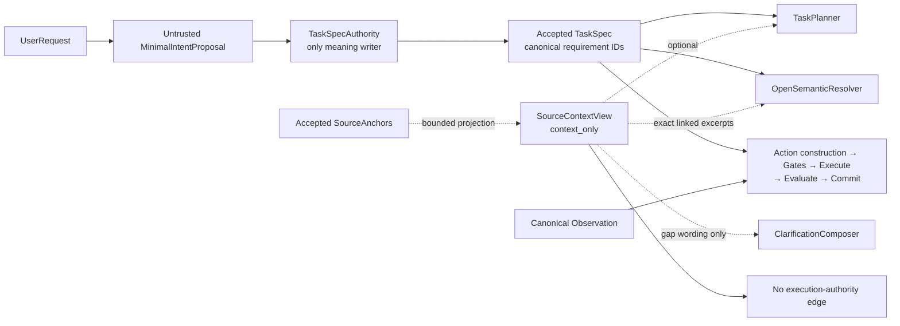
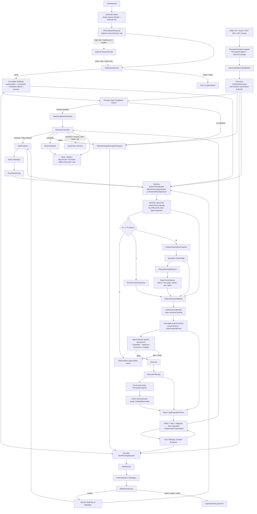
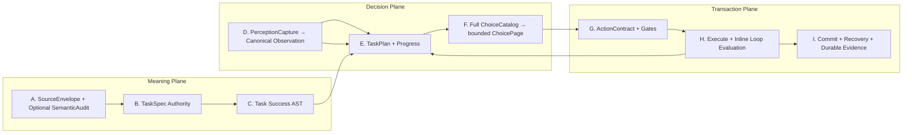
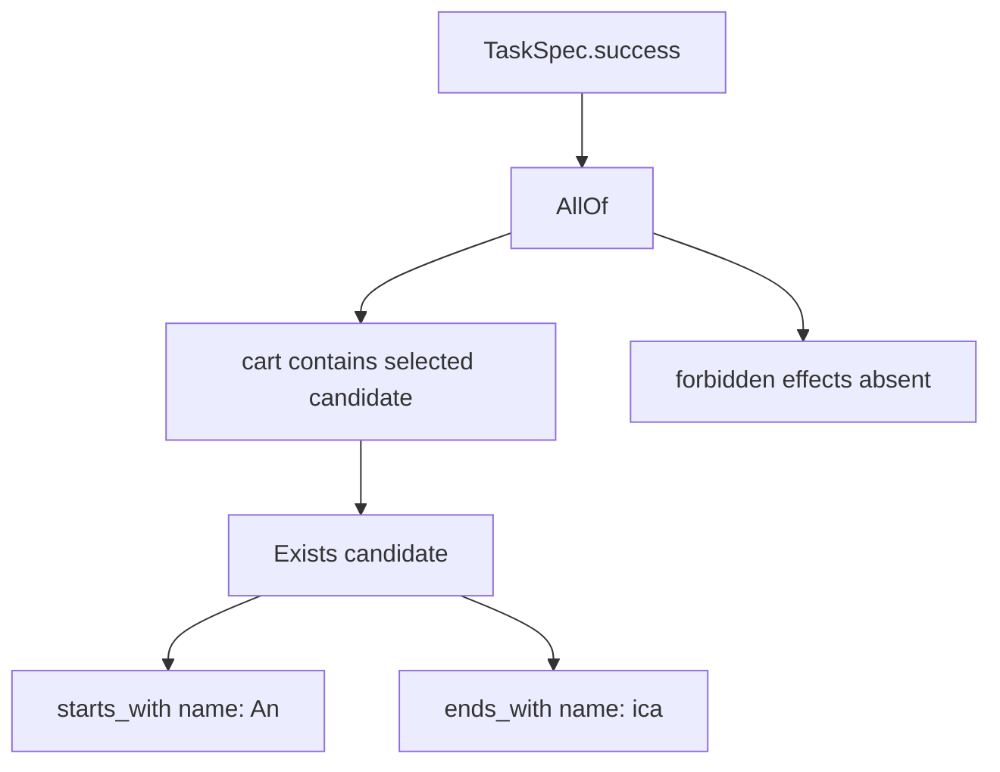
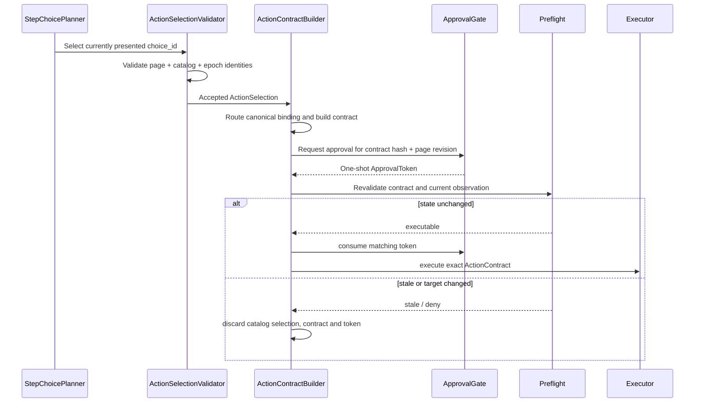
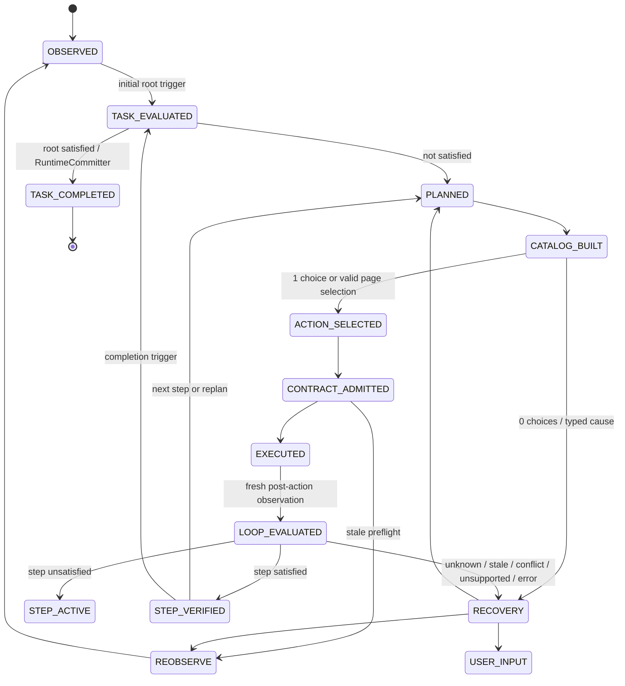
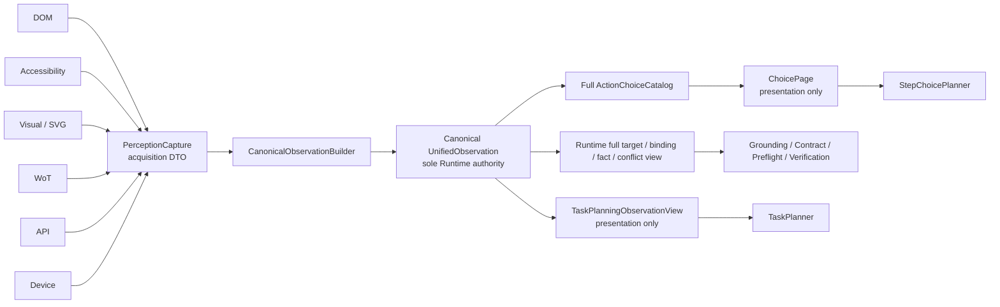

# Affordance Runtime：Task Contract 中心化唯一权威目标架构

> **文档类型：** Authoritative Target Architecture / Architecture Decision
> **状态：** AUTHORITATIVE TARGET — NOT IMPLEMENTED AS A WHOLE
> **生效日期：** 2026-08-05
> **事实基线：** `agent/migrate-runtime-components @ 55bad91e56126269af7453913cf550cb5938108f`
> **最新实现复核：** 2026-08-06 P4-G concrete action authority/high-risk governance 已完成；精确不可变 revision 由 Git 记录。
> **演进来源：** [Task Contract 中心化 Runtime 架构演进规划](../plans/2026-08-05-task-contract-centered-runtime-architecture-evolution-plan.md)
> **冲突优先级：** 本文取代 2026-07-29 权威架构中与 TaskSpec、TaskPlan、TaskProgress、observation/choice authority、criterion/evidence 和 task completion authority 冲突的目标设计；未冲突的 ActionContract、capability、approval、verification、recovery、single-writer、trace 和 benchmark governance 设计继续有效。
> **2026-08-05 Active-step 修正：** `ActionChoiceCatalog` 必须从 canonical observation 完整建立后，才允许生成任何 model-facing `ChoicePlanningRequest`；旧的 `PlanningRequest → ActionChoiceSet` 顺序无效。
> **2026-08-05 Source / Verification 收口：** 默认 intake 采用 `SourceEnvelope + selective SourceAnchor`，旧 SourceLedger clause/claim/obligation coverage 迁入 optional `SemanticAudit`；verification 采用 loop-native typed `LoopEvaluationPhase`，但 `TaskCompletionEvaluator` 与 `RuntimeCommitter` 继续保持逻辑与写权限隔离。
> **2026-08-05 Semantic Authority / Contract Closure 补充：** 第一轮审查的 requirement identity、dependency、choice presentation 与 output closure 建议继续有效；第二轮审查覆盖其严格 raw-text firewall，最终采用 `single semantic admission, bounded contextual rereading, no downstream authority expansion`。
> **2026-08-05 Physical Minimality 补充：** 本文中的完整性、authority 与 store 是逻辑合同，不自动要求全量内存物化、独立 class/service/process/database/model call；首期采用 indexed/ref-based state、in-process policy composition、typed trigger 与 risk-derived feature profile。
> **2026-08-05 Cross-Surface Visibility 补充：** DOM、AX、Visual、SVG、WoT、API 与 Device 是共享 TaskSpec/TaskPlan/Catalog/ActionContract/LoopEvaluator 的 acquisition、grounding、execution 与 evidence surfaces；WoT 显式进入图与 vocabulary，但不形成独立 Agent/Planner/TaskSpec。
> **2026-08-05 Material Binding 纠偏：** material authority 采用 effect-specific typed binding coverage，而不是字符级 span 配额。直接、明确的用户值可用 `DIRECT_USER_EXPLICIT` 准入；间接非结构化来源才要求 exact excerpt，结构化外部来源使用 versioned field identity。`SourceAnchor` 只证明 provenance，不能替代字段完整性、capability、approval、grounding 或 ActionContract。
> **2026-08-06 Concrete Effect Authority / High-risk Governance 收口：** TaskSpec 只保存 parameterized typed `EffectAuthorizationScope`；Runtime 必须从 current canonical target/backend/binding 派生 concrete `RuntimeEffectSignature`，两者经 typed subsumption 得到 `ALLOW | DENY | UNPROVEN` 的 `ActionAuthorityProof`。目标 label、值集合、Planner 声明、source 自报 risk、approval 或 capability 都不能填补 proof 缺口；高风险动作只有在 proof、capability、exact contract approval、fresh preflight 与 effect-specific causal/final verification policy 全部闭合后才可执行。该收口不枚举页面/任务类型，只冻结小型 effect vocabulary、可扩展 operation refs 与字段化参数绑定。

## 0. 权威决议

系统的四个长期权威对象固定为：

```text
TaskSpec
    用户授权与任务完成语义的唯一权威

TaskPlan<StepSpec>
    当前 observation 下执行假设的唯一权威

ActionContract
    当前状态下单次可执行事务的唯一权威

TaskProgress + ledgers
    已验证事实、绑定、最近 ActionOutcome、durable evidence 与执行进度的唯一权威
```

Meaning Plane 另有一个始终存在但不拥有语义解释权的输入 authority object：

```text
SourceEnvelope
    本次任务合法输入来源 identity/version 的唯一权威
```

每一轮另有两个不可反向重建的 epoch authority：

```text
Canonical UnifiedObservation
    当前已采集世界语义的唯一权威

Runtime-owned full ActionChoiceCatalog
    当前 task/plan/step/observation/capability/policy 下合法动作空间的唯一权威
```

它们是带 identity/digest 的 immutable epoch，不是新增任务语义图。任何 model view 都只能由它们单向投影，不能反向成为 Runtime authority。

四条不可违反的等式是：

```text
TaskSpec = what + authorization boundary
TaskPlan = replaceable how under current observation
ActionContract = one grounded, gated, expiring transaction
TaskCompleted = verified closure(TaskSpec.success)
```

四条不可成立的等式是：

```text
obligation ≠ step
receipt success ≠ action effect observed
step complete ≠ task complete
plan exhausted ≠ task completed
model presentation space ≠ runtime candidate space
source envelope ≠ semantic claim graph
loop-native evaluation ≠ planner-owned completion
raw language visibility ≠ semantic authority
requested output declared ≠ required output materialized
```

### 0.1 架构法律

1. **Source 默认只做 envelope-level authority binding。** `SourceEnvelope` 始终存在；material fields 使用风险相称的 typed `MaterialBinding`，精确 `SourceAnchor` 只在间接非结构化来源需要 excerpt provenance 时使用；clause/claim/obligation coverage 只在 optional SemanticAudit 中按风险运行。
2. **Planner 只消费 admitted semantics。** Task Planner 默认消费 TaskSpec；确有里程碑语用需要时可额外接收 bounded、read-only、`context_only` 的 `SourceContextView`。Planner 不得修订任务含义、授权、禁止效果或成功条件；Step Choice Planner 默认不得接收原始请求。
3. **角色由容器定义。** precondition、step completion、task success 与 evidence policy 不能靠漂移 enum 猜测。
4. **计划服从当前事实。** TaskPlan 必须基于 fresh canonical observation 生成并允许被整体替换。
5. **Runtime candidate space 先于 model presentation space。** Runtime 从 canonical observation 生成完整 `ActionChoiceCatalog`；模型只可在当前 `ChoicePage` 选择已展示 choice ID，或返回封闭的翻页、typed refinement、ask/defer 决策。
6. **审批靠近动作。** ApprovalToken 绑定具体 ActionContract 和当前页面状态，不提前批准计划或动作族。
7. **执行与求值分离。** Executor 只返回 receipt；loop-native `LoopEvaluator` 返回 effect、step、task 与 observation continuation 的 typed evaluation，不执行动作、不写状态。
8. **只有 durable evidence 跨 epoch。** current facts 留在 canonical observation，动作因果留在 bounded recent ActionOutcome，artifact/resource/transaction/human confirmation 才进入 DurableEvidenceStore。
9. **只有 RuntimeCommitter 写权威状态。** Planner、LoopEvaluator、EvidenceProvider、RecoveryPolicy 和 Executor 都返回 typed result，不直接修改 StateKernel。
10. **迁移必须替代旧 owner。** 新 canonical owner 上线时必须有 legacy deletion gate，不维持无限 projector 链。
11. **逻辑完整不等于全量物化。** full Catalog 与 canonical observation 可以使用 immutable index、lazy/query-backed membership 和 ref-based epoch；逻辑 membership、digest、coverage、conflict 与 rejection semantics 必须稳定。
12. **逻辑 authority 不等于部署边界。** Authority 可以由 pure function、immutable validator 或同进程 policy composition 实现；只有真实的隔离、并发、规模或法规需求才允许拆成独立 service/store/model call。
13. **Surface 只提供事实、binding、dispatch 与 evidence。** DOM/AX/Visual/SVG/WoT/API/Device 共享一套任务与动作权威；Planner 选择 semantic action，Runtime 在 ActionContractBuilder 中选择 current backend/binding。
14. **授权 scope 与 concrete effect 分权。** TaskSpec 的 `EffectAuthorizationScope` 只表达用户允许的 effect ceiling；Runtime 的 `RuntimeEffectSignature` 只表达 current target/backend/binding 的实际动作事实。二者不得共用一个对象、从对方反向恢复，或由 Planner 创建。
15. **授权匹配结构，不匹配字符串集合。** typed subsumption 必须同时约束 effect class、operation constraint、canonical resource scope、destination、named parameter slots、externality、reversibility、capability 与 policy；target label、subject/objective 文本、关键词和无字段名的 value set 只能用于展示或 clarification，不能证明权限。
16. **Runtime 拥有 concrete effect/risk/assurance classification。** Adapter/source 可以提供 typed assertions，但最终 `RuntimeEffectSignature` 与 Runtime risk 由 Harness policy 合并 operation/backend facts、externality、reversibility、resource sensitivity、amount/recipient、capability、conflict、freshness 与 assurance。缺失或相互矛盾的 material classification 是 `UNPROVEN`，不是 LOW。Text/VLM 只能提高风险或触发更强观察/澄清，不能产生 ALLOW、降低风险或创建 authorization。
17. **Action authority 是可验证 proof，不是 Boolean hint。** Catalog 只接纳 `ALLOW` proof；`DENY` 表示已证明越界，`UNPROVEN` 表示证据不足并走 perceive/clarify/block。Proof 必须绑定 evaluator policy version。Approval 与 capability 只能在 ALLOW 后继续收窄，不能把 UNPROVEN 升级为 ALLOW。
18. **Gate 复核 actual bound transaction。** Task Authority Gate 必须使用 TaskSpec、current observation 与 ActionContract 的实际 target/destination candidate、operation、named parameters、binding/source assurance 重建 proof；不得只复算从 choice 复制到 contract 的 label/digest。

### 0.2 Active-step 核心不变量

```text
ActionChoiceCatalog = f(
    TaskSpec revision,
    TaskPlan revision,
    active StepSpec,
    TaskProgress,
    Canonical UnifiedObservation,
    effective capabilities,
    Runtime policy
)
```

`f` 的输入中禁止出现：

```text
max_model_affordances
max_model_artifact_refs
max_label_chars
max_state_summary_fields
provider token limit
context compaction generation
ChoicePage page_size
```

因此，在上述合法输入相同的前提下，改变任何 model presentation policy 都必须得到相同 `catalog_digest`。

### 0.3 Source 与 Verification 收口不变量

```text
SourceEnvelope
    always-on, lightweight, immutable

SemanticAudit
    risk-triggered, optional, veto / clarify only

LoopEvaluator
    physically inside the execution loop, logically authority-isolated

TaskCompletionEvaluator
    pure evaluator of TaskSpec.success + constraints + final rechecks

RuntimeCommitter
    sole writer of TaskCompleted
```

这既不是删除 provenance/verification，也不是建设两个平行大平台；它把细粒度审计和复杂 evidence orchestration 从默认主链移出，同时保留来源授权边界和独立完成权威。

### 0.4 Semantic Authority 与 Task Contract closure 不变量

本架构限制的是 accepted meaning 的写权限和 authority elevation，不是所有语言文本的读取次数：

```text
single semantic admission
+ bounded contextual rereading
+ no downstream authority expansion
```

Raw language visibility and semantic authority are separate。三层边界固定为：

1. **Meaning Authority Boundary：**只有 `TaskSpecAuthority` 可以 admit/revise accepted requirement、authorization、constraint、forbidden effect 与 success semantics。
2. **Read-only Semantic Context Boundary：**`TaskPlanner`、`OpenSemanticResolver` 与 `ClarificationComposer` 可按需读取 source-bound、明确 `context_only` 的片段；其输出必须引用现有 canonical IDs。
3. **Raw-text-free Execution Authority Boundary：**action-space construction、grounding、contract binding、authority/capability/approval/preflight、execution、loop evaluation、task completion 与 commit 不读取 raw user language，也不能从 objective/source excerpt 临时猜权限或完成条件。



原始语言可以被受限参考，但 accepted task meaning 只有一份。若下游发现 admitted TaskSpec 缺少必要语义，只能返回 `TaskSpecGap` 或 `ClarificationRequired`；不能静默补写 TaskSpec、StepSpec effect 或 ActionContract。

### 0.5 Physical Minimality 与风险分层

目标架构区分 logical contract 与 physical realization：

```text
logical completeness    != eager materialization
logical authority       != class/service/process boundary
logical evidence layer  != one database per namespace
replaceable TaskPlan    != replan on every loop
optional capability     != enabled on every task
```

首期 Runtime 必须是 modular monolith。TaskSpec/TaskPlan admission、ActionContract gates、LoopEvaluator 与 completion evaluation 可以由同进程 pure collaborator 或固定顺序 policy composition 实现，只要 typed input/output、deny semantics、write boundary 与测试隔离保持不变。

能力按任务合同、风险与实际规模派生，而不是手动削弱正确性的模式开关：

| Feature profile | 默认启用 | 按需增加 |
|---|---|---|
| `DIRECT_LOW_RISK` | SourceEnvelope、TaskSpec、canonical observation、direct/single-step plan、small Catalog、ActionContract、mechanical evaluation | 不默认启用 SemanticAudit、paging、ModelVerifier、OpenSemanticResolver 或 durable transaction evidence |
| `MULTI_STEP` | 上述能力 + rolling TaskPlan、bindings、bounded recent outcomes、typed replan、artifact handoff | 仍不默认启用高风险审计或 model evidence |
| `HIGH_RISK_MULTI_SOURCE` | 上述能力 + effect-specific material coverage、indirect-source exact excerpts、risk-triggered SemanticAudit、approval、authoritative final recheck、material-conflict handling、必要 durable evidence | 只启用任务实际需要的 provider/sidecar |

Profile 只能决定 optional machinery 是否激活，不能关闭 Task authority、capability、必要 approval、freshness/preflight、required-output closure、uncertain-effect protection 或 RuntimeCommitter single-writer。

## 1. 唯一权威总图



图中的 `TaskSpecAuthority`、`TaskPlanAuthority`、`ActionSelectionValidator` 与四重 gate 都是必须保留的 authority boundary。所谓“扁平化”只删除重复语义表示与有损 projector，不合并这些安全阶段。`ChoicePlanningRequest` 在 Catalog 的 N-choice 分支内才存在；它不参与 Catalog membership、grounding admission 或 permitted-action 计算。

## 2. 三个平面与九个细节板块



### 板块 A：Source 与 Minimal Intent

`SourceEnvelope` 默认、轻量、始终存在，只保存 whole-request identity/digest、conversation/attachment/target/profile refs、caller identity 与 conversation revision。原始全文只在 intake 短生命周期上下文中存在；Trace 默认只保存 hash/length/refs。

`SourceAnchor` 是 selective provenance primitive：ordinary low-risk field 可引用 whole-request anchor；间接的 attachment/email/web/profile 自然语言中，recipient、amount、account、file、external destination、destructive target、forbidden effect、approval-related constraint 等 material field 应使用精确 source/span anchor。直接用户明确输入不因缺少字符 offset 而失败；typed external ingress 使用 resource/version/field identity。默认不做 clause splitting、claim graph、coverage graph 或 obligation graph。

`MinimalIntentProposal` 只表达：

- source-bound requirements；
- allowed/forbidden effect proposal；
- hard constraints 与 preferences；
- desired outputs；
- typed semantic expressions；
- explicit dependencies；
- ambiguities；
- source dispositions。

它是不可信 proposal，不能携带 accepted task identity、capability grant、步骤、selector、approval 或 completion state。

`TaskSpecAuthority` 内的小型 `MaterialBindingPolicy` 先按 effect 校验必需 material fields；`SemanticAudit` 只在 external/irreversible effect、多 authority sources、attachment/profile 参与授权、source conflict、解释异常、material field ambiguity 或 policy-required audit 时运行。它只能 `PASS | VETO | CLARIFICATION_REQUIRED`，不得承担普通字段完整性检查，不得补写 effect、修改 success、授予 capability，或把 observation/page content 提升为用户授权。

### 板块 B：TaskSpec Authority

`TaskSpecAuthority` 是 task meaning 的唯一准入 owner。它负责 schema、SourceEnvelope/Anchor lineage、audit disposition、canonical ID、dependency consistency、risk policy、capability ceiling、criterion policy、open semantic preservation、deep freeze 与 revision identity。

它只允许四类结果：

```text
ADMITTED(TaskSpec)
REPAIR_REQUIRED(bounded, at most once)
CLARIFICATION_REQUIRED(question)
REJECTED(typed reason)
```

它不得补写模型漏掉的 submit/delete/payment，不得从 raw text 恢复 action family，也不得把风险较低的猜测升级成用户授权。

### 板块 C：Task Success AST

TaskSpec.success 是终态完成语义的唯一根节点。所有 task-level verification 都从该根节点递归求值；`success_criteria` 字符串、terminal obligation、最后一个 step 或 Planner finish 都不能成为第二权威。

### 板块 D：Canonical Observation

`PerceptionCapture` 只记录各 adapter 实际采集的 raw/semistructured inputs 与 coverage；`CanonicalObservationBuilder` 随后构造 Runtime-owned canonical `UnifiedObservation`。Runtime grounding、choice building、preflight 和 verifier 读取完整 canonical target view；模型只读取单向派生的 bounded projection。

### 板块 E：TaskPlan 与 Progress

TaskPlan 是 current observation 下的可替换 Milestone DAG；TaskProgress 是 facts、bindings、bounded recent ActionOutcomes、durable evidence 与 budgets 的 ledger-backed 状态。Plan 不复制历史，Progress 不复制 plan 图或 current observation facts。

### 板块 F：Runtime Choices 与 Step Selection

ActionChoiceBuilder 根据 task/plan revision、active Step、TaskProgress、canonical observation、effective capabilities 与 Runtime policy 产生完整 0/1/N `ActionChoiceCatalog`。0 走确定性 failure classification，1 由 Runtime 选，N 才投影 `ChoicePage` 并调用 StepChoicePlanner；Planner 不能生成新动作，也不能选择当前页未展示的 ID。

### 板块 G：ActionContract 与 Gates

ActionContractBuilder 把 accepted semantic choice 与 current grounding 绑定成单动作合同。合同依次通过 Task Authority、Capability、Approval 与 Freshness/Preflight gate，任何一项失败都禁止执行。

### 板块 H：Execute 与 Verify

Executor 返回 receipt；PostActionObserver 捕获 fresh canonical state；inline LoopEvaluationPhase 对 action effect、active-step completion、triggered task completion 与 observation continuation 一次求值。四层结果不同，不得互相替代。LoopEvaluator 是 pure collaborator，不是独立服务。

### 板块 I：Commit、Recovery 与 Evidence

RuntimeCommitter 串行提交 TaskProgress、StateKernel 与 canonical trace；只有它能从 satisfied TaskCompletionEvaluation 产生 TaskCompleted。Recovery 由 typed cause 决定 owner。Trace/Artifact/Benchmark/Evolution 只消费已提交事件，不反向决定本次任务是否成功。

## 3. 系统只保留两张语义图

### 3.1 TaskSpec 成功表达式树



这张树表达用户最终想要什么、允许什么和禁止什么。它不包含 action sequence、UI selector、页面依赖或当前环境推断，不随页面变化。

### 3.2 当前 TaskPlan DAG


这张图表达 Runtime 在当前 observation 下准备经过哪些独立可验证里程碑完成任务。它可以被缩短、扩展、替换或废弃。

### 3.3 明确不是语义图的对象

- SourceEnvelope / SourceAnchor / SemanticAudit：输入 identity、选择性 lineage 与可选审计，不是 semantic graph；
- DurableEvidenceStore：只保存跨 epoch 的 artifact/resource/transaction/human evidence，不是全量 EvidenceGraph；
- TraceDag：审计历史；
- ActionChoiceCatalog：当前 active-step/canonical-observation epoch 的完整合法候选集合；
- ActionContract：一个动作事务；
- TaskProgress：当前执行状态与 ledger refs。

默认生产路径不再长期维护 obligation DAG、StepSpec DAG、SubgoalSpec DAG 和 projected StepSpec DAG 四套重叠结构。

### 3.4 四种语义角色的唯一落位

| 角色 | 唯一容器 | 能推进 Step | 能完成 Task |
|---|---|---:|---:|
| `PRECONDITION` | `StepSpec.preconditions` 或 `ActionContract.preconditions` | 否 | 否 |
| `PROGRESS_EFFECT` | `StepSpec.completion` | 是 | 否 |
| `TERMINAL_EFFECT` | `TaskSpec.success` | 可间接 | 是 |
| `EVIDENCE_ONLY` | criterion 的 `CriterionPolicy` + current/outcome/durable evidence | 否 | 否 |

Predicate 自身不携带可漂移的 terminal role。相同 `available` predicate 放在 preconditions 时只是动作前提；如果某一步的局部里程碑确实是“高级设置表单 available”，它也可以合法地出现在该 Step 的 completion。语义角色由合同位置决定，而不是由 relation 名称决定。

## 4. SourceEnvelope、SemanticAudit 与 TaskSpec v2

### 4.1 SourceEnvelope

```python
@dataclass(frozen=True)
class SourceEnvelope:
    envelope_id: str
    request_id: str
    request_text_ref: str
    request_text_sha256: str
    conversation_refs: tuple[str, ...]
    attachment_refs: tuple[str, ...]
    target_refs: tuple[str, ...]
    profile_context_refs: tuple[str, ...]
    caller_identity: str
    conversation_revision: str
```

`SourceEnvelopeBuilder` 是 code-owned deterministic builder。它只回答“哪些 source 是本次任务的合法 authority input、其 identity/version 是什么”，不回答“source 表达了什么”。默认不生成 clause units，不受 32-clause bound 限制，也不要求模型输出 coverage/claim/obligation graph。

### 4.2 Selective SourceAnchor 与 risk-proportionate MaterialBinding

```python
@dataclass(frozen=True)
class SourceAnchor:
    anchor_id: str
    source_ref: str
    span_start: int | None = None
    span_end: int | None = None
    content_digest: str = ""
```

`SourceAnchor` 只证明 lineage；它不证明 proposal interpretation 正确，也不授予 capability、approval、grounding、execution 或 completion 权。普通低风险字段允许 whole-request anchor。字符级 exact span 只对间接、非结构化来源中的 material value 提供 excerpt provenance，不是所有高风险请求的通用准入门。

```python
class MaterialBindingKind(Enum):
    DIRECT_USER_EXPLICIT = "direct_user_explicit"
    EXACT_SOURCE_EXCERPT = "exact_source_excerpt"
    TYPED_EXTERNAL = "typed_external"
    USER_CONFIRMED = "user_confirmed"

@dataclass(frozen=True)
class MaterialBinding:
    binding_id: str
    effect_ref: str
    field: MaterialField
    value: TypedValue
    source_ref: SourceRef
    binding_kind: MaterialBindingKind
    source_anchor_ref: SourceAnchorRef | None = None
    external_field_ref: str | None = None
    confirmation_ref: ConfirmationRecordRef | None = None
```

来源与风险规则固定为：

| 来源形式 | 可接受的 material binding | 准入要求 |
|---|---|---|
| 当前 user request 中直接明确的 typed value | `DIRECT_USER_EXPLICIT` | value 必须能在 request 中确定性匹配；不要求字符 offset |
| attachment/email/web/profile 等间接非结构化文本 | `EXACT_SOURCE_EXCERPT` | field-matched exact anchor，且 excerpt digest 与 typed value 一致 |
| typed external ingress | `TYPED_EXTERNAL` | versioned source identity + typed field path；不得来自 Runtime observation target |
| 后续用户确认 | `USER_CONFIRMED` | 绑定明确的 versioned conversation confirmation record；不得由模型或页面自确认 |
| DOM/AX/Visual/SVG/WoT/API/Device current observation | 不可作为 material authorization | 只可用于 grounding、state、preflight 与 evidence |

`MaterialBindingPolicy` 是 `TaskSpecAuthority` 的小型 deterministic admission collaborator，不是 graph、store、service 或第二次模型审查。它按每个 effect 的稳定 ID 校验字段组：

| Effect kind | 必需字段组 |
|---|---|
| `SEND` | recipient；external destination 或 channel；content 或 attachment/file |
| `PAYMENT` | payee 或 account；amount；currency |
| `DELETE` | destructive target；scope |
| `SHARE` | principal；resource；permission |

同一 effect 的一个不相关 FILE/AMOUNT anchor 不能替代 recipient/payee/account；whole-request anchor 不能替代间接来源的 exact/typed binding。字段缺失、同字段冲突或来源不足返回 typed clarification/veto。具体 action-time approval 仍绑定完整 ActionContract；material admission 不等于提前批准动作。

### 4.3 MinimalIntentProposal 与 optional SemanticAudit

```python
@dataclass(frozen=True)
class MinimalIntentProposal:
    objective: str
    inputs: tuple[InputProposal, ...]
    requested_effects: tuple[EffectProposal, ...]
    constraints: tuple[ConstraintProposal, ...]
    forbidden_effects: tuple[EffectProposal, ...]
    success_proposal: CriterionExprProposal
    ambiguities: tuple[IntentAmbiguity, ...]

@dataclass(frozen=True)
class SemanticAudit:
    audit_id: str
    source_envelope_ref: str
    trigger: AuditTrigger
    critical_anchors: tuple[SourceAnchor, ...]
    coverage_findings: tuple[AuditFinding, ...]
    conflicts: tuple[SourceConflict, ...]
    decision: Literal["pass", "veto", "clarification_required"]
```

Audit triggers：external side effect、irreversible action、multiple authority sources、attachment/profile 参与授权、source conflict、recipient/amount/destructive-scope ambiguity，或 explicit enterprise/user audit policy。

SemanticAudit 可以阻止准入、请求澄清、指出 source conflict、异常跨来源解释或不一致风险范围；普通 material field 的 effect-specific completeness 与 provenance-form 校验归 `MaterialBindingPolicy/TaskSpecAuthority`。Audit 不能补充 requested effect、创建 obligation、修改 success criterion、授予 capability、把 page content 提升为用户要求，或把 rejected proposal 升级为 ready。

### 4.4 TaskSpec v2

以下为规范性形状，字段名可在实现计划中做小幅机械调整，但语义位置不得改变：

```python
@dataclass(frozen=True)
class TaskRequirement:
    requirement_id: str
    semantic_payload: RequirementExpr
    source_binding_refs: tuple[SourceBindingRef, ...]

@dataclass(frozen=True)
class OutputSpec:
    output_id: str
    requirement_ref: RequirementRef
    materialization: CriterionExpr
    source_binding_required: bool = True

@dataclass(frozen=True)
class TaskSpec:
    task_ref: TaskRef
    objective: str
    requirements: tuple[TaskRequirement, ...]
    inputs: tuple[InputBinding, ...]
    allowed_effect_refs: tuple[RequirementRef, ...]
    hard_constraint_refs: tuple[RequirementRef, ...]
    preference_refs: tuple[RequirementRef, ...]
    forbidden_effect_refs: tuple[RequirementRef, ...]
    success: CriterionExpr
    required_outputs: tuple[OutputSpec, ...]
    capability_ceiling: frozenset[CapabilityId]
    risk_policy_ref: str
    source_envelope_ref: str
    source_binding_digest: str
```

`requested_output_refs` 是 `required_outputs[*].requirement_ref` 的 deterministic projection，不是第二份持久化语义。`success` leaf、effect authorization、constraint、preference 与 output container 引用 canonical `TaskRequirement.requirement_id`；它们不分别用自由文本重述 recipient、amount、message、target 或 desired result。

`objective` 只用于解释和用户可读摘要，明确不具 semantic authority，也不能被 Planner、grounder、gate 或 evaluator 用来恢复缺失的 typed requirement。TaskSpec 中不存在 `source_claims`、`obligations`、claim dependencies、terminal flags、task structure、action family、interaction operation 或 execution evidence instances。`source_binding_digest` 覆盖 admitted material requirement/output field → `MaterialBinding`，并间接绑定 SourceEnvelope/SourceAnchor/external field identity；它不是一张新的 provenance graph。

### 4.5 稳定性与 revision 规则

TaskSpec revision 只允许由以下事件创建：

1. 用户澄清；
2. 用户修改请求；
3. 授权或风险策略变化导致合同必须收缩或重新确认。

Observation 变化、动作失败、目标不可见、Planner 改主意或 plan replacement 都不得修改 TaskSpec。

### 4.6 Allowed effects 是 ceiling，不是执行 grant

`allowed_effects` 只定义任务允许造成的最大效果范围。一个动作仍需：

```text
effect traces to allowed_effect_ref
AND effective capability grant exists
AND approval policy passes
AND current preflight passes
```

`capability_ceiling` 同样不是 grant。实际 grant 可以更窄，不能更宽。

### 4.6.1 Typed EffectAuthorizationScope：TaskSpec 的授权上限

`allowed_effect_refs` 继续引用 canonical `TaskRequirement.requirement_id`；不新增第二张 effect registry。对 `kind="effect"` 的 requirement，其唯一 `semantic_payload` 必须包含或可无损投影出一个 parameterized `EffectAuthorizationScope`。它不包含 current action kind、backend、locator、candidate、observation epoch 或 Runtime confidence：

```python
@dataclass(frozen=True)
class ParameterAuthorization:
    slot: str
    value_ref: InputRef | BindingRef | LiteralValueRef
    predicate: ValuePredicate | None = None

@dataclass(frozen=True)
class EffectAuthorizationScope:
    requirement_ref: RequirementRef
    effect_class: EffectClass
    resource_scope: ResourceScopeRef
    operation_constraint: OperationRef | None
    destination_scope: ResourceScopeRef | None
    parameters: tuple[ParameterAuthorization, ...]
    externality: Externality
    reversibility: Reversibility
    required_capabilities: frozenset[CapabilityId]
    risk_policy_ref: RiskPolicyRef
    minimum_source_assurance: AssuranceLevel
    approval_policy_ref: ApprovalPolicyRef | None
    completion_policy_ref: CriterionPolicyRef
```

`ResourceScopeRef` 绑定 admitted resource/account/recipient/device/artifact identity 或明确的 typed bounded predicate；label 只可作为 display alias，不能单独建立 scope。`ParameterAuthorization` 按 named slot 绑定，因此 `recipient=Alice, amount=100` 不等于 `recipient=100, amount=Alice`。对 input/binding 的 normalization 只允许 TaskSpec 中声明的 deterministic typed normalization，不能把所有 scalar value 放入无字段名集合再比较。

核心 `EffectClass` 保持小而稳定：`READ / NAVIGATE / CREATE / UPDATE / DELETE / SEND / SHARE / PAY / INVOKE / EXECUTE / INTERACTION_ONLY / UNKNOWN`。具体业务差异通过 resource/destination/operation/value/capability 表达；不得增加 `DELETE_EMAIL`、`DELETE_FILE`、`DELETE_ACCOUNT` 等页面或业务组合枚举。`OperationRef` 是 namespaced、versioned、可扩展的 semantic operation identity/constraint，不是中央业务动作枚举。未解析的 effectful `UNKNOWN` 不能进入 executable authority；它只能在 admission 前解析/澄清。

风险不是授权的替代物。`EffectAuthorizationScope` 说明用户允许的 typed effect ceiling；Runtime risk 可以要求更强 gate，却不能因风险等级恰好不高于某值就证明 operation、resource、destination 或 parameters 已获授权。TaskSpec scope 与 Runtime concrete signature 是两个不同合同，禁止用同一个 `EffectSignature` 类型同时承担两者。

### 4.7 旧字段迁移

| 旧字段或概念 | 目标位置或处理 |
|---|---|
| `task_structure` | Task Planner 根据 task + observation 决定 |
| obligation dependencies | TaskPlan Step dependencies |
| obligation `blocking` / `terminal` | 由 preconditions、step completion、TaskSpec.success 的容器表达 |
| interaction operation/relation | StepSpec interaction intent |
| action family | Runtime ActionChoice / active-step planning |
| source claims / field provenance | SourceEnvelope + selective SourceAnchor；高风险进入 SemanticAudit |
| completed flags | TaskProgress |
| evidence instances | current UnifiedObservation / RecentActionOutcomeIndex / DurableEvidenceStore |
| evidence description strings | typed CriterionPolicy |
| duplicate targets | 从 EffectAuthorization 与 CriterionExpr 派生 |
| success criteria strings | 一个 typed `CriterionExpr` root |
| ambiguity status | unresolved 时不产生 TaskSpec |
| `operation_class` | 从 allowed effects + risk policy 派生；若缓存，不得成为第二权威 |

### 4.8 Semantic Authority Boundary 与 SourceContextView

`SourceEnvelope.request_text_ref` 允许 source owner 在严格 allowlist 下投影已准入节点对应的只读上下文，但不把 unrestricted conversation、attachment body 或页面文本重新放回 Runtime read model：

```python
@dataclass(frozen=True)
class AnchoredExcerpt:
    anchor_ref: str
    text: str
    linked_requirement_ids: tuple[str, ...]
    linked_criterion_ids: tuple[str, ...]

@dataclass(frozen=True)
class SourceContextView:
    source_envelope_ref: str
    anchored_excerpts: tuple[AnchoredExcerpt, ...]
    request_summary: str = ""
    authority: Literal["context_only"] = "context_only"

@dataclass(frozen=True)
class TaskSpecGap:
    source_anchor_ref: str
    linked_requirement_ids: tuple[str, ...]
    missing_semantics: str
```

`SourceContextProjector` 只能从 accepted `TaskSpec.source_binding_digest` 和引用的 `SourceAnchor` 产生 view。`request_summary` 是 explanatory summary，不是 TaskSpec fallback。消费者 allowlist 固定为：

| Consumer | 可见上下文 | 输出限制 |
|---|---|---|
| `TaskPlanner` | 可选 bounded SourceContextView | Step 必须引用已有 requirement/effect IDs；不得创建 accepted semantics |
| `OpenSemanticResolver` | typed OpenSemanticCriterion + exact linked excerpts + current admissible targets | 只解析现有 criterion；返回 typed resolution/evidence、TaskSpecGap 或 clarification |
| `ClarificationComposer` | 与 gap/ambiguity 精确绑定的 excerpt | 只生成问题，不修改 TaskSpec |
| `StepChoicePlanner` | 默认无 raw/source context | 只消费 Active Step + ChoicePage |
| `RecoveryPolicy` | 默认无 raw/source context | 语义缺口转 TaskSpecGap/clarification |

以下 execution authority path 不得接收 `SourceContextView`、raw request、conversation content、legacy IntentDraft 或 source claim：

```text
ActionChoiceBuilder → InteractionGrounder → ValuePredicateResolver
→ ActionSelectionValidator → ActionContractBuilder
→ TaskAuthorityGate / CapabilityGate / ApprovalGate / PreflightService
→ Executor → LoopEvaluator → TaskCompletionEvaluator → RuntimeCommitter
```

有界 proposal repair 只能在 TaskSpec admission 前替换 untrusted proposal；它不能产生第二份 accepted semantic representation。

### 4.9 Atomic requirement identity 与 dependency 单一落位

系统保存一个扁平 canonical requirement table 和一个 success expression tree；`TaskRequirement` 不是 claim/obligation node，不携带 blocking/terminal/dependency edges。

语义依赖与执行依赖只允许以下落位：

```text
semantic value dependency
    → InputRef / BindingRef / ObservationValueRef / typed ValueExpr

execution milestone ordering
    → StepSpec.depends_on
```

TaskSpec 不再保存 accepted claim dependency、obligation dependency 或第三套 task dependency graph。需要“先读 ID，再填表”的任务由 binding declaration/ref 表达值流，由当前 TaskPlan DAG 表达执行顺序。

## 5. Semantic AST 与最小 CriterionPolicy

### 5.1 ValueExpr

```python
ValueExpr = (
    Literal(value)
    | InputRef(input_id)
    | BindingRef(binding_id)
    | FieldRef(entity_expr, field_name)
    | ObservationValueRef(fact_key)
    | NormalizedValue(operation, child)
)
```

首期 normalization 只允许封闭 deterministic operator：

```text
trim
case_fold
date_normalize
number_parse
```

禁止任意代码、自由函数调用或由 Planner 注入 evaluator。

### 5.2 Subject 与 Predicate

```python
SubjectExpr = EntityRef | CollectionRef | QueryRef | FieldSubject

@dataclass(frozen=True)
class PredicateExpr:
    criterion_id: str
    requirement_refs: tuple[RequirementRef, ...]
    subject: SubjectExpr
    operator: PredicateOperator
    value: ValueExpr | None
    policy: CriterionPolicy
    source_anchor_refs: tuple[SourceAnchorRef, ...]
```

第一版 operator vocabulary：

```text
equals              not_equals
contains            starts_with          ends_with
matches_regex       greater_than         greater_or_equal
less_than           less_or_equal        between
in_set              exists               absent
visible             available            enabled
selected            checked              expanded
ordered_as          changed              contains_entity
```

这是 predicate vocabulary，不是 TaskType enum；禁止产生 `NamePrefixSearchTask`、`PriceRangeTask` 等枚举膨胀。

Vocabulary registration 与首期 evidence-provider coverage 分离。首期 mandatory mechanical baseline 只要求：

```text
equals / contains / starts_with / ends_with / between
exists / absent / selected / checked / changed
AllOf / AnyOf / Not
```

其余已注册 operator 可以按 provider/场景逐步实现；尚无合格 evaluator/provider 时必须返回 `UNSUPPORTED`，不能退化为 description matcher、任意代码或“机械失败后自动问模型并通过”。已注册但暂不支持的 operator 也不能伪装成 `OpenSemanticCriterion`；开放节点只保存尚未注册但明确且 source-bound 的语义。

### 5.3 Boolean 与 quantified expression

```python
CriterionExpr = (
    PredicateExpr
    | AllOf(children)
    | AnyOf(children)
    | Not(child)
    | Exists(query, predicate)
    | Count(query, comparison, value)
    | OpenSemanticCriterion(operator_name, typed_arguments, source_anchor_refs)
)
```

`Not` 只能来自用户明确否定、deterministic normalization 或 source-bound proposal。Planner 不得因为 positive criterion 已满足而把它反转成 negative criterion。

`OpenSemanticCriterion`（迁移期可保留 `OpenSemanticExpr` alias）只保真保存尚未注册但明确的用户语义。它可以触发 registered resolver、bounded ModelVerifier evidence 或 clarification；它不能直接生成 ActionContract。`OpenSemanticResolver` 只接收 typed criterion、其 exact SourceAnchor excerpts、current admissible targets 与 allowed action/value boundary，不接收 unrestricted conversation 或 page text 作为 authority。解析结果必须保留已有 requirement/criterion/anchor IDs；无法解析或发现语义缺失时返回 `TaskSpecGap` / `ClarificationRequired`，不能 patch TaskSpec。

Criterion 说明“什么必须为真”，DOM/AX/API/Visual/Model/Human 说明“可由什么来源证明”。source kind 必须放在 policy/provider 层，禁止生成 `DomPredicateCriterion`、`ApiPredicateCriterion` 等组合爆炸。

### 5.4 CriterionPolicy

```python
@dataclass(frozen=True)
class CriterionPolicy:
    satisfaction_mode: SatisfactionMode
    validity_mode: EvidenceValidityMode
    minimum_assurance: AssuranceLevel
    allowed_source_kinds: tuple[EvidenceSourceKind, ...]
    model_fallback_allowed: bool = False
```

三个正交维度：

```text
SatisfactionMode:
    STATE_HOLDS
    ACTION_CAUSED

EvidenceValidityMode:
    CURRENT_OBSERVATION
    RECENT_ACTION
    DURABLE
    FINAL_RECHECK

AssuranceLevel:
    WEAK
    STRUCTURAL
    AUTHORITATIVE
```

语义：

| 维度 | 规则 |
|---|---|
| `STATE_HOLDS` | 当前状态为真即可；允许 initial observation 无动作完成 |
| `ACTION_CAUSED` | 必须有 current task/ActionContract-bound ActionOutcome causality |
| `CURRENT_OBSERVATION` | evidence 必须属于 current canonical observation epoch |
| `RECENT_ACTION` | bounded Runtime-owned ActionOutcome 只证明过去动作确实造成过该效果；仅允许 `ACTION_CAUSED + causal_lineage_required`，不证明当前状态仍成立 |
| `DURABLE` | artifact/resource/version/confirmation evidence 可跨 epoch，受明确 invalidation 约束 |
| `FINAL_RECHECK` | terminal commit 前必须使用最新 authoritative external recheck |
| `WEAK` | receipt、toast、model/heuristic；默认只做 diagnostic |
| `STRUCTURAL` | DOM、AX、visual structural state |
| `AUTHORITATIVE` | business API、device/resource state、transaction/resource identity |

规范性 source kinds 至少包括：

```text
DOM_STATE / ACCESSIBILITY_STATE / VISUAL_STATE
SVG_GEOMETRY / WOT_DESCRIPTION / WOT_PROPERTY_STATE
API_STATE / DEVICE_STATE / WOT_ACTION_RESULT / NETWORK_TRANSACTION
ARTIFACT_INTEGRITY / FILE_RECEIPT / DOWNLOAD_RECEIPT
MODEL_SEMANTIC / HUMAN_CONFIRMATION
```

WoT 三种 typed role 不可混用：`WOT_DESCRIPTION` 只提供 Thing identity、forms、operations 与 capability/grounding metadata；`WOT_PROPERTY_STATE` 提供带 freshness/resource identity 的 device-state evidence；`WOT_ACTION_RESULT` 是 contract-bound dispatch/causality outcome。Description 或 action receipt 都不能单独满足 state/task completion；high-risk external effect 仍需要 authoritative property/resource/transaction `FINAL_RECHECK` 或明确 human confirmation。

Receipt 证明 executor 报告动作调用结果，不自动证明任何 criterion。Model evidence 默认不具备 AUTHORITATIVE assurance；purchase/send/delete/payment/account-change 等 high-risk external effect 必须 authoritative final recheck 或明确 human confirmation。

需要同时证明“本次动作造成过效果”和“效果当前仍成立”时，TaskSpec 必须声明两个独立 leaf：`ACTION_CAUSED + RECENT_ACTION + causal_lineage_required` 与 `STATE_HOLDS + CURRENT_OBSERVATION`。禁止以旧 action fact 代替当前状态证据。`FINAL_RECHECK` policy 的 minimum assurance 必须为 `AUTHORITATIVE`，Runtime final-recheck identity 只接受 authoritative source/strength/assurance。

## 6. TaskPlan、StepSpec 与 TaskProgress

### 6.1 TaskPlan

```python
@dataclass(frozen=True)
class TaskPlan:
    plan_ref: PlanRef
    task_ref: TaskRef
    based_on_state_version: int
    based_on_observation_ref: ObservationRef
    steps: tuple[StepSpec, ...]
    assumptions: tuple[PlanAssumption, ...]
    replan_triggers: tuple[ReplanTrigger, ...]
    supersedes: PlanRef | None
```

TaskPlan 可以是完整小 DAG、rolling-horizon partial plan 或单 step plan。长任务不要求初始 Planner 预测完整未来。

### 6.2 StepSpec

```python
@dataclass(frozen=True)
class StepSpec:
    step_id: str
    objective: str
    requirement_refs: tuple[RequirementRef, ...]
    depends_on: tuple[str, ...]
    interaction_scope: InteractionIntent
    preconditions: tuple[CriterionExpr, ...]
    completion: CriterionExpr
    effect_authorization_refs: tuple[str, ...]
    consumes_bindings: tuple[str, ...]
    produces_bindings: tuple[BindingDeclaration, ...]
    assumptions: tuple[PlanAssumption, ...]
    max_actions: int
    max_recoveries: int
```

`interaction_scope` 是语义范围，不包含 selector、coordinate、backend handle 或 approval token。
Canonical `StepSpec` 不包含具有 authority 的 `effectful`、risk、backend 或 concrete operation 字段。外部兼容 provider 若仍携带 `effectful`，它最多是 edge-adapter hint，Runtime 的 Catalog、risk、gate 与 approval 完全忽略；canonical P4-G 路径已删除该 authority 用途。Planner 只能请求已有 `effect_authorization_refs`，不能宣布当前动作已经获准。

### 6.3 Step 切分规则

Step 只在以下边界切分：

- 独立可验证里程碑；
- 数据或 binding dependency；
- 跨页面、应用、设备或环境；
- 高风险动作前后的准备与审批；
- artifact handoff；
- 必须 fresh observe；
- 独立 recovery/budget boundary。

每个 field、button、click 或 obligation 不自动成为 Step。

### 6.4 TaskProgress

```python
@dataclass
class TaskProgress:
    current_plan_ref: PlanRef
    active_step_id: str | None
    verified_steps: tuple[VerifiedStepRecord, ...]
    fact_ledger_ref: LedgerRef
    binding_ledger_ref: LedgerRef
    recent_action_outcomes: tuple[ActionOutcomeRef, ...]
    durable_evidence_store_ref: DurableEvidenceStoreRef
    recent_failures: tuple[FailureRecord, ...]
    recovery_state: RecoveryState
    action_count_by_step: Mapping[str, int]
    replan_count: int
```

```python
@dataclass(frozen=True)
class VerifiedStepRecord:
    plan_ref: PlanRef
    step_id: str
    step_digest: str
    verified_criterion_ids: tuple[str, ...]
    evidence_refs: tuple[str, ...]
    completed_at_state_version: int
```

Replan 时：

- 新计划不需要复用旧 step ID；
- 不把 completed old steps 强行插回新 plan；
- 已验证事实、bindings 与 durable evidence 按 policy 复用；
- current observation facts 不复制为长期 evidence，recent ActionOutcomes 保持有界；
- 旧 plan 和 step 历史由 trace/VerifiedStepRecord 保存；
- `_carry_forward_completed_subgoals()` 式 legacy identity 机制退出默认生产路径。

### 6.5 TaskPlanAuthority 的 admission

Authority 必须验证：

1. task identity/revision 精确匹配；
2. based-on observation/state 未失效；
3. step IDs 唯一、dependency DAG 无环；
4. entry steps 可解释且 completion 可验证；
5. 每个 Step 都引用其服务的 canonical TaskSpec requirement IDs；read-only/data-discovery Step 即使没有 effect，也必须具备 `requirement_refs`；
6. 所有效果动作有 TaskSpec effect authorization refs；
7. objective/completion/effect 不能引入 TaskSpec 未准入的新 requirement；只允许 current observation-grounded enabling condition；
8. 不含 selector、coordinate、backend、approval 或 capability grant；
9. budgets 在 Runtime policy 内；
10. replan 没有重定义已提交事实；
11. assumptions 与 replan triggers typed 且可审计。

决策只允许：

```text
ACCEPTED(TaskPlan)
REJECTED(reason)
REPAIR_REQUIRED(issues)
CLARIFICATION_REQUIRED(question)
NO_PLAN_NEEDED(reason)
```

### 6.6 TaskPlanner 调用门

TaskPlan 可替换不表示每轮重新生成。Runtime 首先走 deterministic fast path：

```text
initial task success/output closure already satisfied → no plan
current active StepSpec remains feasible             → reuse current plan
one direct deterministic milestone                   → direct/rule plan
```

只有 `NO_CURRENT_PLAN`、`PLAN_EXHAUSTED_TASK_INCOMPLETE`、`STEP_INFEASIBLE`、`ASSUMPTION_DISPROVED`、`ENVIRONMENT_BOUNDARY_CHANGED` 或显式 policy/budget trigger 才能构造 TaskPlanningRequest 并调用 TaskPlanner。每次请求必须携带 typed `replan_trigger`；普通 loop continuation 不能通过空原因反复生成 DAG。

## 7. 两个 Planning horizon、完整 Catalog 与封闭选择协议

### 7.1 TaskPlanningRequest

Task-planning horizon 在 canonical observation 之后使用独立 projector：

```text
Canonical UnifiedObservation
    → TaskPlanningObservationProjector
    → bounded TaskPlanningRequest
    → TaskPlanner
    → PlanProposal<StepSpec>
```

```python
@dataclass(frozen=True)
class TaskPlanningRequest:
    task_spec: TaskSpec
    source_observation_ref: ObservationRef
    observation: TaskPlanningObservationView
    verified_facts: tuple[FactRef, ...]
    bindings: tuple[BindingRef, ...]
    previous_plan: TaskPlan | None
    recent_failures: tuple[FailureSummary, ...]
    disproved_assumptions: tuple[AssumptionRef, ...]
    remaining_budget: TaskPlanningBudget
    replan_trigger: ReplanTrigger | None
```

输出只能是 `PlanProposal<StepSpec>` 或 typed no-plan/clarification/failure，不得输出 concrete action。Task-planning projection 可以有独立 budget，但不得成为 active-step Runtime choice 的输入。

### 7.2 Runtime-owned full ActionChoiceCatalog

`ActionChoiceSet` 的 identity binding 保留，并升级为完整 Catalog：

```python
@dataclass(frozen=True)
class CatalogSlice:
    choices: tuple[ActionChoice, ...]
    next_cursor: str | None

@dataclass(frozen=True)
class ChoiceFilter:
    filter_id: str
    arguments: FrozenObject
    schema_version: str

@dataclass(frozen=True)
class ChoiceRejectionSummary:
    considered_target_count: int
    admitted_choice_count: int
    rejected_count_by_reason: FrozenObject

RejectionIndexRef = str

class CatalogMembership(Protocol):
    """Immutable, snapshot-bound logical membership."""

    def count(self) -> int: ...
    def contains(self, choice_id: str) -> bool: ...
    def get(self, choice_id: str) -> ActionChoice | None: ...
    def page(self, cursor: str | None, size: int) -> CatalogSlice: ...
    def query(self, typed_filter: ChoiceFilter) -> CatalogSlice: ...

@dataclass(frozen=True)
class ActionChoiceCatalog:
    catalog_id: str
    catalog_digest: str
    task_ref: TaskRef
    plan_ref: PlanRef
    active_step_id: str
    state_version: int
    observation_ref: ObservationRef
    membership: CatalogMembership
    considered_target_count: int
    admitted_choice_count: int
    rejection_summary: ChoiceRejectionSummary
    rejection_index_ref: RejectionIndexRef | None

@dataclass(frozen=True)
class ChoiceRejection:
    target_id: str | None
    action_kind: ActionKind | None
    reason_code: str
    evidence_refs: tuple[str, ...] = ()
```

Catalog 必须密封 choice IDs，并保存完整 logical membership、输入 identities、counts 与 rejection diagnostics。小空间可以 eager materialize；大表格、虚拟列表或组合空间可以使用 immutable lazy/indexed/query-backed membership。所有实现都必须绑定同一 observation/catalog snapshot，提供确定性 `contains/get/page/query`，并使相同 canonical inputs 的 membership、ordering、rejection semantics 与 digest 相同。空 Catalog 不能丢掉“看过什么、拒绝了什么、为什么拒绝”的信息。`ChoiceBuildReport` 可以作为相同 digest 下的独立诊断记录，或由 summary/index 构成；无论物理形式如何，都不得从 model request 反推。

### 7.2.1 RuntimeEffectSignature 与 authorization proof

Runtime 在 Catalog admission 前，必须从 current canonical target、实际 action support、backend operation 与 candidate bindings 构造 route-independent concrete `RuntimeEffectSignature`。TaskSpec 不保存或生成该对象：

```python
@dataclass(frozen=True)
class RuntimeEffectSignature:
    observation_ref: ObservationRef
    action_kind: ActionKind
    effect_class: EffectClass | None
    target_ref: CanonicalTargetRef
    resource_ref: CanonicalResourceRef | None
    destination_ref: CanonicalResourceRef | None
    operation_ref: OperationRef | None
    parameter_values: FrozenObject
    externality: Externality | None
    reversibility: Reversibility | None
    assurance: AssuranceLevel
    conflict_status: ConflictStatus
    candidate_binding_digest: str
    source_refs: tuple[str, ...]

class AuthorityStatus(StrEnum):
    ALLOW = "allow"
    DENY = "deny"
    UNPROVEN = "unproven"

@dataclass(frozen=True)
class ActionAuthorityProof:
    status: AuthorityStatus
    task_ref: TaskRef
    authorization_scope_ref: EffectAuthorizationScopeRef | None
    authorization_scope_digest: str | None
    enabling_policy_ref: EnablingActionPolicyRef | None
    runtime_effect_signature_digest: str
    observation_ref: ObservationRef
    candidate_binding_digest: str
    reason_codes: tuple[str, ...]
    evaluator_policy_version: str
    proof_digest: str

@dataclass(frozen=True)
class ActionChoice:
    choice_id: str
    target_id: str
    destination_id: str | None
    action_kind: ActionKind
    runtime_effect_signature_digest: str
    authorization_proof_ref: ActionAuthorityProofRef
    authorization_proof_digest: str
    requirement_refs: tuple[RequirementRef, ...]
    effect_authorization_refs: tuple[EffectAuthorizationScopeRef, ...]
    runtime_risk: RiskLevel
    conflict_status: ConflictStatus
```

Runtime signature 采用 Harness-owned policy composition。各 surface 能提供的不是等价 authority：

| Source | 可提供的 concrete effect assertion |
|---|---|
| API/OpenAPI | operation、resource、named parameters、externality 与 transaction identity |
| WoT TD / Device schema | Thing identity、property/action、input schema 与 operation binding |
| application adapter / UIA | registered domain operation、resource identity、risk floor |
| DOM/AX | form action/method、control/role/structure、destination；通常只提供部分 operation proof |
| Visual/SVG | target geometry 与弱语义；可定位高风险 target，但 caption/label 不能单独证明高风险业务 effect |

Source-declared typed action/risk 只是输入。一个普通网页没有 `data-runtime-risk` 或同类字段时，不能因此把未知 effectful action 默认成 LOW。operation、effect、externality、reversibility、resource identity、material parameter、assurance 或 conflict 任一无法证明时返回 `UNPROVEN`。

Runtime risk 使用保守最大值而不是 TaskSpec/Planner 单值：

```python
runtime_risk = max(
    effect_class_risk,
    externality_risk,
    reversibility_risk,
    resource_sensitivity_risk,
    amount_or_recipient_risk,
    capability_risk,
    source_uncertainty_risk,
    conflict_risk,
)
```

规范 policy tier 为 `LOW / MODERATE / HIGH / CRITICAL`；迁移期 legacy `MEDIUM/IRREVERSIBLE` 只能在 risk-policy ingress 显式映射，不得形成第二套排序。Text/VLM 可以建议更高 tier、触发 targeted observation、SemanticAudit 或 clarification；它们永远不能产生 `ALLOW`、降低 Runtime risk、创建 effect scope 或用按钮 caption 代替 typed proof。

`ActionAuthorityEvaluator` 对 TaskSpec scope 与 concrete signature 做 typed subsumption，唯一允许条件是：

```text
effect class compatible
AND operation constraint absent or matches registered operation
AND resource exact/bounded match
AND destination exact/bounded match
AND every named parameter satisfies its admitted value/predicate
AND externality/reversibility are within scope and policy
AND required capability is within TaskSpec ceiling and current grant is checked later
AND hard constraints hold and forbidden effects do not match
AND source assurance/conflict/risk policies pass
AND active Step requirement/effect refs trace to that scope
```

Planner 的 `effectful`、`risk`、choice role、objective 或 label 不参与上述证明。`ActionChoice` 只携带 Runtime signature digest、proof ref/digest 和 Runtime-derived presentation fields；Catalog membership 只包含 `ALLOW`。`DENY` 与 `UNPROVEN` 必须在 rejection report 中区分；规范 reason vocabulary 至少包括 `EFFECT_UNKNOWN`、`TARGET_SCOPE_UNPROVEN`、`DESTINATION_SCOPE_UNPROVEN`、`PARAMETER_SCOPE_UNPROVEN`、`INSUFFICIENT_SOURCE_ASSURANCE` 与 `MATERIAL_SOURCE_CONFLICT`。UNPROVEN 只能进入 targeted observation、stronger backend、clarification/ask-user 或 deny/block，不能交给 Planner 自由重写。

`EnablingActionPolicy` 是 Harness-owned 的窄 policy，而不是 `role != DIRECT` 自动放行。允许候选只有 observe、focus、hover、scroll、open non-committing menu/dialog、allowed-domain navigation、wait，以及使用 admitted `InputBinding` 的 local reversible draft edit。每个 enabling choice 必须服务一个 requirement ref，其 concrete signature 为 `INTERACTION_ONLY` 或已证明的 local reversible draft，不得 external commit、删除、发送、支付、共享、改权限、执行代码、披露未授权数据或保持 `UNKNOWN` external effect。高风险动作不能借 `enabling_need` 绕过 effect scope；fill/type/upload/cross-origin transfer 只有在上述 typed input/data-disclosure policy 明确通过时才可进入 Catalog。每个 ALLOW proof 必须且只能绑定一个 `authorization_scope_ref` 或一个 versioned `enabling_policy_ref`；不得用空 scope digest 模糊表示 enabling 放行。

### 7.3 PlanningStage 的 StepChoiceFlow

Coordinator 仍只编排。active-step 算法由无状态/纯 collaborator `StepChoiceFlow` 拥有：

```python
@dataclass(frozen=True)
class StepChoiceFlow:
    choice_builder: ActionChoiceBuilder
    presentation_projector: ChoicePresentationProjector
    selection_validator: ActionSelectionValidator

    def prepare(
        self,
        *,
        task: TaskSpec,
        plan: TaskPlan,
        progress: TaskProgress,
        step: StepSpec,
        scope: ActiveStepScope,
        observation: UnifiedObservation,
        capabilities: EffectiveCapabilities,
        policy: RuntimePolicy,
    ) -> StepChoicePreparation: ...
```

权威顺序固定为：

```text
catalog = ActionChoiceBuilder.build(canonical Runtime inputs)

0 choices → classify_zero_choice(catalog, coverage, rejections)
1 choice  → RuntimeActionSelection(only_choice_id)
N choices → ChoicePresentationProjector.project(catalog)
          → StepChoicePlanner.select(ChoicePlanningRequest)
          → ActionSelectionValidator.validate(proposal, catalog, current_page)
```

`PlanningRequestBuilder.build(snapshot) → planner → planner internal choice build` 是必须退出的旧顺序。

### 7.4 Strict ChoicePlanningRequest 与 Planner port

Strict Step Planner 的唯一端口是：

```python
class StepChoicePlannerPort(Protocol):
    def select(
        self,
        request: ChoicePlanningRequest,
    ) -> ActionSelectionProposal: ...

@dataclass(frozen=True)
class ChoicePlanningRequest:
    task_ref: TaskRef
    plan_ref: PlanRef
    active_step: StepView
    catalog_id: str
    catalog_digest: str
    page: ChoicePage
    recent_outcomes: tuple[ActionOutcomeSummary, ...]
    remaining_budget: RuntimeBudgetView
```

`GeneralistLMPlanner` strict production profile 中必须删除 `BrowserSnapshot`、`ActionChoiceBuilder`、`ActiveStepScope`、`UnifiedObservation.from_planner_observation`、`ActionChoiceDispatcher`、`PlanningRequestBuilder` 和 `StateKernel` 依赖。兼容 profile 只能由显式 adapter 包装，不能是默认实现。

Planner 输出是封闭 union：

```python
ActionSelectionProposal = (
    SelectChoice(choice_id, reason)
    | RequestNextChoicePage(continuation_token)
    | RefineChoiceQuery(typed_filter)
    | AskUser(question)
    | Defer(reason)
    | ReportPlanIssue(kind, evidence_refs)
)
```

严禁输出 selector、coordinate、backend、locator、shell/Python、arbitrary parameters、approval token、新 capability、TaskSpec patch 或 `task_completed`。

### 7.5 N-choice 大空间协议

候选空间分四层处理：

1. **Runtime deterministic narrowing：**只按 active StepSpec 的 allowed action kind、interaction intent、target role、collection/ordinal、authorized literal、required state、forbidden effects、capability 与 Runtime policy 做无损合法性过滤。
2. **Full Catalog：**过滤后即使仍有 120 个 choices，也完整保留 120 个并密封 digest。
3. **Bounded ChoicePage：**只控制本次模型可见内容，不改变 Catalog。
4. **Sealed retrieval protocol：**模型选择当前页 ID，或请求 continuation/typed refinement；不能猜测隐藏 ID。

```python
@dataclass(frozen=True)
class ChoicePresentation:
    choice_id: str
    action_kind: ActionKind
    target_id: str
    target_label: str
    target_role: str
    destination_id: str | None
    destination_label: str | None
    relevant_current_state: FrozenObject
    effect_summary: str
    expected_effect_refs: tuple[CriterionRef, ...]
    requirement_refs: tuple[RequirementRef, ...]
    authorization_reason_codes: tuple[str, ...]
    generation_reason_codes: tuple[str, ...]
    evidence_refs: tuple[str, ...]
    conflict_status: ConflictStatus
    risk: RiskLevel

@dataclass(frozen=True)
class ChoicePage:
    catalog_digest: str
    total_choice_count: int
    included_choice_count: int
    page_index: int
    page_size: int
    choices: tuple[ChoicePresentation, ...]
    truncated: bool
    continuation_token: str | None
    projection_policy_id: str
```

`ChoicePresentation` 是 bounded semantic context：它必须足以比较当前页内多个合法选择，但不得包含 selector、coordinate、locator、backend handle、approval token、hidden choice ID 或 unrestricted source text。`effect_summary` 只能由已准入 proof/signature 生成，用于向模型或用户解释；其 requirement/effect linkage 只能引用 accepted TaskSpec IDs。`authorization_reason_codes` 说明该 choice 通过了哪些结构化授权条件，`generation_reason_codes` 说明 Runtime 为何生成它；两者均是只读展示字段，不能由 Planner 修改，也不能反向成为 choice admission authority。

若 `choice_id ∈ full catalog` 但 `choice_id ∉ current presented page`，`ActionSelectionValidator` 必须返回 `UNPRESENTED_CHOICE_ID`。模型必须先请求下一页或 typed retrieval；此规则同时封住 prompt injection 对隐藏 ID 的猜测执行。

### 7.6 Effectful/high-risk truncated page

read-only/navigation choice 可以分页或 typed retrieval。对 effectful/high-risk action：

```text
page.truncated
+ no deterministic unique authorization match
→ require further retrieval / clarification
```

只有 Runtime 已证明某 choice 是 TaskSpec authorization 与 active StepScope 下的唯一匹配，才允许越过“继续检索”进入 selection。模型在截断页中的排序偏好不能充当 uniqueness proof。

### 7.7 permitted action kinds 与 admission 单源派生

```python
permitted_action_kinds = tuple(
    sorted({choice.action_kind for choice in catalog.choices})
)
```

active-step admission、permitted action kinds、zero-choice classification 和 diagnostics 必须来自同一次 Catalog build 及其 rejection report，不允许另做一次 grounding。由此禁止出现“request 声明某 action kind permitted，但当前页或 Catalog 没有对应 choice”的自相矛盾。

### 7.8 Grounding 与 PredicateResolver

Grounding 只读取 accepted typed `InteractionIntent` 与 canonical current targets。对 prefix/suffix/range/composite query，registered `ValuePredicateResolver` 在当前 candidates 上 deterministic filtering：

```text
0 matches → inspect SourceCoverage / active perception / safe input-prefix / typed failure
1 match   → deterministic semantic choice or binding
N matches → full Catalog; StepChoicePlanner only after ChoicePage projection
```

Resolver 不读 raw user text。未注册 semantic operator 走 bounded open resolution 或 clarification，不能临时添加 regex task special case。多 source binding 可以形成一个 semantic choice，具体 backend/binding 由 ActionContractBuilder 在 canonical candidates 上 route。

## 8. ActionContract、四重 Gate 与动作附近审批

### 8.1 ActionContract

```python
@dataclass(frozen=True)
class ActionContract:
    contract_ref: ContractRef
    task_ref: TaskRef
    plan_ref: PlanRef
    active_step_id: str
    choice_catalog_ref: ChoiceCatalogRef
    selected_choice_id: str
    observation_ref: ObservationRef
    semantic_action: SemanticAction
    target_binding: TargetBinding
    destination_binding: TargetBinding | None
    parameters: FrozenObject
    preconditions: tuple[CriterionExpr, ...]
    expected_effects: tuple[CriterionExpr, ...]
    evaluation_requirements: tuple[CriterionEvaluationRequirement, ...]
    effect_authorization_refs: tuple[str, ...]
    action_authority_proof: ActionAuthorityProof
    runtime_effect_signature: RuntimeEffectSignature
    required_capabilities: frozenset[CapabilityId]
    risk: RiskLevel
    validity: ContractValidity
    idempotency_key: str
    compensation: CompensationSpec | None
    contract_hash: str
```

`ContractValidity` 至少绑定 snapshot、page/environment revision、target fingerprint、issued time 与 expiry。所有 hash-critical payload 必须先递归 normalize/freeze，再计算 digest。

`ActionContractBuilder` 必须接收 selected `ActionChoice`、current `ChoiceCatalogRef` 与同一 canonical `ObservationRef`，再从 canonical target 的全部 `GroundingCandidate` 中为具体 action route/bind execution surface。它不得从 `ChoicePresentation`、label summary 或 representative source 生成 locator。Builder 必须以最终实际 target/destination candidate、backend operation 与 named parameters 重建 route-specific `RuntimeEffectSignature`；同一 semantic choice 的 DOM click、WoT invoke 与 API call 可以具有不同 operation、capability、assurance、externality/reversibility 和 risk。若 route 后 signature digest 或 binding digest 与 Catalog proof 不一致，必须重跑 typed evaluator；结果非 ALLOW 时 contract construction 立即失败，不能把 choice 的 authorized label/digest 原样复制后视为复核完成。若 fresh preflight 产生新 observation epoch，则旧 Catalog、selection、contract 与 approval 全部 stale，必须重建，不能把旧 choice 静默绑定到新页面。

### 8.2 四重 gate

| Gate | 判定 | 禁止 |
|---|---|---|
| Task Authority | 以 TaskSpec `EffectAuthorizationScope`、current observation 与 contract 的 route-specific `RuntimeEffectSignature` 独立重建 `ActionAuthorityProof`；必须为 ALLOW，且 proof/policy/binding/epoch digests 一致、不违反 constraints/forbidden effects | 用关键词、label、无字段 value set、Planner risk/effectful 或从 choice 复制的 digest 猜核心权限 |
| Capability | 当前实际 grants 是否覆盖 contract requirements | 把 capability ceiling 当 grant |
| Approval | 是否存在匹配 concrete contract 的有效 one-shot token | 提前批准 plan/action family |
| Freshness/Preflight | snapshot/page/target/TTL/preconditions 是否仍成立 | 自动重定位后继续执行旧 contract |

四重 gate 是交集关系，任何一项 deny 都不能被其他 gate 抵消。

### 8.3 审批绑定时序



审批发生在具体 operation、resource identity、destination、named parameters、effect class、externality/reversibility、risk、backend binding 和页面状态已知之后，执行之前。ApprovalToken 必须通过 typed fields 或 `contract_hash` 绑定 TaskSpec revision、Catalog digest、observation epoch、RuntimeEffectSignature digest、proof/policy version、target/resource、destination/recipient、amount/value、backend operation、risk、expiry 与 one-shot use；Re-ground、参数变更、risk/operation classification 变化、snapshot 变化或 contract rebuild 必须重新审批。

用户面对的 approval presentation 至少显示：将执行什么、作用于谁/什么资源、发送到哪里、金额/关键参数、是否可逆、当前 backend operation、证据来源与 material uncertainty。展示文本不是 approval authority；token 只绑定上述 typed contract payload。

Approval 的法律含义是“用户同意执行这个已经被 Task Authority 证明在授权范围内的 concrete transaction”，不是补充 TaskSpec。`DENY`/`UNPROVEN` 不能弹出 approval 后继续；需要扩大 target、destination、amount、recipient、operation 或 destructive scope 时，必须先由用户澄清形成新 TaskSpec revision，再重建 Catalog、contract 与 approval。

### 8.4 高风险动作 policy closure

高风险治理使用小型 effect-policy matrix，不为每个网站/任务枚举 workflow：

| Effect class / example | Action-time 必需条件 | Post-action 必需条件 |
|---|---|---|
| external communication / share | exact recipient/principal、channel/destination、content/resource binding；data-disclosure classification；capability；concrete approval when policy requires | contract-bound causal outcome；authoritative delivery/resource recheck when available |
| payment / purchase / financial commit | payee/account、amount、currency、destination/resource identity；authoritative source assurance；concrete one-shot approval；fresh totals/preconditions | no blind retry；transaction/resource `FINAL_RECHECK`；uncertain effect blocks/handoffs |
| delete / destructive mutation | exact resource and scope、destructive effect class、irreversibility/compensation policy、capability、concrete approval | causal outcome + authoritative absence/tombstone/final state recheck |
| account/security/permission change | exact principal/account/resource/permission、minimum authoritative assurance、capability、concrete approval | authoritative account/security state recheck |
| safety-relevant device actuation | exact Thing/device/operation/property/value、fresh device identity/state、WoT/API assurance、conflict-free binding、approval/policy interlock | authoritative device/property recheck；ambiguous dispatch never blindly repeats |

对于上述动作，source assurance 低于 signature policy、material conflict、unknown operation/effect/risk、coverage insufficient、pending external result 或 final-recheck identity 不匹配都必须 fail closed。机械 evidence 优先；ModelVerifier 只能提供辅助 evidence，不能单独证明高风险 effect authority 或 completion。

最低 source/evidence policy 固定为：

| Risk tier | 最低执行来源 | 最低完成证据 |
|---|---|---|
| LOW | current Visual/DOM/AX binding 可用 | fresh observation |
| MODERATE | structural binding 或明确 target interaction | structural/resource state |
| HIGH | structural/authoritative operation identity | authoritative external `FINAL_RECHECK` |
| CRITICAL | authoritative operation；policy 可要求 human takeover | authoritative transaction/resource evidence |

视觉来源可以参与高风险 target 定位，但 visual caption、OCR 或 VLM summary 不能单独授予高风险 effect；必须已有 typed TaskSpec scope、concrete approval、足够强的 preflight 与 authoritative completion evidence。任何 material source conflict 在 contract admission 前阻断。

高风险执行遵循 exact-contract single-attempt 语义：Executor 每个 admitted attempt 只 dispatch 一次，在 backend 支持时使用 contract-bound idempotency key，并记录 attempt/dispatch/transaction identity。timeout、transport ambiguity 或 unknown response 立即产生 `UNCERTAIN_EXTERNAL_EFFECT`；在 authoritative status/idempotency lookup 证明原动作未发生以前，不得重试、换 backend 重放或把“没有 receipt”解释为“没有 effect”。再次执行必须经过 fresh observation、new choice/proof、new contract 和 new approval，旧合同不得原地修改。

## 9. Execution、Inline Loop Evaluation 与完成权威

### 9.1 物理内化、逻辑分权

公开 GUI/computer-use 产品普遍使用 `action → new observation → next decision` 的 loop-native feedback；独立 benchmark 则使用 getter/validator 判定结果。本架构采用两者的安全交集：evaluation 物理上属于 serial Runtime loop，但 Planner、Executor、Evaluator 与 Committer 在类型和权限上分离。

| 层 | 问题 | 输出 | 无权做什么 |
|---|---|---|---|
| Receipt | Executor 是否报告动作调用结果 | `ExecutionReceipt` | 证明 criterion、step 或 task |
| Action effect | 当前 ActionContract 的局部预期效果是否发生 | `CriterionEvaluation` | 提交 task completion |
| Step | StepSpec.completion 是否满足 | `CriterionEvaluation` | 修改 TaskSpec 或直接写 progress |
| Task | TaskSpec.success root 是否满足 | `TaskCompletionEvaluation` | 直接写 StateKernel |
| Commit | typed evaluation 应产生何种权威 transition | `RuntimeCommitter` transition | 重解 criterion 或伪造 evidence |

默认不建设独立 verifier service、VerifierPlanner、异步 verifier queue、全量 EvidenceGraph 或无界 EvidenceIndex。

### 9.2 LoopEvaluation 合同与非布尔状态

```python
class CriterionStatus(StrEnum):
    SATISFIED = "satisfied"
    UNSATISFIED = "unsatisfied"
    UNKNOWN = "unknown"
    STALE = "stale"
    CONFLICT = "conflict"
    UNSUPPORTED = "unsupported"
    ERROR = "error"

@dataclass(frozen=True)
class CriterionEvaluation:
    criterion_id: str
    status: CriterionStatus
    observed_value: JsonValue | None
    evidence_refs: tuple[str, ...]
    missing_source_kinds: tuple[str, ...]
    evaluated_at_observation_ref: ObservationRef | None
    reason_code: str

@dataclass(frozen=True)
class LoopEvaluation:
    action_effect: CriterionEvaluation | None
    step_completion: CriterionEvaluation | None
    task_completion: TaskCompletionEvaluation | None
    durable_evidence_updates: tuple[DurableEvidenceRecord, ...]
    observation_continuation: ObservationContinuation
    failure: FailureEnvelope | None
```

`SATISFIED` 需要充分有效 evidence；`UNSATISFIED` 需要充分反证；无 evidence 是 `UNKNOWN`；失效为 `STALE`；material disagreement 为 `CONFLICT`；缺 provider/operator 为 `UNSUPPORTED`；provider exception 为 `ERROR`。不得把这些状态压成 Boolean。

authoritative provider 必须保留真实 `observed_value`、resource/transaction identity、source、freshness 与 assurance，而不是只写 `True`。Boolean pass 可作为派生显示，不能替代可重新校验的 observed state。

### 9.3 三层 evidence location 与因果证据

1. **Current Observation Evidence：**dialog absent、checkbox checked、URL、field value 等留在 canonical UnifiedObservation，不复制进长期 store。
2. **Recent ActionOutcome Evidence：**contract identity、pre/post observation refs、state delta、receipt 与 transaction correlation 保存在有界 recent index，用于 action causality 与 retry safety。
3. **Durable Evidence：**artifact hash、file/download receipt、API resource ID/version、transaction ID、external/human confirmation 才进入小型 DurableEvidenceStore。

```python
@dataclass(frozen=True)
class CausalEffectEvidence:
    contract_id: str
    action_outcome_id: str
    pre_observation_ref: ObservationRef
    post_observation_ref: ObservationRef
    changed_subjects: tuple[str, ...]
    transaction_ref: str = ""
```

`STATE_HOLDS` 可由 current state 满足；`ACTION_CAUSED` 必须有 current task/contract-bound CausalEffectEvidence。无需构建通用 causal graph。

### 9.4 TaskCompletionEvaluator

```python
@dataclass(frozen=True)
class TaskCompletionEvaluation:
    status: CriterionStatus
    root_criterion_id: str
    criterion_results: tuple[CriterionEvaluation, ...]
    required_output_results: tuple[OutputMaterializationEvaluation, ...]
    missing_required_outputs: tuple[str, ...]
    missing_rechecks: tuple[str, ...]
    constraint_violations: tuple[str, ...]
    uncertain_external_effects: tuple[str, ...]
    result_payload: FrozenObject
```

纯 evaluator 输入为 TaskSpec、current observation、TaskProgress、latest ActionOutcome 与 durable evidence。唯一允许 RuntimeCommitter 提交 TaskCompleted 的条件是：

```text
TaskSpec.success root == SATISFIED
AND no required constraint violation
AND no unresolved external effect
AND all required FINAL_RECHECK completed
AND all required outputs materialized
AND every required output that requires lineage is source-bound
```

Output materialization 是 typed closure，不是 Planner prose。`OutputSpec.materialization` 必须证明 structured result 已构造；`source_binding_required=True` 时还必须具有合法 source/artifact/resource refs。Planner `FinishProposal` 只转换为 `FinalVerificationRequested`；plan exhausted、latest passed report、reward、receipt、自然语言总结或 terminal_readiness 都不能替代 root/output evaluation。

### 9.5 Task completion evaluation 触发器

完整 root evaluation 只在以下事件运行：

- first canonical observation established；
- active step completed；
- durable evidence added；
- external final recheck returned；
- TaskPlan exhausted；
- Planner proposed Finish；
- immediately before every TaskCompleted commit。

Runtime 可以在 initial `STATE_HOLDS` 已满足时无动作完成，不需要等待 Planner finish。普通按键/鼠标动作不必每次递归求完整 TaskSpec AST。

### 9.6 EvidenceAdmissionPolicy

现有 CriteriaEvidenceMatcher 的 evidence-passed、criterion/requirement linkage、receipt-not-independent-proof 与 current-epoch freshness 规则保留，但 matcher 退化为 `EvidenceAdmissionPolicy`：

```text
CURRENT_OBSERVATION → exact current epoch
RECENT_ACTION       → bounded current-task ActionOutcome with exact contract/receipt/pre/post/effect lineage
DURABLE            → durable record not invalidated
FINAL_RECHECK       → latest authoritative external recheck
```

它只决定 evidence 是否可用于某 typed criterion ID，不拥有 composite/root completion semantics。description-based synthetic criterion IDs 退出默认生产路径。

### 9.7 ObservationContinuation

```python
class ObservationDisposition(StrEnum):
    REUSE = "reuse"
    AUGMENT_TARGETED = "augment_targeted"
    RECAPTURE = "recapture"
    WAIT_AND_RECAPTURE = "wait_and_recapture"

@dataclass(frozen=True)
class ObservationContinuation:
    disposition: ObservationDisposition
    observation_ref: ObservationRef
    reason_code: str
```

post-action capture 经 CanonicalObservationBuilder 后默认成为下一轮 epoch。页面稳定、无 material conflict、evaluation conclusive、next-step source requirements 已满足、无 approval wait 且 lease fresh 时 `REUSE`；只缺 targeted source 时 `AUGMENT_TARGETED`；stale/conflict/inconclusive/new-source requirement 时 `RECAPTURE`；异步 loading/pending mutation 时 `WAIT_AND_RECAPTURE`。决定 owner 是 Perception，Coordinator 只执行 typed continuation。

### 9.8 ModelVerifier

ModelVerifier 只用于 OpenSemanticCriterion、visual/language open semantics、low/medium-risk subjective state 或 mechanical provider 无法归一化的内容。它只返回 EvidenceRecord/CriterionEvidence，不返回 TaskCompleted、StepCompleted、progress mutation 或 grant。

purchase、payment、send、delete、account change 和 irreversible external transaction 不得仅靠 model evidence 完成，必须 authoritative resource/transaction final recheck 或 explicit human confirmation。ModelVerifier 不阻塞 P0 completion correctness，可在 mechanical path 稳定后加入。

### 9.9 Mechanical evidence providers

现有 DOM、control-state、AX、HTTP/API、spatial、artifact 等 verifier 保留为 LoopEvaluator 内部 providers。provider 只提取 observed value 与 source/assurance/freshness metadata；统一 typed predicate evaluator 负责 equals/contains/prefix/suffix/range/visible/absent/selected/ordered-as 等 operator。

`operator × source × criterion type` 的专用类组合被禁止。`VerifierLadder.verify()` 的 Boolean/receipt fallback 与 verification-disabled synthetic PASSED 必须删除或隔离，只允许 typed evaluation/report path。

### 9.10 状态机



## 10. Perception、Canonical Observation 与多来源冲突

### 10.1 三层对象、单一 observation authority



三层职责：

1. **`PerceptionCapture`（当前 `BrowserSnapshot` 的长期角色）：**一次采集过程的 raw/semistructured DTO，包含 PageAffordanceModel、AX tree、visual/SVG observations、source observations、grounding candidates、source assertions 与 arbitration outputs；不是长期 Runtime semantic authority。
2. **`UnifiedObservation`：**由 `CanonicalObservationBuilder.build(capture)` 单向建立，是唯一 current semantic observation authority。
3. **`TaskPlanningObservationView` / `PlannerObservationView` / `ChoicePage`：**仅表示“本次给某模型展示什么”，生命周期限于该次 request。

Production path 必须删除 `UnifiedObservation.from_planner_observation(...)`。以下组件禁止消费 presentation view：`ActionChoiceBuilder`、`InteractionGrounder`、`ActionContractBuilder`、`PreflightService`、`LoopEvaluator`、`EvidenceProvider`、`TaskCompletionEvaluator`。

### 10.2 Canonical UnifiedObservation 数据合同

```python
@dataclass(frozen=True)
class UnifiedObservation:
    ref: ObservationRef
    targets: tuple[CanonicalTarget, ...]
    source_coverage: tuple[SourceCoverage, ...]
    artifact_refs: tuple[str, ...]
    captured_at_s: float
    target_catalog_digest: str

@dataclass(frozen=True)
class CanonicalTarget:
    target_id: str
    role: str
    label: str
    surfaces: tuple[Surface, ...]
    action_support: tuple[ActionSupport, ...]
    state_facts: tuple[StateFact, ...]
    grounding_candidates: tuple[GroundingCandidate, ...]
    conflict_status: ConflictStatus
    conflicts: tuple[SourceConflict, ...]
    source_assertion_refs: tuple[str, ...]
    freshness: Freshness

@dataclass(frozen=True)
class ActionSupport:
    action_kind: ActionKind
    candidate_ids: tuple[str, ...]

@dataclass(frozen=True)
class StateFact:
    property_name: str
    value: JsonValue
    status: Literal["accepted", "conflicted", "unknown", "stale"]
    assertion_refs: tuple[str, ...]
```

`Surface` vocabulary 必须显式包含 `Surface.WOT`。它与 DOM、AX、Visual、SVG、API、Device 一样只是 canonical target 的 source surface；不会取得 task meaning、planning、completion 或 commit authority。

规范要求：

- 不选择 representative surface 作为 Runtime target semantics；DOM、AX、visual、SVG、WoT/API bindings 全部保留。
- 不只保存 `supported_actions` union；每个 action kind 必须能追溯到可执行 candidate IDs。
- 不把 state 压成任意 top-N dict；`checked`、`selected`、`collection_position`、`scroll_top`、`min/max/step` 等 typed facts 不因字段顺序丢失。
- conflict status 必须区分 `RESOLVED`、`NO_MATERIAL_CONFLICT`、`MATERIAL_CONFLICT` 与 `INCONCLUSIVE`；空 conflict tuple 不能代表“模型没有看到冲突字段”。
- confidence 保留 source-local 语义；不同 source 未校准时不得用 max confidence 假装完成 fusion。

### 10.3 SourceCoverage 与三个预算边界

Canonical observation 不声称是外部世界全集。每个 source 必须携带：

```python
@dataclass(frozen=True)
class SourceCoverage:
    source: GroundingSource
    capture_policy_id: str
    captured_item_count: int
    truncated: bool
    omitted_item_count_estimate: int | None
    completeness: Literal["complete", "bounded", "unknown"]
```

例如 accessibility adapter 最多采集 256 个节点属于 acquisition budget；第 257 个节点若未进入 capture，CanonicalObservationBuilder 无法恢复它，但必须通过 `truncated=True` 与 `completeness="bounded"` 使该未知性可见。

| 边界 | 决定什么 | 可影响 Runtime Catalog | 证明责任 |
|---|---|---:|---|
| Perception acquisition budget | Runtime 实际采集到什么 | 是 | SourceCoverage |
| Runtime semantic admission | 当前 step 下哪些 target/action 合法 | 是 | Catalog rejections/build report |
| Model presentation budget | 本轮模型看到哪些摘要/page | 否 | projection policy + counts + continuation |

因此“coverage complete 且目标不存在”“source 被 acquisition 截断”“required source 未启用”和“目标存在但模型未展示”是四种不同状态。严格不变量只要求相同 canonical observation + active step + task/plan revision + policy/capabilities 产生相同 Catalog；不要求不同 acquisition policy 对同一外部页面产生相同 Catalog。

### 10.4 多来源 conflict 的执行规则

| 冲突情况 | Runtime 行为 |
|---|---|
| 与当前 step 无关的 non-material conflict | choice 可以存在，并记录 diagnostic |
| 当前 action 所需 StateFact 冲突 | 不自动选择；active perception 或 typed failure |
| target identity 冲突 | 不建立 executable choice |
| high-risk action 存在 material conflict | ActionContract/preflight 前阻断 |
| 多 binding 但无 semantic conflict | 建立一个 semantic choice，ContractBuilder 后续 route |
| source confidence 不可比较 | 保留 source-local confidence，不做 max-confidence fusion |

Conflict 与 coverage 都必须从 capture 经 canonical observation、Catalog/rejection report、contract/preflight 一路保真；presentation 可以摘要，但不得改变其 authority status。

### 10.5 Cross-Surface shared authority 与 route

DOM / AX / Visual / SVG / WoT / API / Device use one shared TaskSpec、one current `TaskPlan<StepSpec>`、one logical `ActionChoiceCatalog`、one `ActionContract` admission chain and one `LoopEvaluator`。Surface 只提供 acquisition、grounding、execution 或 evidence 能力，不形成平行任务链。

| Surface | Acquisition / canonical input | Grounding / contract binding | Executor / outcome | Evidence role |
|---|---|---|---|---|
| DOM / AX | elements、roles、control state | selector / handle / accessibility relation | DOM executor receipt | current structural state |
| Visual / SVG | screenshot region、point/bbox、geometry | visual point/bbox/mark or SVG geometry | visual executor receipt | current spatial/visual state |
| WoT | Thing Description、property/resource state | thing/form/operation/resource binding | WoT executor receipt | fresh device/resource state and contract-bound outcome |
| API / Device | resource/device snapshot | endpoint/device operation binding | API/device executor receipt | authoritative resource/device state when declared |

Planner selects the semantic action; ActionContractBuilder selects the current backend/binding. 该选择必须基于 current canonical observation、required evidence strength、capability、risk 与 policy，并绑定到新的 contract；Planner 不选择 selector、coordinate、href、method 或 executor。

同一 semantic target 同时存在 DOM、Visual、WoT 或 API bindings 且无 material conflict 时，Catalog 通常只建立一个 backend-neutral semantic choice。若 source state 冲突，必须保留 assertion 与 conflict status；若当前 route 在 dispatch 前失效，只能在 fresh observation epoch 上重新 route 并建立新 contract，不能修改旧 contract 或盲目重复 effectful action。

## 11. Recovery、Replan 与 Coordinator

### 11.1 Failure owner 路由

| 现象 | Failure kind | Owner / 允许响应 |
|---|---|---|
| acquisition budget 截断可能隐藏目标 | `PERCEPTION_COVERAGE_INSUFFICIENT` | Runtime Recovery / active perception |
| target 存在但 required property 未采集 | `REQUIRED_STATE_UNOBSERVED` | Runtime Recovery / targeted perceive |
| concrete operation/effect/risk/source assurance 无法证明 | `ACTION_AUTHORITY_UNPROVEN` | targeted perception / typed resolver / user clarification / block；approval 不可覆盖 |
| concrete operation/target/destination/named parameter 已证明越界 | `ACTION_AUTHORITY_DENIED` | block；若用户确需扩大范围则新 TaskSpec revision |
| material source conflict | `SOURCE_CONFLICT` | Runtime Recovery，high-risk 时 block/terminal |
| coverage complete，step target 不存在 | `STEP_TARGET_NOT_PRESENT` | TaskPlanner propose replacement plan |
| 多个合法 choices | 不是 failure | StepChoicePlanner 在 ChoicePage 上选择/检索 |
| choices 太多无法一次展示 | 不是 grounding failure | Choice paging / typed retrieval protocol |
| capability 缺失 | `CAPABILITY_MISSING` | Safety/User deny 或取得明确 grant |
| active step 与环境结构不兼容 | `STEP_INFEASIBLE` | TaskPlanner replan |
| catalog/state/observation 不匹配 | `STALE_CHOICE_CATALOG` | reobserve + rebuild catalog |
| 模型返回未知或未展示 choice | `INVALID_ACTION_SELECTION` / `UNPRESENTED_CHOICE_ID` | provider repair / next page；不得执行 |
| real user ambiguity / new authorization | `USER_CLARIFICATION_REQUIRED` | User clarify 或新 TaskSpec revision |
| uncertain external side effect | `UNCERTAIN_EXTERNAL_EFFECT` | authoritative recheck / block；不得盲重试 |
| admitted evidence 已 stale | `EVIDENCE_STALE` | Runtime current/final recheck |
| TaskSpec open semantic 需要受限解析 | `OPEN_SEMANTIC_UNRESOLVED` | OpenSemanticResolver；失败后再路由 User/TaskPlanner/Terminal |
| plan exhausted 且 task root UNKNOWN | `FINAL_EVIDENCE_INSUFFICIENT` | TaskPlanner 或 final evidence acquisition |
| required authoritative provider 不支持 | `AUTHORITATIVE_EVIDENCE_UNSUPPORTED` | Terminal 或 TaskPlanner |

FailureEnvelope 可以保留多个 root-cause facts，但一个时刻只有一个 control owner。

Failure owner 必须从 `CriterionStatus`、missing source、catalog rejection 与 external-effect state 等 typed cause 推导，不能解析 generic error strings。`MODEL_RESOLVER` 不作为全局 owner；OpenSemanticResolver 只是受限阶段。

`TARGET_NOT_FOUND` 只适用于 relevant source coverage 已证明 complete；`SOURCE_NOT_OBSERVED` 适用于 required source 尚未采集。presentation truncation 不得归类为 `GROUNDING_AMBIGUOUS`，因为 presentation 不参与 grounding。

### 11.2 Replan

Replan 输入包括 previous plan、verified facts/bindings、recent failures、disproved assumptions、remaining budgets 与 trigger。新 plan 可以改变 step 数量、粒度、顺序与 IDs，但不能：

- 修改 TaskSpec；
- 重定义已验证 facts；
- 扩大 effect authorization；
- 复用 stale concrete action；
- 删除必须保留的 durable evidence lineage。

### 11.3 Coordinator

Coordinator 只执行：

```text
invoke phase owner
→ receive typed result
→ commit state transition
→ append canonical events in order
→ choose continue / return
```

它不做 semantic parsing、planning algorithm、grounding、verification matching、failure string interpretation 或 recovery command synthesis。

### 11.4 StateKernel

StateKernel 保存权威 identity 与当前状态：TaskSpec ref、current TaskPlan、TaskProgress、`current_observation_ref`、`current_choice_catalog_ref`、capability grants、pending approval、ledger refs、budgets、failure/recovery state 与 terminal result。它不承载 model presentation 内容，不解释自然语言、不推导 semantic role，也不实现 planner/verifier。

```python
@dataclass
class StateKernel:
    current_observation_ref: ObservationRef | None
    current_choice_catalog_ref: ChoiceCatalogRef | None
    # task / plan / progress / grants / approvals / budgets / terminal refs ...

class ObservationStore(Protocol):
    def put(self, observation: UnifiedObservation) -> ObservationRef: ...
    def get(self, ref: ObservationRef) -> UnifiedObservation: ...
```

`UnifiedObservation` 是逻辑 epoch contract，不要求把全部 surface、binding、fact、coverage 与 conflict 反复复制进每个 consumer object。允许的物理表示是 immutable epoch header 加只读索引：

```text
ObservationEpoch  → identity / version / digest / acquisition policy
TargetIndex       → target_id → CanonicalTarget
BindingIndex      → target/action → GroundingCandidate refs
FactIndex         → target/property → accepted or conflicted fact
CoverageIndex     → source/scope → SourceCoverage
```

Runtime collaborator 通过 `ObservationRef` 和受限 read-only index 读取；model-facing projector 只产生 bounded copy。不同物理布局不得改变 canonical target identity、coverage/conflict semantics 或 observation digest。

三类存储边界：

```text
StateKernel     → current authority identities
ObservationStore → immutable canonical observation graph
ArtifactStore   → DOM、截图、AX tree 等大型历史内容
```

单进程 MVP 可用内存 map 实现 ObservationStore，Trace/ArtifactStore 保存历史。Planner 永远不能获得 ObservationStore handle，只能接收 projector 生成的 immutable request。

## 12. Authority Matrix

| 责任 | 唯一 Owner | 禁止承担的责任 |
|---|---|---|
| Source identity/version | `SourceEnvelopeBuilder` / immutable SourceEnvelope | 解释语义、创建 graph |
| Material-field source binding | `SourceAnchorBuilder` + TaskSpecAuthority admission | 授予 effect/capability |
| 自然语言提案 | `MinimalIntentInterpreter` | 创建 accepted TaskSpec |
| 来源/风险审计 | optional `SemanticAudit` | 添加要求、修改 success、升级授权 |
| Bounded source context projection | `SourceContextProjector` | 创建 requirement、扩大 consumer allowlist、把 summary 变成 authority |
| Task meaning 与 revision | `TaskSpecAuthority` | 生成步骤或动作 |
| Canonical requirement identity | `TaskSpecAuthority` | 创建 obligation/dependency graph、由 objective 恢复字段 |
| Perception acquisition + coverage | `PerceptionSession` | 把未采集目标宣称为不存在 |
| Canonical current world | `CanonicalObservationBuilder` + `ObservationStore` | 读取 model projection policy、修改 task/progress |
| Model presentation view | 对应 `TaskPlanningObservationProjector` / `ChoicePresentationProjector` | 改变 canonical observation 或 Catalog |
| Plan proposal | `TaskPlanner` | 创建 PlanRef、执行动作、从 SourceContextView 创建新 requirement |
| Plan admission | `TaskPlanAuthority` | 添加步骤、授予 capability |
| Plan install/replace | `Coordinator / TaskTransitionService` | 发明 plan semantics |
| Progress/fact/binding/recent outcome/durable evidence | `TaskProgressService` + bounded stores | 根据 receipt 完成 task、持久化 current facts |
| Current full legal choice Catalog | `ActionChoiceBuilder` | 读取 presentation budget、调用模型或执行 |
| Task effect scope contract | `TaskSpecAuthority` + immutable `EffectAuthorizationScope` | 保存 current backend/action/binding 或生成 Runtime signature |
| Runtime effect/risk/assurance classification | Harness-owned `ActionEffectClassifier` / risk policy | 从 Planner、caption、source 自报 risk 单独授予权限或降低风险 |
| Typed action authority proof | pure `ActionAuthorityEvaluator` | 用 approval/capability 补齐 UNPROVEN、用 label/keyword/value set 猜权限 |
| 0-choice root-cause classification | Runtime catalog failure classifier | 把 presentation omission 当 grounding failure |
| N-choice presentation | `ChoicePresentationProjector` | 删除/添加 Catalog member |
| N-choice selection/retrieval | `StepChoicePlanner` | 发明动作/参数、选择未展示 ID |
| Selection admission | `ActionSelectionValidator` | 改成另一个 choice |
| Concrete transaction/binding route | `ActionContractBuilder` | 从 model view 绑定、执行、审批、自我授权 |
| Task effect authorization | `TaskAuthorityGate` | 用关键词扩权 |
| Effective capability | `CapabilityGate` | 修改 TaskSpec ceiling |
| Concrete approval | `ApprovalGate` | 预批 plan/action family |
| State freshness | `PreflightService` | 在旧合同上自动重定位 |
| Backend execution | `Executor` | 判断 effect/step/task |
| Evidence extraction | internal `EvidenceProvider` | 判断 root completion、写 state |
| Effect/step/task typed evaluation | `LoopEvaluator` | 执行动作、写 progress、提交 terminal |
| Evidence admission | `EvidenceAdmissionPolicy` | 重定义 criterion/composite semantics |
| Open semantic resolution | bounded `OpenSemanticResolver` | 修改 TaskSpec、读取 unrestricted conversation/page text、授予 effect |
| Task closure semantics | `TaskCompletionEvaluator` | 写 StateKernel、根据 plan exhausted 通过 |
| Required output closure | `TaskCompletionEvaluator` | 用 Planner prose 代替 typed/source-bound materialization |
| Observation continuation | `PerceptionOwner` | 隐式重复 capture、修改 task |
| Durable evidence persistence | `DurableEvidenceStore` | 保存 current observation 或无界 action history |
| Failure classification | `FailureOwnerRouter` | 执行 recovery |
| Recovery command | 对应 typed owner | 任意修改 state |
| State/trace commit | `Coordinator / RuntimeCommitter` | 重解语义或实现领域算法 |
| Trace/artifact | event subscribers | 影响当前 completion |
| Benchmark/evolution | offline pipeline | 影响当前 RunResult |

最重要的三条 authority 关系：

```text
TaskSpecAuthority owns task meaning
TaskPlanAuthority owns current execution hypothesis
CanonicalObservationBuilder owns current observed semantics
ActionChoiceBuilder owns current legal action catalog
TaskCompletionEvaluator owns task closure semantics
RuntimeCommitter owns authoritative state transitions
```

Planner、Executor、LoopEvaluator 和 EvidenceProvider 都不拥有 state commit 权力；TaskCompletionEvaluator 拥有完成语义求值权，但不拥有提交权。

上述 owner 名称定义责任和否决边界，不规定部署拓扑。单进程 MVP 可以把多个 gate 组合在一个 `ActionAdmissionService` 内按 Task → Capability → Approval → Freshness 的固定顺序执行，也可以用一个轻量 RunLedger 物理承载 fact、binding、recent-outcome 与 durable-evidence namespace；各逻辑结果、生命周期和禁止写权限仍须独立。不得仅因 authority matrix 中有一行就创建独立进程、数据库、队列或模型调用。

## 13. 端到端示例

### 13.1 关闭弹窗

```text
TaskSpec.success:
    absent(dialog)

StepSpec:
    objective: dismiss dialog
    preconditions:
        visible(dialog)
        available(close_control)
    completion:
        absent(dialog)
```

动作后：

```text
ExecutionReceipt.success
    → only executor accepted the click

ActionEffectEvaluation
    → dialog changed / close control disappeared

StepCompletionEvaluation
    → absent(dialog)

TaskCompletionEvaluation
    → TaskSpec.success == absent(dialog)
```

只有最后一层的 `SATISFIED` 结果可以授权 RuntimeCommitter 提交 `TaskCompleted`；Evaluator 本身无写权。

### 13.2 注册表单

```text
Step 1: registration form is valid and complete
    type name → local effect verify
    type email → local effect verify
    type password → local effect verify
    re-evaluate step completion

Step 2: registration submission is confirmed
    prepare concrete submit ActionContract
    capability / approval / preflight
    execute
    independently verify confirmation
```

三个字段不是三个 task-level steps。submit 与 confirmation 形成独立风险和验证边界。

### 13.3 “An…ica”候选加入购物车

```text
candidate_query =
    Exists candidate in candidates:
        AllOf(
            starts_with(candidate.name, "An"),
            ends_with(candidate.name, "ica")
        )

task_success =
    contains_entity(cart, candidate_query)
```

Planner 根据 observation 决定是否搜索、翻页、打开详情、绑定唯一候选，以及生成一个还是多个 steps。TaskSpec 不决定这些执行选择。

### 13.4 初始已满足

若 cart 已包含唯一 matching candidate，pre-plan task verification 可直接通过。系统不生成虚假 `implicit visible` plan，也不重复 effectful action。

### 13.5 第 81 个目标与 ChoicePage

canonical observation 中有 120 个 admitted choices，唯一符合 typed active-step predicate 的目标位于旧 model affordance top-80 之外：

```text
ActionChoiceBuilder → full 120-choice Catalog (stable digest)
Runtime deterministic narrowing → unique authorized choice
ChoicePage size 40/80/160 → Catalog digest unchanged
```

若 deterministic narrowing 后仍有多个合法 choices，Planner 可翻页或提交 typed refinement。它不能直接返回未展示 ID；`ActionSelectionValidator` 返回 `UNPRESENTED_CHOICE_ID`。

### 13.6 高风险、多 binding 与 conflict

同一 recipient target 同时有 DOM 与 AX bindings 且无语义冲突时，Catalog 中只建立一个 semantic send choice，ActionContractBuilder 再 route 具体 binding。若 recipient identity 的 source assertions material-conflicted，则不建立 executable send choice；若 page 又被截断，模型也不能从当前页挑一个相似 recipient 执行。系统先 active perceive、继续检索或向用户澄清。

### 13.7 SourceEnvelope 与 material anchor

用户请求“向附件中的财务负责人发送 500 欧元发票，但不要抄送外部地址”：

```text
SourceEnvelope
    request digest + attachment ref + caller/conversation revision

SourceAnchors
    recipient → exact attachment anchor
    amount → exact request span
    forbidden external CC → exact request span

SemanticAudit
    triggered by external send + attachment authority source
    pass / veto / clarification only
```

Audit 不能补充附件中未授权的 recipient，也不能把页面建议联系人升级为用户要求。

### 13.8 STATE_HOLDS 与 ACTION_CAUSED

“确保通知已开启”使用 `STATE_HOLDS + CURRENT_OBSERVATION + STRUCTURAL`，初始 observation 已开启时可以无动作完成。“把通知从关闭切换到开启”使用 `ACTION_CAUSED`，必须具有 disabled → enabled 的 pre/post observation 和 toggle ActionContract-bound ActionOutcome。

“发送邮件”使用两个 distinct success leaves：`ACTION_CAUSED + RECENT_ACTION + causal_lineage_required` 证明本次 ActionContract 造成过发送效果，`STATE_HOLDS + FINAL_RECHECK + AUTHORITATIVE` 证明最新 transaction/resource state；页面 toast 或 ModelVerifier 判断只能做 weak/structural evidence，不能替代 transaction/resource confirmation。

## 14. 保留、替换与删除

| 当前资产 | 决议 | 目标状态 |
|---|---|---|
| SourceLedger default clause/claim/obligation path | SPLIT + RETIRE FROM DEFAULT | always-on SourceEnvelope；clause/span/coverage 能力迁入 optional SemanticAudit |
| SourceEnvelope | ADD AS DEFAULT | lightweight immutable source identity/version authority |
| selective SourceAnchor | ADD | material-field lineage；ordinary fields 可 whole-request anchor |
| Draft → accepted TaskSpec boundary | KEEP + CONSOLIDATE | `MinimalIntentProposal → TaskSpecAuthority` |
| TaskSpec obligations as plan skeleton | DELETE FROM DEFAULT | TaskSpec success/authorization + observation-aware planner |
| `StepSpec → SubgoalSpec → StepSpec` | DELETE FROM DEFAULT | direct `TaskPlan<StepSpec>` |
| TaskPlan admission/versioning | KEEP + STRENGTHEN | true validation/admission authority |
| completed-subgoal carry-forward | REPLACE | Fact/Binding ledgers + bounded RecentActionOutcome + DurableEvidenceStore |
| bounded PlanningRequest | KEEP + SPLIT | TaskPlanningRequest / ChoicePlanningRequest；后者只能由 ChoicePage 构造 |
| PlannerContext domain projection | DELETE FROM DEFAULT | pure provider serializer |
| BrowserSnapshot as long-lived authority | REPLACE | PerceptionCapture DTO → CanonicalObservationBuilder |
| `UnifiedObservation.from_planner_observation` | DELETE FROM PRODUCTION | canonical observation 不从 presentation 恢复 |
| representative-source Runtime semantics | DELETE | CanonicalTarget 保留 all surfaces/bindings/facts/conflicts |
| Runtime-owned ActionChoice 0/1/N | KEEP + STRENGTHEN | full ActionChoiceCatalog + ChoiceBuildReport + ChoicePage |
| strict planner internal ActionChoiceBuilder | DELETE | PlanningStage-owned StepChoiceFlow |
| `_planner_affordance_inventory` / compact state as Runtime input | DELETE | 仅可留在 presentation projector |
| InteractionGrounder | KEEP | add typed PredicateResolver |
| PlannerProposal → ActionContract | KEEP | immutable grouped contract |
| capability / approval / preflight | KEEP | explicit four-gate intersection |
| separate verification orchestration platform | DO NOT BUILD BY DEFAULT | inline LoopEvaluationPhase + internal providers |
| current-state evidence copied to EvidenceIndex | DELETE FROM DEFAULT | keep in canonical observation |
| CriteriaEvidenceMatcher completion semantics | REDUCE | EvidenceAdmissionPolicy only |
| `VerifierLadder.verify()` receipt/boolean fallback | DELETE / ISOLATE | typed CriterionEvaluation only |
| verification-disabled synthetic PASSED | DELETE | UNKNOWN / UNSUPPORTED / explicit NOT_EVALUATED diagnostic |
| fresh post-action verification | KEEP + INLINE | LoopEvaluation + ObservationContinuation reuse protocol |
| latest-report TaskCompletionVerifier | REPLACE | pure TaskCompletionEvaluator over full TaskSpec.success closure |
| mechanical verifiers | KEEP + INTERNALIZE | LoopEvaluator evidence providers |
| ModelVerifier | DEFER + LIMIT | evidence only；never model-only high-risk completion |
| typed recovery | KEEP + REFINE | finer owner taxonomy |
| single-writer Coordinator | KEEP + SLIM | commit/orchestration only |
| Trace / Artifact / Benchmark / Evolution | KEEP OFFLINE | never synchronous completion authority |

## 15. 迁移阶段

详细依赖与覆盖台账由[演进规划](../plans/2026-08-05-task-contract-centered-runtime-architecture-evolution-plan.md)定义。权威顺序为：

1. **P0-A — completion correctness：**TaskCompletionEvaluator 递归验证完整 `TaskSpec.success`；删除 receipt fallback、disabled PASSED、latest-report/plan-exhausted completion。
2. **P0-B — canonical observation correctness：**建立 `PerceptionCapture → CanonicalObservationBuilder → UnifiedObservation`，封住 presentation-derived observation。
3. **P0-C — choice-space correctness：**将 ActionChoiceBuilder 移出 GeneralistLMPlanner；Runtime 先建立 full Catalog，再决定 0/1/N 和是否调用模型。
4. **P0-D — regression redlines：**第 81 个目标、state 第 13 字段、artifact/label/context limit、material conflict、multi-binding、未展示 choice 与 effectful truncated page。
5. **P0-E — thin source correctness：**SourceEnvelope 成为默认 source path；普通任务不再建立/验证 clause/claim/obligation graph。
6. **P1 — direct plan + loop-native evaluation：**删除 Step/Subgoal/obligation plan shape，引入 LoopEvaluator 与 ObservationContinuation。
7. **P2 — minimal CriterionPolicy + evidence providers：**2 satisfaction × 3 validity × 3 assurance；先实现 mandatory mechanical operator baseline，其他 registered operator 可返回 UNSUPPORTED；current/outcome/durable evidence 分层；mechanical providers 内化。
8. **P3 — stable TaskSpec v2 + optional SemanticAudit：**TaskSpecAuthority 单一准入，audit 保持 trigger-based veto/clarify-only，selective SourceAnchor 冻结。
9. **P4 — rolling TaskPlanner + strict StepChoice port：**拆分 TaskPlanFlow/StepChoiceFlow；先稳定 deterministic narrowing/small ChoicePage，再按需要引入 paging、typed retrieval；TaskPlanner 只由 typed planning trigger 调用。
10. **P4-G — concrete action authority / high-risk closure：**以 `EffectAuthorizationScope ⊒ RuntimeEffectSignature → ActionAuthorityProof` 替换字符串、无字段 value set、Boolean/copy-field proof；Catalog 只接纳 ALLOW，route 后重建 proof，高风险执行闭合 exact approval、fresh preflight 与 causal/final verification。
11. **P5 — bounded stores + legacy deletion：**使用 ref/index-based ObservationStore 与可组合 RunLedger namespace；Fact/Binding、RecentActionOutcome、DurableEvidence 保持逻辑生命周期隔离，并落实旧 source/completion authority 删除门。

source/plan authority、completion authority 与 observation/choice authority 都是 correctness boundary：分别防止 intake graph 决定执行、错误宣布成功，以及合法动作在进入 ActionContract 安全链前被 presentation 错误删除。

附件中的最小 cutover 编号按以下方式原样保留：

| Slice | 必须完成的替换 | 删除/限制门 |
|---|---|---|
| `S1` | 新增 SourceEnvelope、SourceEnvelopeBuilder、SourceAnchor；默认只登记 whole request 与 conversation/attachment/target/profile refs | 不建立 clause/claim/obligation graph |
| `S2` | 将现有 SourceLedgerBuilder、clause segmentation、required_candidate、coverage validator/model checker 迁入 `semantic_audit/` | 普通 entrypoint 不再调用 |
| `S3` | 从 LLMIntentDraft、IntentDraft、TaskSpec 删除 candidate/source claims 与 obligations | 同时删除 intake prompt 的强制 graph 指令 |
| `S4` | 模型只输出 MinimalIntentProposal，TaskSpecAuthority 接管唯一 admission | SemanticAudit 只有 veto/clarify 权 |
| `V1` | DOM、control-state、HTTP/API、artifact 等 mechanical verifier 成为 LoopEvaluator 内部 evidence providers | provider 不拥有 completion semantics |
| `V2` | 默认只允许 typed report/evaluation path | 弃用/隔离 `VerifierLadder.verify()` receipt/Boolean fallback 与 disabled PASSED |
| `V3` | TaskCompletionEvaluator 递归求值 TaskSpec.success root | latest VerificationReport.passed 不得完成 task |
| `V4` | post-action canonical observation 通过 ObservationContinuation 复用、targeted augment、等待或重捕获 | 不再无条件 `REPEAT_OBSERVATION` |
| `V5` | ModelVerifier 仅在 open/visual/subjective low/medium-risk 场景后置启用 | model-only evidence 不得完成 high-risk external effect |

Verification 自身的 P0–P3 优先级不可被总体阶段编号稀释：

| Priority | Required scope |
|---|---|
| `VER-P0` | 删除无动作/latest-report 自动通过；TaskCompleted 只来自 TaskSpec.success root；Planner Finish 只请求 final evaluation；plan exhausted 不完成；disabled 不 PASSED；区分 STATE_HOLDS 与 ACTION_CAUSED |
| `VER-P1` | LoopEvaluator façade、typed current-state precheck、三种 validity、durable-only persistence、post-action observation reuse、typed failure 与统一 assurance vocabulary |
| `VER-P2` | API/resource final recheck、artifact/hash、network/transaction、optional ModelVerifier 与 human confirmation providers |
| `VER-P3` | 隔离/删除 terminal_readiness authority、latest-report completion、description matcher、Boolean VerifierLadder 与 TaskPlan completion authority |

### 15.1 具体模块改造与删除门

| 模块/文件 | 目标改造 | 同阶段删除门 |
|---|---|---|
| `unified_observation.py` | `CanonicalObservationBuilder.build(PerceptionCapture)` 建立 canonical epoch | production 删除 `from_planner_observation()`；禁止 import `planning_request.py` |
| `planning_request_builder.py` | 只做 TaskPlanningObservationView/ChoicePage 的 bounded presentation；记录 source ref、total/included/omitted、truncated、policy、continuation | `_planner_affordance_inventory()` 与 `_compact_affordance_state()` 不得被 Runtime choice construction 使用 |
| `generalist_planner.py` | strict profile 实现 `select(ChoicePlanningRequest)` | strict path 删除 BrowserSnapshot、ActionChoiceBuilder、ActiveStepScope、UnifiedObservation、PlanningRequestBuilder、StateKernel 依赖 |
| `planning_phase.py` | 注入 `StepChoiceFlow`，Planner 调用前建立 full Catalog | 删除“先 build model request、再由 planner reconstruct choices”的默认顺序 |
| `perception_phase.py` | 普通/targeted capture 后统一调用 CanonicalObservationBuilder，并输出 canonical observation ref | BrowserSnapshot 不再作为后续 Runtime semantic authority |
| `state_kernel.py` | 增加 `current_observation_ref`、`current_choice_catalog_ref` | 停止从 planner projection 恢复 current target state |
| `ActionContractBuilder` | 接收 selected choice、CatalogRef、Canonical ObservationRef，并从完整 candidates route binding | 禁止从 representative/model view bind；new epoch 使旧 contract/approval stale |
| `effect_authority_contracts.py` | 仅定义 `EffectAuthorizationScope`、`RuntimeEffectSignature`、externality/reversibility、typed proof 与 digests | 不拥有 TaskSpec admission、Catalog membership、route、approval 或执行；两种合同不得合并成一个类型 |
| `action_effect_classifier.py` / risk policy | 从 canonical assertions 与 actual candidate/backend/binding 纯派生 Runtime signature、risk 与 assurance | 不读取 Planner risk/effectful、不得将未知 effect 默认 LOW、不得成为独立服务 |
| `action_choice_authority.py` | 执行 typed subsumption 与窄 `EnablingActionPolicy`，返回 ALLOW/DENY/UNPROVEN proof | 不做 label/keyword/value-set matching，不调用模型，不让 approval/capability 扩权 |
| `action_choice_builder.py` / Catalog owner | builder 生成 semantic choices 与 rejection；Catalog owner 只维护 immutable membership/digest/query | 不把分类、授权、投影、route 或执行继续塞回 oversized Catalog god file |
| `source_envelope.py` | 新增 immutable `SourceEnvelope`、`SourceAnchor` 与 deterministic builders；默认只建立 whole request、conversation/attachment/target/profile refs | 普通 entrypoint 不得 clause-split，也不得建立 claim/obligation graph |
| `intent_compiler.py` / intake contracts | 模型只产出 `MinimalIntentProposal`；TaskSpecAuthority 做唯一 validation/admission | 删除默认 `candidate_source_claims`、`candidate_obligations`、`source_claims`、`obligations` 与 prompt 强制 graph 指令 |
| `semantic_audit/` | 收纳原 SourceLedger 的 clause/span/coverage/conflict 能力，并仅按风险触发 | 普通 entrypoint 不调用；audit 只有 pass/veto/clarify 权，不能修改 proposal 或 TaskSpec |
| `verification/contracts.py` | 定义 `CriterionEvaluation`、`LoopEvaluation`、`TaskCompletionEvaluation`、`DurableEvidenceRecord`、`ObservationContinuation` | 禁止 Boolean verification result 与 synthetic PASSED |
| `verification/loop_evaluator.py` | 在串行主 loop 内聚合 effect/step/task typed evaluation 与 observation continuation | 不拥有执行、progress mutation 或 terminal commit 权 |
| `verification/predicates.py` + `verification/providers/` | 统一 typed operators；DOM/API/artifact/external 等仅提供 evidence；model provider 后置 | 删除 `operator × source × criterion type` 类爆炸与 receipt fallback |
| `verification/task_completion.py` | 递归求值完整 TaskSpec.success root、required constraints、external effects 与 final rechecks | latest report、plan exhausted、reward、receipt 均无 completion authority |
| Runtime loop / progress storage | 保存 current observation ref、有界 RecentActionOutcome 与小型 DurableEvidenceStore；执行 typed ObservationContinuation | 不复制 current facts 到全量 EvidenceIndex，不无界保存 action history |

迁移期的 presentation builder 只能采用以下方向：

```python
PlanningRequestBuilder.build(
    task_spec,
    task_plan,
    task_progress,
    canonical_observation,
    choice_page_or_none,
)
```

它可以 truncate observed text/labels、select artifact refs、project bounded state summaries，但每个 view 必须携带 `source_observation_ref`、`total_target_count`、`included_target_count`、`omitted_target_count`、`projection_truncated`、`projection_policy_id` 与 `continuation_token`。这些字段只证明展示 coverage，不得被 Runtime ActionChoiceBuilder 读取。

`PerceptionStage.ObservationOutput` 必须增加 canonical `UnifiedObservation` 或其 ref；普通 capture、targeted capture 与 post-action capture 全部调用同一个 builder。不能存在一条 capture 构建 canonical observation、另一条 capture 仍输出长期 BrowserSnapshot authority 的分叉。

### 15.2 轻量 verification 模块布局与升级门

默认目录只允许形成以下最小面：

```text
verification/
├── contracts.py
│   ├── CriterionEvaluation / LoopEvaluation
│   ├── TaskCompletionEvaluation
│   ├── DurableEvidenceRecord
│   └── ObservationContinuation
├── loop_evaluator.py
├── predicates.py
├── providers/
│   ├── structural.py
│   ├── api.py
│   ├── artifact.py
│   ├── external.py
│   └── model.py              # optional later
├── step_completion.py
└── task_completion.py
```

Runtime 默认只维护 `Current UnifiedObservation + bounded RecentActionOutcome + small DurableEvidenceStore`。只有出现多 Agent 并行推进、异步 evidence 晚到、法规级完整 lineage、一个 evidence 影响多个无序目标、复杂资源级 invalidation 或跨任务证据复用的真实需求并有 benchmark 证明时，才允许引入更复杂的 EvidenceIndex/EvidenceGraph；它仍不得成为第二 completion authority。

### 15.3 P0 回归红线

核心性质测试的目标形式是：

```python
catalog_before = build_runtime_catalog(canonical_inputs)

for model_policy in (
    max_affordances_80,
    max_affordances_160,
    state_fields_12,
    state_fields_24,
    short_labels,
    long_labels,
    compacted_context,
):
    page = project_choice_page(catalog_before, model_policy)
    assert rebuild_not_required(page)
    assert catalog_before.catalog_digest == stable_catalog_digest
```

重构后 `build_runtime_catalog()` 的签名本身不得接收 presentation limits。另需测试 acquisition coverage 的变化可以产生不同 Catalog，但必须由 SourceCoverage/digest 显式解释。

任何阶段都必须满足：

```text
foundation
→ production cutover
→ legacy deletion or explicit isolated adapter
```

禁止将 shadow/projector/compatibility path 变成永久双权威。

## 16. 非目标

- 不把 Runtime 变成通用工作流 DSL、知识图谱或概率世界模型。
- 不允许 TaskSpec 保存 UI primitive 或环境瞬态事实。
- 不允许 Planner 生成 selector、coordinate、backend、contract、approval、capability 或 task completion。
- 不以更复杂的 obligation role system 延长混合图。
- 不以 task-specific parser、benchmark template、URL 或 selector 特例填补 schema 缺口。
- 不让 ModelVerifier、reward、receipt、trace 或 benchmark 成为同步完成权威。
- 不把所有阶段合并进 Coordinator、GeneralistLMPlanner 或单个 Agent 类。
- 不在核心 closure 稳定前实现 action batch、跨设备 workflow 或高级自动 skill mining。
- 不用扩大 top-k、修改排序或增加 provider context 修复 Runtime choice 丢失。
- 不让 BrowserSnapshot、UnifiedObservation 与 PlannerObservationView 成为三套并行事实权威。
- 不把 canonical observation 描述为外部世界全集；有限 acquisition 必须由 SourceCoverage 明示。
- 不让 model page 上的 omission、排序或 hidden choice ID 改变 Runtime capability 或 authorization semantics。
- 不让默认 intake 为普通任务建立 request → clause ledger → claim/obligation graph → model coverage audit。
- 不让 SourceEnvelope、SourceAnchor 或 SemanticAudit 成为新的 planning/progress graph 或 execution authority。
- 不让 SemanticAudit 修订 proposal/TaskSpec；它只能 pass、veto 或请求 clarification。
- 不建设“TaskSpec 后所有模块绝对不可读取任何 source excerpt”的 strict raw-text firewall；只允许显式 `context_only`、source-bound、consumer-allowlisted rereading。
- 不让 bounded contextual rereading 产生新 requirement、effect、constraint、capability、success semantics 或 TaskSpec revision。
- 不让 action construction、contract/gate、execution、evaluation、completion 或 commit 接收 raw request/SourceContextView。
- 不默认建设独立 verifier service、VerifierPlanner、full EvidenceGraph 或无界 EvidenceIndex。
- 不把 current observation facts 复制进 durable store，也不让历史 current-state evidence 跨 epoch 自动有效。
- 不让 CriteriaEvidenceMatcher、EvidenceAdmissionPolicy、ModelVerifier 或 mechanical provider 拥有 composite/root completion semantics。
- 不把 full Catalog 误解为每轮 eager materialize 所有 choice；允许 deterministic lazy/indexed membership。
- 不把 canonical observation 复制成每个阶段各自持有的巨型对象；Runtime 使用 epoch ref/read-only index。
- 不因逻辑 authority、gate 或 evidence namespace 存在就默认创建独立 service/process/database/queue/model call。
- 不因 TaskPlan 可替换就每轮调用 TaskPlanner；无 typed planning trigger 时复用仍可行计划。
- 不让 feature profile 关闭任务实际要求的授权、安全、freshness、completion 或 single-writer gate。

## 17. 架构验收 Gate

### 17.1 阻塞 Gate

1. TaskSpec accepted object 中不存在 step、selector、coordinate、backend 或 environment-derived action sequence。
2. Planner API 无 TaskSpec patch、ActionContract、approval token、capability grant 和 TaskCompleted 返回类型。
3. 默认生产 TaskPlan 直接持有 StepSpec，且 composite criteria/evidence policy round-trip 无损。
4. obligation presence 不得强制选择非 observation-aware plan path。
5. TaskPlanAuthority 同时执行 validation 与 identity/version admission。
6. TaskProgress 不依赖新旧 plan 复用 step IDs 来保留事实。
7. Runtime ActionChoiceBuilder 在任何 ChoicePlanningRequest 之前使用 canonical observation 建立 full Catalog，且不接收 model presentation 参数。
8. 所有效果动作携带 TaskSpec effect authorization refs。
9. ApprovalToken 与 exact contract hash/page revision 绑定并 one-shot。
10. Preflight stale 后必须废弃旧 contract；禁止自动重定位继续执行。
11. Receipt、effect、step、task 四层结果使用不同类型和 authority。
12. TaskCompletionEvaluator 对 TaskSpec.success 做完整递归 closure；latest report、plan exhausted、external reward 均不可单独通过。
13. 无合格 evidence 返回 `UNKNOWN`、`UNSUPPORTED` 或其他 typed failure，不乐观完成。
14. Coordinator 只提交 typed transitions，不包含 semantic parser/planner/verifier/recovery 算法。
15. Trace/Artifact/Benchmark/Evolution 不在同步 completion dependency graph 中。

#### Observation / Choice P0 Gate

| ID | 阻塞不变量 |
|---|---|
| `OBS-01` | Canonical UnifiedObservation 是唯一 current semantic observation authority。 |
| `OBS-02` | PlannerObservationView 与 ChoicePage 只是 presentation projections。 |
| `OBS-03` | ActionChoiceBuilder 不得 import 或消费 PlannerObservationView。 |
| `OBS-04` | `unified_observation.py` 不得 import `planning_request.py`。 |
| `OBS-05` | Generalist Step Planner strict profile 不得构建 ActionChoiceSet/ActionChoiceCatalog。 |
| `OBS-06` | 改变 model presentation policy 不得改变 ActionChoiceCatalog digest。 |
| `OBS-07` | 所有 ActionChoices 绑定一个 canonical observation epoch。 |
| `OBS-08` | 所有 ActionContracts 绑定 current Catalog choice 与相同 pre-action observation epoch。 |
| `OBS-09` | Material conflict 必须显式；unknown/inconclusive 不等于 no conflict。 |
| `OBS-10` | Acquisition truncation 表示为 SourceCoverage，不得编码成 target absence。 |
| `OBS-11` | Truncated ChoicePage 保留 total/included count、policy 与 continuation metadata。 |
| `OBS-12` | Effectful selection 来自 incomplete ChoicePage 时，必须有 deterministic unique authorization 或继续检索/澄清。 |
| `OBS-13` | 可复用的 fresh post-action observation 不得立即重复 capture。 |
| `OBS-14` | Perception owner 必须显式选择 REUSE、AUGMENT_TARGETED、RECAPTURE 或 WAIT_AND_RECAPTURE。 |

#### SourceEnvelope / SemanticAudit Gate

| ID | 阻塞不变量 |
|---|---|
| `SOU-01` | SourceEnvelope 轻量、immutable、始终存在，拥有 source identity/version，不拥有语义。 |
| `SOU-02` | 默认 SourceEnvelopeBuilder 不做 clause splitting、claim graph、coverage graph 或 obligation graph。 |
| `SOU-03` | material authorization 使用 typed `MaterialBinding`；direct user explicit value 不要求字符级 span。 |
| `SOU-04` | indirect unstructured material value 使用 field-matched exact excerpt；typed external ingress 使用 versioned field identity。 |
| `SOU-05` | SemanticAudit 只由 high-risk、multi-source、conflict 或 explicit policy trigger 启用。 |
| `SOU-06` | SemanticAudit 只能 pass/veto/clarify，不能添加 effect、修改 success 或授予 capability。 |
| `SOU-07` | TaskSpec 只绑定 source_envelope_ref 与 source_binding_digest，不复制 raw source/claim graph。 |
| `SOU-08` | MinimalIntentProposal 与 TaskSpec 默认不存在 candidate_source_claims、candidate_obligations、source_claims 或 obligations。 |
| `SOU-09` | Runtime observation/page content 不得被提升为用户 authority source。 |
| `SOU-10` | Trace 默认只记录 source hash/length/ref，不复制 raw request content。 |
| `SOU-11` | 旧 SourceLedger 的 clause/span/coverage 能力只可作为 optional SemanticAudit implementation。 |
| `SOU-12` | TaskPlan 是 observation-grounded milestone graph，不是 intake obligation graph。 |

#### Material Binding Gate

| ID | 阻塞不变量 |
|---|---|
| `MAT-01` | 每个 external/irreversible effect 必须有稳定 effect ID、与风险一致的 operation/effect kind，以及该 kind 的完整 material field-group coverage；effect kind 不得把 operation 降级为 read-only/reversible。 |
| `MAT-02` | `DIRECT_USER_EXPLICIT` value 只需在当前 request 中确定性匹配；不得仅因缺少 exact span 请求澄清。 |
| `MAT-03` | attachment/email/web/profile 等间接非结构化 material value 必须用 field-matched exact excerpt；typed external value 必须绑定 versioned source/field identity。 |
| `MAT-04` | DOM/AX/Visual/SVG/WoT/API/Device current observation/page/screen 不得创建 material authorization。 |
| `MAT-05` | SourceAnchor 只证明 provenance，不证明字段完整性，也不授予 capability、approval、grounding、contract 或 completion。 |
| `MAT-06` | 一个无关 field anchor、whole-request anchor 或其他 effect 的 binding 不得满足当前 effect 的缺失 material field。 |
| `MAT-07` | missing/conflicted/insufficient material binding 返回 typed clarification/veto；SemanticAudit 不承担普通字段完整性校验。 |

#### Semantic Authority Boundary Gate

| ID | 阻塞不变量 |
|---|---|
| `NLI-01` | `TaskSpecAuthority` 是唯一可 admit/revise task meaning、authorization、constraints、forbidden effects 与 success semantics 的 owner。 |
| `NLI-02` | TaskSpec admission 后，raw/anchored source text 只能通过明确 `context_only` 的 read-only view 暴露。 |
| `NLI-03` | 使用 source-text assistance 的 plan、open-semantic resolution、clarification 必须引用已有 requirement、criterion、effect-authorization 或 SourceAnchor IDs。 |
| `NLI-04` | 下游发现语义缺口时只返回 `TaskSpecGap` / `ClarificationRequired`，不得 patch/reinterpret TaskSpec。 |
| `NLI-05` | Action-space construction、contract binding、authority gates、execution、verification/evaluation 与 completion 不得使用 raw user language。 |
| `NLI-06` | `OpenSemanticResolver` 只能接收 typed OpenSemanticCriterion 与 exact linked SourceAnchor excerpts，不能把 unrestricted conversation/page text 当 authority。 |
| `NLI-07` | Observation、website/tool/email/PDF/screen content 可用于 grounding/evidence，但不能创建用户授权。 |
| `NLI-08` | Bounded repair 必须在 admission 前替换 untrusted proposal，不得形成第二份 accepted semantic representation。 |

#### Atomic Requirement / Dependency / Choice / Output Gate

| ID | 阻塞不变量 |
|---|---|
| `REQ-01` | 每个 material user requirement 只有一个 stable ID 与一个 typed semantic payload。 |
| `REQ-02` | Authorization、constraint、success 与 output container 引用 canonical IDs，不各自重述 free-form semantics。 |
| `REQ-03` | `TaskSpec.objective` 仅为 explanatory summary，不得用于恢复缺失 typed requirement。 |
| `REQ-04` | 每个 StepSpec 携带 `requirement_refs`；effectful Step 还必须携带 `effect_authorization_refs`。 |
| `REQ-05` | TaskPlanAuthority 拒绝无法 trace 到 TaskSpec requirement/effect IDs 或 current observation-grounded enabling need 的 objective/completion/effect。 |
| `DEP-01` | Semantic value dependency 只由 typed InputRef/BindingRef/ValueExpr 表达一次。 |
| `DEP-02` | Execution ordering 只由 current TaskPlan `StepSpec.depends_on` 表达。 |
| `DEP-03` | Accepted TaskSpec 不存在 claim/obligation dependency graph。 |
| `CHOICE-13` | 每个 presented choice 包含 bounded target semantics、relevant state、requirement/effect linkage、conflict、risk 与 generation reason；不包含 execution binding 或 hidden IDs。 |
| `OUT-01` | 每个 required OutputSpec 有 stable output ID 与 typed materialization criterion。 |
| `OUT-02` | TaskCompleted 要求所有 required outputs materialized，并按声明 source-bound。 |
| `OUT-03` | Planner prose/summary 不能替代 required structured output。 |

#### Concrete Effect Authority / High-risk Gate

| ID | 阻塞不变量 |
|---|---|
| `AUTHZ-01` | 每个 effectful allowed requirement 具有唯一 parameterized `EffectAuthorizationScope`；TaskSpec 不保存 concrete `RuntimeEffectSignature`，也不存在由 objective/subject/label 恢复 operation 或 scope 的 fallback。 |
| `AUTHZ-02` | target/destination 使用 canonical source-bound resource scope；display label 相等不能单独证明 identity。 |
| `AUTHZ-03` | 参数按 named slot 与 admitted InputRef/BindingRef/predicate 比较；无字段 value-set 包含关系不能证明授权。 |
| `AUTHZ-04` | Runtime 从 current canonical target、actual candidate/backend/binding 与 typed source assertions 构造 concrete `RuntimeEffectSignature` 并独立推导 risk；Planner 不拥有 effectful/risk/role classification。 |
| `AUTHZ-05` | 未知 operation/effect/externality/reversibility/risk、assurance 不足、material conflict 或 coverage 不足为 `UNPROVEN`；不得默认 LOW 或自动放行。Text/VLM 只能升风险或触发观察/澄清，不能产生 ALLOW 或降风险。 |
| `AUTHZ-06` | Catalog 只接纳 `ALLOW` proof，并区分 `DENY` 与 `UNPROVEN` rejection/recovery。 |
| `AUTHZ-07` | EnablingActionPolicy 只允许 requirement-bound INTERACTION_ONLY/local reversible draft；必须证明无 external commit、高风险 effect、未授权 data disclosure 或 cross-origin expansion，不能只靠 action-kind/role whitelist。 |
| `AUTHZ-08` | ActionContract hash 绑定 TaskSpec scope digest、route-specific RuntimeEffectSignature、proof/evaluator-policy version、target/destination binding、named parameters、externality/reversibility、risk、assurance、epoch 与 candidate digest。 |
| `AUTHZ-09` | Task Authority Gate 从 actual bound transaction 独立重建 proof；不得只复算 choice 复制字段或 scope digest。 |
| `AUTHZ-10` | Approval/Capability 只能收窄已经 ALLOW 的动作；任何 concrete scope 变化要求新 contract，授权范围扩大要求新 TaskSpec revision。 |
| `HRA-01` | external/destructive/account-security/safety-device effect 必须满足 effect-specific material fields、minimum assurance、capability、approval/preflight 与 completion policy。 |
| `HRA-02` | uncertain external effect 只能 authoritative recheck、block 或 handoff；不得自动重试。 |
| `HRA-03` | high-risk completion 同时要求 contract-bound causal evidence 与 policy-required authoritative FINAL_RECHECK；model/receipt/toast 不能单独完成。 |

#### Physical Minimality Gate

| ID | 阻塞不变量 |
|---|---|
| `CAT-PHY-01` | full Catalog 表示稳定逻辑 membership；允许 eager/lazy/indexed/query-backed 实现，但 page size、model budget 与物化策略不得改变 membership/order/digest/rejection semantics。 |
| `OBS-PHY-01` | canonical observation 通过 immutable epoch ref/read-only index 访问；物理布局不得改变 target、binding、coverage、conflict 或 digest。 |
| `AUTH-PHY-01` | logical owner/gate 不要求独立 class/service/process/database/model call；同进程组合不得合并其 typed deny/write semantics。 |
| `CRIT-PHY-01` | canonical operator vocabulary 与阶段性 provider coverage 分离；未支持 operator 返回 UNSUPPORTED，不得自由文本兜底或 model-auto-pass。 |
| `PLAN-PHY-01` | TaskPlanner 只能由 typed planning/replanning trigger 调用；active step 仍可行时复用 current plan。 |
| `PROFILE-01` | risk-derived profile 只控制 optional machinery，不能禁用任务要求的 authority、approval、freshness、output closure 或 single-writer。 |

#### Cross-Surface Gate

| ID | 阻塞不变量 |
|---|---|
| `SURFACE-01` | DOM、AX、Visual、SVG、WoT、API 与 Device 共享同一 TaskSpec、current TaskPlan、logical Catalog、ActionContract admission 与 LoopEvaluator；surface 不拥有平行任务或完成权威。 |
| `SURFACE-02` | 一个 semantic CanonicalTarget 保留所有 current bindings、source assertions、coverage 与 conflicts；不得选择 representative surface 或以最大 confidence 静默覆盖冲突。 |
| `SURFACE-03` | Planner selects the semantic action; ActionContractBuilder selects the current backend/binding，并将 route 绑定 current observation、evidence requirement、capability、risk 与 policy。 |

#### Loop-native Verification / Recovery Gate

| ID | 阻塞不变量 |
|---|---|
| `VER-01` | Receipt success 永不直接完成 criterion。 |
| `VER-02` | 没有 explicit criterion coverage 的 passed report 永不推进 progress。 |
| `VER-03` | TaskCompleted 只来自 TaskSpec.success root evaluation。 |
| `VER-04` | Planner FinishProposal 只转换为 FinalVerificationRequested。 |
| `VER-05` | STATE_HOLDS 可以由 current-state precheck 满足。 |
| `VER-06` | ACTION_CAUSED 必须有 contract-bound ActionOutcome evidence。 |
| `VER-07` | 只有 durable evidence 跨 observation epoch 持久化。 |
| `VER-08` | Historical evidence 只按其 validity mode 接受。 |
| `VER-09` | External transaction completion 必须通过 authoritative final recheck。 |
| `VER-10` | ModelVerifier 只能提供 evidence。 |
| `VER-11` | High-risk external effects 不能由 model-only evidence 完成。 |
| `VER-12` | No evidence means UNKNOWN；verification disabled 也不得 PASSED。 |
| `VER-13` | Conflict 保持 CONFLICT，不得退化为空 evidence set。 |
| `VER-14` | Plan exhaustion 不等于 task completion。 |
| `REC-01` | Failure owner 必须由 typed evaluation cause 决定，不使用 generic error strings。 |

静态 import/call gates：

```text
action_choice.py       must not import planning_request.py
unified_observation.py must not import planning_request.py
strict generalist_planner.py must not import ActionChoiceBuilder, BrowserSnapshot, or StateKernel
Runtime catalog construction must not call PlanningRequestBuilder
```

### 17.2 行为 Gate

- 关闭弹窗场景不能用 `close_control is_available` 完成任务。
- 多 terminal/composite success 可由 AllOf/AnyOf 正确求值。
- prefix + suffix 候选条件不被压成 equals、visible 或 task enum。
- 表单多个 field actions 可以在一个 Step 内推进。
- 初始已经满足的 current-state task 可无动作完成。
- plan exhausted 且 task success inconclusive 时必须 replan/recover/block，不得 completed。
- payment/delete/send 等 `new_effect` criterion 不能由 pre-existing state 冒充本次完成。
- post-action observation 在 fresh 时被下一轮复用，在 loading/conflict/timeout 时重捕获。
- DOM、Visual 与 WoT 同时表示同一无冲突 target 时，Catalog 只产生 backend-neutral semantic choice，具体 route 到 contract 阶段决定。
- GUI state 与 WoT/API device state 存在 material conflict 时不得自动取最高 confidence；high-risk effect 必须阻断或取得 authoritative recheck。
- DOM route 在 dispatch 前失效而 visual/WoT route 仍可行时，只能基于 fresh epoch 建立新 contract；旧 approval/contract 不得沿用。
- action re-ground 或 page revision 变化后旧 approval 不可复用。
- uncertain external effect 不得自动重试造成重复副作用。
- `max_model_affordances=80/160`、artifact/label/state summary limit 与 context compaction 变化不得改变同一 canonical inputs 的 Catalog digest。
- 唯一合法目标位于旧 top-80 之外时仍必须进入 full Catalog；presentation omission 不能变成 `GROUNDING_AMBIGUOUS`。
- state 第 13 个 required fact 不能因 model top-12 summary 从 Runtime semantics 消失。
- multi-binding target 产生一个 semantic choice，ContractBuilder 从 canonical candidates route binding。
- unknown/material conflict 不能通过空 conflict tuple 或 max source confidence 被伪装为已融合。
- 模型返回 full Catalog 中存在但当前页未展示的 ID 时必须 `UNPRESENTED_CHOICE_ID`。
- effectful/high-risk truncated page 没有唯一授权匹配时必须继续 retrieval/clarification。
- 同一 target 上存在多个 operation 时，只能生成与 admitted `operation_ref` 匹配的 choice；相同 label、相同 risk 或相同 target ID 不构成 operation authority。
- `recipient=Alice, amount=100` 与 `recipient=100, amount=Alice` 必须得到不同 authorization result；parameter field 名是 proof 的一部分。
- 普通 DOM 页面未声明 action risk 时，potentially effectful control 必须由 Runtime classifier 得到 typed risk/effect，无法证明时为 `UNPROVEN`；不得因缺少自报属性默认 LOW。
- 将已授权 choice 的 label/digest 复制到指向另一个 actual grounding candidate 的 ActionContract 时，Task Authority Gate 必须拒绝。
- source assurance 不足或 DOM/Visual/WoT/API 对 operation/target/state 有 material conflict 时，高风险 choice 不得进入可审批 Catalog。
- TaskSpec `EffectAuthorizationScope` 与 Runtime `RuntimeEffectSignature` 必须是不同类型；尝试把 current action kind/backend/binding 写入 TaskSpec 或从 TaskSpec 直接构造 concrete signature 时门禁失败。
- Text/VLM 建议更高风险时 Runtime 可以上调或触发观察；建议更低风险、ALLOW 或新 effect scope 时必须忽略并记录 policy rejection。
- Approval presentation 必须向用户显示 concrete resource/destination、关键参数、可逆性、来源与不确定性；任一 hash-critical typed field 改变使 token 失效。
- LOW/MODERATE/HIGH/CRITICAL 的 source/evidence minimum 必须按 policy matrix 执行；visual-only high-risk semantics 不能取得 ALLOW。
- acquisition policy 改变可以改变 Catalog，但必须由 SourceCoverage 与新的 observation/catalog digest 显式解释。
- 普通低风险 request 即使超过旧 32-clause bound，也必须能通过 SourceEnvelope 默认路径进入 MinimalIntentProposal；不得因未建 source claim/obligation coverage 而失败。
- recipient、amount、external destination 或 destructive target 缺少精确合法 anchor 时，高风险 admission 必须 veto/clarify；audit 不得替用户补值。
- 多 source 的 material conflict 必须保留为 audit/observation conflict，不得通过 max-confidence 或 empty findings 合并掉。
- `STATE_HOLDS` 的初始状态满足可无动作完成；相同 predicate 若声明 `ACTION_CAUSED`，不得用 pre-existing state 冒充。
- 当前 observation、最近 ActionOutcome 与 durable evidence 的相同 observed value 必须按 validity/causality policy 得出不同 admission 结果。
- verification disabled、provider 缭乱或 evidence 缺失只能得到 UNKNOWN/UNSUPPORTED/ERROR，绝不能 synthetic PASSED。
- external transaction 已执行但状态不确定时必须 authoritative final recheck 或 block/user handoff，不得盲重试。
- fresh/stable post-action observation 直接复用；仅缺目标 source 时 targeted augment；loading 时 wait-and-recapture；stale/conflict 时 recapture。
- Task Planner 使用 bounded SourceContextView 生成的每个 Step 必须引用已有 requirement IDs；发现未准入含义时必须返回 TaskSpecGap/clarification。
- OpenSemanticResolver 只能解析与当前 criterion 精确绑定的 excerpt；unrestricted raw request 或 page text 不能成为授权输入。
- 改写 ChoicePresentation 的 label/state page budget 不得改变 full Catalog；presented choice 必须保留 requirement/effect/conflict/risk/reason 语义。
- success root 已满足但 required structured output 未 materialize 或缺少要求的 source binding 时，任务不得完成。
- eager、lazy 与 indexed Catalog 在相同 canonical inputs 下必须产生相同 count、choice membership/order 与 digest。
- model page size 或 lazy page cursor 不得成为 Catalog membership 输入；未物化 choice 仍必须可由 sealed ID 确定性 contains/get。
- ObservationStore 内部从 tuple 改为 indexes 不得改变 canonical observation digest、coverage 或 conflict result。
- 无 typed replan trigger 的普通 loop continuation 不得调用 TaskPlanner；仍可行 active Step 必须复用。
- DIRECT_LOW_RISK profile 仍必须执行适用的 Task/Capability/Freshness gates 和完整 completion/output closure。

### 17.3 治理 Gate

- 新 canonical owner 与 legacy deletion gate 同阶段提交。
- compatibility 只能是显式 adapter，具备 owner、allowlist 与删除日期/条件。
- tests 验证代码不变量与行为，不以历史文案精确字符串代替 correctness。
- benchmark evidence 只证明对应 revision/profile，不反向定义 Runtime semantics。

## 18. 完整性映射

| 规划主题 | 权威设计落点 |
|---|---|
| 薄 intake / 厚 execution loop | §0、§1、§2 |
| TaskSpec 稳定授权合同 | §0、§4 |
| Semantic Authority Boundary / bounded source context | §0.4、§4.8、§12、§17.1 |
| Atomic TaskRequirement identity | §4.4、§4.9、§5、§6、§17.1 |
| Semantic value vs execution-order dependency | §4.9、§6、§17.1 |
| SourceEnvelope always-on + selective SourceAnchor | §1、§2 板块 A、§4 |
| Optional SemanticAudit veto/clarify-only | §1、§2 板块 A/B、§4.3 |
| TaskSpec what vs TaskPlan how | §0、§6 |
| Obligation role 稳定落位 | §0.1、§3、§5、§13.1 |
| 两张语义图 | §3 |
| Step/Subgoal 有损往返删除 | §6、§14、§17 |
| Semantic AST 与组合值 | §5、§13.3 |
| 最小 CriterionPolicy：satisfaction/validity/assurance | §5.4、§9 |
| current/outcome/durable evidence locations | §6.4、§9.3 |
| TaskPlan、StepSpec、TaskProgress | §6 |
| TaskPlanningRequest / ChoicePlanningRequest | §7.1、§7.4 |
| Runtime-owned full ActionChoiceCatalog 0/1/N | §7.2–§7.3 |
| ChoicePage / paging / typed retrieval | §7.4–§7.6 |
| ChoicePresentation bounded semantic contract | §7.5、§17.1 |
| Grounding 与 PredicateResolver | §7.8 |
| ActionContract 与四重 gate | §8 |
| 动作附近审批 | §8.3 |
| receipt/effect/step/task 四层 typed evaluation | §9 |
| loop-native physical sequence / logical authority separation | §1、§9.1、§12 |
| `PLAN_EXHAUSTED != TASK_COMPLETED` | §0、§3.2、§9 |
| Required output materialization closure | §4.4、§9.4、§17.1 |
| pre-plan already-satisfied check | §1、§9.2、§13.4 |
| PerceptionCapture / canonical-first observation / SourceCoverage | §10 |
| post-action observation 四态 continuation | §9.7、§10 |
| Recovery/Replan/Coordinator | §11 |
| module authority matrix | §12 |
| 保留与删除边界 | §14 |
| P0-A/P0-B/P0-C/P0-D/P0-E/P1–P5 | §15 |
| 非目标与验收 | §16–§17 |

### 18.1 Active-step 修正逐条映射

| Amendment ID | 权威设计落点 |
|---|---|
| `ACR-00` Catalog 先于 model-facing request | §0.2、§1、§7.3 |
| `ACR-01` 完整双 horizon 架构 | §1、§2 |
| `ACR-02` acquisition/canonical/presentation 三层角色 | §10.1 |
| `ACR-03` CanonicalTarget/ActionSupport/StateFact/conflict | §10.2 |
| `ACR-04` acquisition coverage 与 model omission | §10.3、§11.1 |
| `ACR-05` full Catalog identity/counts/rejections | §7.2 |
| `ACR-06` strict ChoicePlanningRequest | §7.4 |
| `ACR-07` PlanningStage StepChoiceFlow | §7.3、§12 |
| `ACR-08` deterministic narrowing + paging/retrieval | §7.5 |
| `ACR-09` effectful truncated page | §7.6、§17.2 |
| `ACR-10` permitted kinds/admission 单源派生 | §7.7 |
| `ACR-11` multi-source conflict rules | §10.4 |
| `ACR-12` failure ownership taxonomy | §11.1 |
| `ACR-13` StateKernel refs + ObservationStore | §11.4 |
| `ACR-14` post-action canonical epoch reuse | §9.7、§10 |
| `ACR-15` concrete file/module changes | §15.1 |
| `ACR-16` migration sequence + regression redlines | §15、§15.3 |
| `ACR-17` OBS-01–OBS-12 + import gates | §17.1 |
| `ACR-18` completion and observation/choice both P0 | §15 |
| `ACR-FINAL` Runtime builds, model selects presented IDs | §19 |

### 18.2 SourceEnvelope B+ 修正逐条映射

| Amendment ID | 权威设计落点 |
|---|---|
| `BPLUS-00` always-on envelope、optional audit、loop-native evaluator | §0、§1 |
| `BPLUS-01` heavy SourceLedger 仅代表当前实现，不代表目标 | §2 板块 A、§14–§15 |
| `BPLUS-02` SourceEnvelope + SourceAnchor + MinimalIntentProposal + TaskSpec v2 | §4 |
| `BPLUS-03` SemanticAudit triggers、合同与 veto/clarify-only 权限 | §4.3、§12、§17 |
| `BPLUS-04` TaskPlan/Milestone Graph，不再叫 Plan/Obligation Graph | §3、§6、§17 |
| `BPLUS-05` verification 时序内化，完成权威保持隔离 | §1、§9、§12 |
| `BPLUS-06` 产品 loop feedback 与 independent grading 的交集 | §9.1 |
| `BPLUS-07` LoopEvaluator façade 与三层 evidence location | §9.2–§9.4 |
| `BPLUS-08` 最小 validity/causality/assurance policy | §5.4、§9.3 |
| `BPLUS-09` verifier 内化后的主循环与 task trigger | §1、§9.5、§9.10 |
| `BPLUS-10` Source S1–S4 与 Verification V1–V5 迁移 | §15.1–§15.2 |
| `BPLUS-11` 最终统一图与两条原则 | §1、§19 |

### 18.3 Loop-native Verification 修正逐条映射

| Amendment ID | 权威设计落点 |
|---|---|
| `LOOPVER-00` lightweight typed evaluation + independent completion semantics | §0、§9 |
| `LOOPVER-01` 最新统一 architecture chain | §1 |
| `LOOPVER-02` 不建设默认大 verifier platform / full EvidenceIndex / source-specific criteria | §5、§9、§16 |
| `LOOPVER-03` 最小 CriterionPolicy 三个正交维度 | §5.4 |
| `LOOPVER-04` state truth、action causality 与 CausalEffectEvidence | §9.3、§13.8 |
| `LOOPVER-05` 七态 CriterionStatus + compact CriterionEvaluation | §9.2 |
| `LOOPVER-06` TaskCompletionEvaluation 唯一通过条件 | §9.4 |
| `LOOPVER-07` completion evaluation trigger set | §9.5 |
| `LOOPVER-08` CriteriaEvidenceMatcher 退化为 EvidenceAdmissionPolicy | §9.6、§14–§15 |
| `LOOPVER-09` ObservationDisposition 四态 | §9.7 |
| `LOOPVER-10` ModelVerifier evidence-only 与 high-risk prohibition | §9.8 |
| `LOOPVER-11` mechanical verifier 内化为 evidence provider | §9.9 |
| `LOOPVER-12` 删除 receipt fallback 与 verification-disabled PASSED | §9.9、§14–§17 |
| `LOOPVER-13` typed recovery ownership | §11.1 |
| `LOOPVER-14` 轻量模块布局与复杂 evidence platform 升级门 | §15.2 |
| `LOOPVER-15` P0–P3 verification priority | §15 |
| `LOOPVER-16` VER-01–VER-14、OBS-13–OBS-14、REC-01 | §17.1 |

### 18.4 Semantic Authority / Contract Closure 补充逐条映射

| Amendment | 权威设计落点 |
|---|---|
| strict Semantic Firewall 修正为 Task Meaning Write Barrier | §0.4、§4.8、§12 |
| `NLI-01`–`NLI-08` single admission / bounded rereading | §4.8、§17.1 |
| `TaskRequirement` 与 `REQ-01`–`REQ-05` | §4.4、§4.9、§5、§6.2、§6.5、§17.1 |
| `DEP-01`–`DEP-03` dependency 单一落位 | §4.9、§6、§17.1 |
| `ChoicePresentation` 与 `CHOICE-13` | §7.5、§17.1 |
| required OutputSpec 与 `OUT-01`–`OUT-03` | §4.4、§9.4、§17.1 |

### 18.5 Physical Minimality 补充逐条映射

| Amendment | 权威设计落点 |
|---|---|
| logical full Catalog / lazy-indexed realization | §0.5、§7.2、§17.1 |
| ref/index-based canonical observation | §0.5、§11.4、§17.1 |
| logical authority vs physical deployment | §0.5、§12、§16、§17.1 |
| criterion vocabulary vs provider coverage | §5.2、§15、§17.1 |
| typed TaskPlanner invocation gate | §6.6、§15、§17.1 |
| risk-derived feature profiles | §0.5、§16、§17.1 |

### 18.6 Cross-Surface Visibility 补充逐条映射

| Amendment | 权威设计落点 |
|---|---|
| WoT 显式进入主图、Surface vocabulary 与 source/evidence vocabulary | §3、§9.1、§10.1–§10.3 |
| DOM / AX / Visual / SVG / WoT / API / Device 共享一条 authority chain | §0.1、§10.5、§17.1 |
| semantic choice 与 backend/binding route 分离 | §7、§10.4–§10.5、§17.1 |
| `SURFACE-01`–`SURFACE-03` 可执行不变量 | §17.1–§17.2 |

## 19. 最终收口

目标 Runtime 的主线最终只允许：

```text
one source-bound task contract
one lightweight immutable SourceEnvelope per admitted request revision
zero or one risk-triggered SemanticAudit with veto/clarify-only authority
zero or one bounded context_only SourceContextView per allowlisted semantic consumer request
one canonical TaskRequirement identity per material user requirement
one current execution plan
one canonical observation epoch per current state
one shared cross-surface authority chain for DOM / AX / Visual / SVG / WoT / API / Device
one runtime-owned logically full action choice catalog per active-step epoch
zero or one bounded choice page per model call
one concrete action contract per attempt
one typed LoopEvaluation per post-action evaluation cycle
one bounded RecentActionOutcome index and one small DurableEvidenceStore
one pure task completion semantic authority
one typed/source-bound materialization result per required OutputSpec
one state/trace committer
```

最终 authority 方向只能是：

```text
UserRequest
→ SourceEnvelope
→ MinimalIntentProposal
→ optional SemanticAudit
→ TaskSpecAuthority
→ immutable TaskSpec
→ Canonical UnifiedObservation
→ observation-grounded TaskPlan / Milestone Graph
→ full Runtime ActionChoiceCatalog
→ bounded model ChoicePage
→ ActionContract / Gates / Execute
→ post-action Canonical UnifiedObservation
→ inline LoopEvaluator
→ RuntimeCommitter
```

最终原则只有两条：

> **Source provenance 默认只做 envelope-level authority binding，细粒度 clause/span 审计按风险启用。**

> **Verification 默认是执行循环内的轻量 typed evaluation，而不是独立平台；只有 completion semantics 与 Planner/Executor 保持逻辑隔离，并且只有 RuntimeCommitter 能提交完成。**

> **逻辑完整与严格 authority 不要求 eager materialization 或 service/store/model-call 碎片化；首期复杂度由 typed trigger、实际规模和任务风险渐进启用。**

Step Planner 不再从页面摘要中发明或恢复动作空间；Runtime 先建立完整合法动作目录，模型只在该目录的受控页面中选择。项目的差异化安全能力——stable TaskSpec、runtime-owned action choices、versioned ActionContract、capability boundary、exact approval binding、fresh preflight、independent completion authority、bounded recovery 与 auditable trace——全部保留。被删除的是 default clause/claim/obligation coverage path、obligation-shaped plan、庞大默认 verifier platform、presentation-derived Runtime semantics、同一语义的重复图、有损 projector 和模糊 completion authority。
